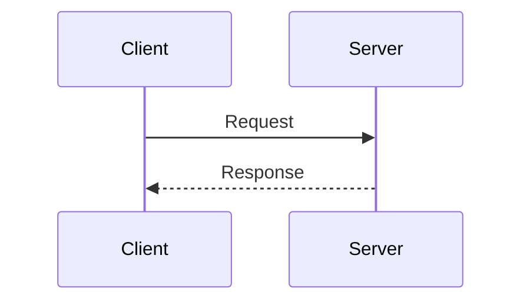

# Slide Deck Authoring Guide

This document describes patterns, preferences, and conventions for creating security-focused slide decks in this codebase.

## Audience Context

These slide decks are for a seminar on building secure applications with Angular + .NET. The target audience is professional developers who need practical, actionable security knowledge.

## Core Philosophy

### Security as a Feature

- Security isn't binary (secure/insecure)
- It's a feature to be prioritized against competing concerns
- Trade-offs are real and context-dependent
- Avoid absolutist "always do X" advice
- Acknowledge organizational realities (bureaucracy, technical debt, budgets)

### Practical Over Theoretical

- Show real code, not toy examples
- Include famous incidents and real CVEs with links
- Black hat perspective (the attack) + white hat perspective (the defense)
- "Dumb example" → "Smarter attack" → "Sophisticated defense" progression
- Explain _why_ something is vulnerable, not just _that_ it is

### Simplicity Over Complexity

- User (Lenny) distrusts "brilliant" ideas that add complexity
- Prefer simple, maintainable solutions
- When showing multiple approaches, evaluate trade-offs honestly

## Technical Structure

### Markdown Hierarchy

```
# Deck Title
├── ## Topic Title (major sections)
│   ├── ### Slide Title
│   ├── ### Another Slide Title
│   └── ...
└── ## Another Topic
    ├── ### Slide Title
    └── ...
```

- `#` = Deck title (once per file)
- `##` = Topic/section title (creates section breaks)
- `###` = Individual slide title (every content slide needs one)

### Slide Separation

```markdown
---
### Slide Title

Content here
---
```

- Slides separated by `---` on its own line
- Blank line before and after the separator
- Every content slide starts with `###` heading

## Required Deck Structure

Every deck should follow this standard structure to maintain consistency and help learners track their progress.

### Goals Slide

Place immediately after the deck title slide. Format as questions with definite answers that will be covered in the deck.

```markdown
---

### Goals
By the end of this deck, you should be able to answer--
1. What are 2 components of a request's **origin**?
2. What is **CORS** and what problems does it solve?
3. What does **CSRF** stand for? And why is it not the problem that it used to be?
4. What do **Trusted Types** have to do with _types_ in programming?


---
```

**Guidelines:**
- Start with "By the end of this deck, you should be able to answer--"
- Ask 3-4 questions (not statements)
- Questions should have definite answers covered in the deck
- Be "forgiving" - ask for 2 when there are 3+ options
- Bold important terms using `**term**`
- Questions should be answerable after completing the deck

### Roadmap Slide

Place immediately after the Goals slide. Simple numbered list of major sections (the `##` headings in your deck).

```markdown
### Roadmap
1. Browser Security Ecosystem
2. Same Origin Policy
3. Cross-Origin Resource Sharing
4. Content Security Policy
5. Trusted Types

---
```

**Guidelines:**
- Simple numbered list only
- Each item corresponds to a `##` section heading in the deck
- No bullets or sub-items
- Keep it concise - just the section names

### Recap Slide

Place at the very end of the deck, just before the final `## Fin` section if present.

```markdown
---

### Recap
1. What are 2 components of a request's **origin**?
2. What is **CORS** and what problems does it solve?
3. What does **CSRF** stand for? And why is it not the problem that it used to be?
4. What do **Trusted Types** have to do with _types_ in programming?

---
```

**Guidelines:**
- Exact duplicate of the Goals questions
- Copy-paste from Goals slide to ensure consistency
- Serves as reinforcement and self-assessment
- No additional content - just the questions

## Content Guidelines

### Brevity

- Maximum ~5 bullets per slide
- Maximum ~25 words per bullet (or ~12 words if many bullets)
- Exception: Code-heavy slides can skip bullets entirely
- If you need more content, split into multiple slides

### Bullet Style

```markdown
- Short, punchy statement
- Another brief point with [inline link](https://example.com)
- Use parallel structure when possible
```

- Use `*` or `-` for bullets (be consistent within a file)
- Exactly one space after the bullet marker
- Sub-bullets use 2-space indentation

### Links

**DO:**

```markdown
- [Not Invented Here](https://en.wikipedia.org/wiki/Not_invented_here) has new meaning in AI age
- Attackers scan for [Lodash vulnerabilities](https://security.snyk.io/package/npm/lodash)
```

**DON'T:**

```markdown
- Not Invented Here has new meaning
- [Read more](https://en.wikipedia.org/wiki/Not_invented_here)
```

- Inline links on important terms, not separate "Read more" bullets
- Link to authoritative sources:
  - Microsoft Docs for .NET/C# topics
  - MDN for web standards
  - OWASP for security concepts
  - Luminaries: Bruce Schneier, Dan Krebs, etc.
  - Wikipedia for general concepts
  - Vendor documentation (Angular, npm, etc.)
- Use descriptive link text, not bare URLs

### Code Samples

**Rules:**

- Maximum 15 lines per slide
- Include language identifier: ```csharp`, ``typescript`, ```bash`
- Use realistic code, not contrived examples
- **Never include comments** (see user rules)
- Use "One True Brace" style (opening brace on same line)
- Show vulnerable code first, then mitigations

**Example Pattern:**

````markdown
### The Vulnerability

```csharp
public async Task<Order> GetOrder(int orderId){
    return await _db.Orders.FirstAsync(o => o.Id == orderId);
}
```
````

---

### The Fix

```csharp
public async Task<Order> GetOrder(int orderId){
    var order = await _db.Orders.FirstAsync(o => o.Id == orderId);
    if (order.CustomerId != _currentUser.CustomerId){
        throw new UnauthorizedAccessException();
    }
    return order;
}
```

````

### Tables

Use tables for comparisons, step-by-step exploits, or strategy evaluations:

```markdown
| Strategy | Security Updates | Stability | Effort |
|----------|------------------|-----------|---------|
| **Pin everything** | Manual only | High | High |
| **Auto-update** | Immediate | Low | Low |
````

- Use bold in first column for emphasis when appropriate
- Keep cell contents brief
- Use for "Pros/Cons" comparisons

### Diagrams

**Mermaid is available:**

````markdown

````

````

- Use for sequence diagrams, flowcharts, mindmaps
- Scale if needed: `<div style="transform: scale(0.85); transform-origin: top center;">`
- Test rendering - mermaid can be finicky

## Content Patterns

### Attack → Defense Pattern
1. **What's the vulnerability?** - Define and explain
2. **Famous example** - Real-world incident with link
3. **The exploit** - Show how attack works (code or steps)
4. **Mitigation #1** - Simple defense
5. **Mitigation #2** - More sophisticated defense
6. **Defense evaluated** - Trade-offs, when to use what

### Progressive Complexity
```markdown
### Dumb Example
[Simple, obvious attack that's easy to defend]

### Smarter Attack
[More sophisticated approach]

### Defense in Depth
[Layered mitigations]
````

### Evaluation Slides

When presenting solutions, evaluate them:

```markdown
### Solution X Evaluated

**Strengths:**

- Clear benefit #1
- Clear benefit #2

**Weaknesses:**

- Limitation #1
- Limitation #2

**When to use:** Context matters
```

### Real-World Examples

- Include famous breaches/attacks with year: `[Mirai Botnet](https://...) (2016)`
- Link to primary sources (Wired, CISA, vendor advisories)
- Explain what went wrong (combine multiple failures)
- Extract lessons applicable to everyday development

## Style Preferences

### Emphasis

- Use `**bold**` for key terms and emphasis
- Use `*italics*` sparingly
- Use `<u>underline</u>` for acronym expansion: `<u>S</u>QL <u>I</u>njection`
- Use inline code formatting for technical terms: `` `package.json` ``, `` `HttpContext` ``

### Tone

- Professional but not stuffy
- Acknowledge complexity and frustration
- Humor is acceptable (see "Who Gets Yelled At" taxonomy)
- No condescension toward beginners
- No security theater - be honest about limitations

### Organization

- Start broad, then narrow
- Create clear sections with `##` headings
- Use descriptive slide titles
- Group related concepts together
- End sections with summary or practical takeaway

## Common Mistakes to Avoid

1. **Too much text** - If you can't read it in 10 seconds, it's too much
2. **Vague statements** - "Security is important" → "SQL injection allows data theft"
3. **Missing links** - Always link to authoritative sources
4. **Toy examples** - Show real code patterns developers will recognize
5. **False dichotomies** - Acknowledge trade-offs, not "right" vs "wrong"
6. **Ignoring context** - What works for a startup doesn't work for a bank

## Frontmatter

```yaml
---
title: 'Descriptive Title'
description: "One or two sentence summary of the deck's content"
status: 'Live'
flavor: 'Deck'
---
```

- `status` can be: 'Live', 'Draft', 'Archived'
- `flavor: 'Deck'` marks this as a slide deck (required)

## MDX-Specific Features

### Comments

```markdown
{/_ TODO: Fix styling _/}
{/_ Note: This example needs updating _/}
```

Use MDX comments for notes that shouldn't appear in slides.

### HTML/JSX

You can use HTML elements when needed:

```markdown
<figure style='width:40%;height:auto;'>

</figure>

<br/>

<div style="transform: scale(0.85);">
[Scaled content here]
</div>
```

## User Rules Reminder

From the user's cursor rules:

1. **Functional changes only** - No cosmetic refactoring
2. **Only make changes when explicitly instructed** - Default to proposing, not implementing
3. **Preserve existing style** - Match surrounding patterns

## Example Slide Sequences

### Security Topic Template

````markdown
## Topic Name

---

### What's [Topic Name](link-to-docs)?

- Definition with key terms
- Why it matters
- Impact ranges from X to Y

---

### [Famous Example](link) (Year)

- What happened
- Scale/impact
- What failed
- Lessons learned

---

### The Vulnerability

```code
[vulnerable code example]
```
````

---

### Mitigation #1: Simple Approach

- How it works
- When to use

```code
[mitigated code]
```

---

### Mitigation #2: Sophisticated Approach

- More robust solution
- Trade-offs

---

### Defense in Depth

- No single mitigation is enough
- Layer multiple strategies
- Monitor and respond

```

## Testing Your Slides

Before considering slides complete:
1. **Structure**: Deck has Goals, Roadmap, and Recap slides in correct positions?
2. **Goals/Recap match**: Recap questions are exact duplicates of Goals?
3. **Roadmap accuracy**: Roadmap items match actual `##` section headings?
4. Read each slide aloud - does it take more than 30 seconds?
5. Check all links - do they go to authoritative sources?
6. Run code examples - do they actually work?
7. Review progression - does each slide build on the previous?
8. Verify mermaid diagrams render properly
9. Check for typos and formatting consistency

## Resources Referenced Often

- **OWASP**: https://owasp.org/
- **Microsoft Docs**: https://learn.microsoft.com/
- **MDN**: https://developer.mozilla.org/
- **Bruce Schneier**: https://www.schneier.com/
- **CISA**: https://www.cisa.gov/
- **npm docs**: https://docs.npmjs.com/
- **Snyk vulnerability DB**: https://security.snyk.io/


## Final Notes

These slides are tools for discussion, not reference documentation. The goal is for developers to:
1. Understand the vulnerability
2. Recognize it in their code
3. Know how to fix it
4. Understand trade-offs
5. Remember to look it up later when needed

If a slide doesn't serve one of these goals, it probably doesn't belong.

```
