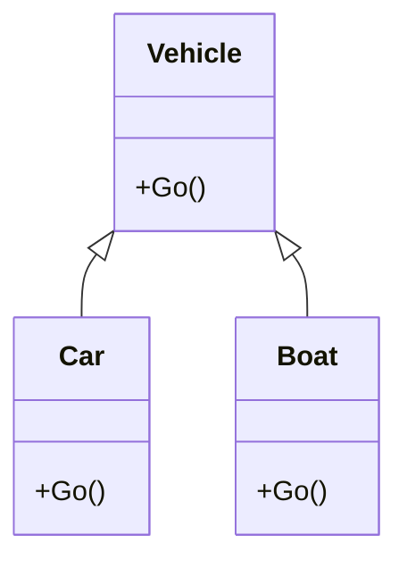

# Objects: Fancy

---

### Goals

1. Lorem
2. Ipsum
3. Sic

---

### Roadmap

1. Inheritance
2. Keywords
3. `System.Object`

---


## Inheritance

---

### Cautionary Overview
* Implementation inheritance means that you inherit the implementation of the base class
* Aka 'is-a' relationship
* Benefits:
  - Code reuse
  - Uniform interface -- aka [Liskov Substitution Principle](https://en.wikipedia.org/wiki/Liskov_substitution_principle)
* Drawbacks:
  - Relationships are fixed at compile time
  - Difficult to reason about

---

### Fatherly Advice
* Use implementation inheritance sparingly
* Prefer composition
* Don't memorize inheritance rules
* Look them up if you have to

---

### Example: UI Framework
* A base `Control` class contains rendering pipeline, event handling, and layout logic
* **Value**: Shared implementations for focus management, styling, accessibility features
* **Why interfaces aren't enough**: Rendering and event bubbling are complex, but vary by control type

---

### Example: Control
```csharp
public abstract class Control {
    public abstract void Paint();
    public abstract void OnMouseDown();
    
    // Virtual method (can be overridden but has default implementation)
    public virtual Size GetPreferredSize() => new Size(10, 10);
        
    // Sealed method (cannot be overridden by derived classes)
    public sealed void RequestRepaint() {
        ScheduleRender();
        NotifyLayoutManager();
    }
    
    // Private helper methods
    private void NotifyLayoutManager() { /* Implementation */ }
}
```

---

### Example: Button

```csharp title="Button.cs"
public class Button : Control{
  public override void Paint(){
    // Do paint stuff
  }
  public override void OnMouseDown(){
    // Style for button pressed
  }
  public override void OnMouseUp(){
    // Style normally; fire handler
  }
}
```

---


## Keywords

---

### Overview
* [`abstract`](https://learn.microsoft.com/en-us/dotnet/csharp/language-reference/keywords/abstract)
* [`sealed`](https://learn.microsoft.com/en-us/dotnet/csharp/language-reference/keywords/sealed)
* [`virtual`](https://learn.microsoft.com/en-us/dotnet/csharp/language-reference/keywords/virtual)
* [`override`](https://learn.microsoft.com/en-us/dotnet/csharp/language-reference/keywords/override)
* [`base`](https://learn.microsoft.com/en-us/dotnet/csharp/language-reference/keywords/base)


---

### Keyword: [`abstract`](https://learn.microsoft.com/en-us/dotnet/csharp/language-reference/keywords/abstract)
* Abstract **classes** can't be instantiated
* Abstract **methods** have no implementation

```csharp
public abstract class Shape {
    public abstract double CalculateArea();
    public void Display() => Console.WriteLine($"Area: {CalculateArea()}");
}

// Must implement all abstract methods
public class Circle : Shape {
    public double Radius { get; set; }    
    public override double CalculateArea() => Math.PI * Radius * Radius;
}
```

---

### Keyword: [`sealed`](https://learn.microsoft.com/en-us/dotnet/csharp/language-reference/keywords/sealed)
* Sealed **classes** can't be inherited
* Sealed **methods** can't be overridden


```csharp
// Can't be used as a base class
public sealed class Utility {
    public void DoWork() => Console.WriteLine("Working...");
}

public class Base {
    public virtual void Method() => Console.WriteLine("Base implementation");
}

public class Derived : Base {
    // No further overrides allowed in subclasses
    public sealed override void Method() => Console.WriteLine("Final implementation");
}
```

---

### Keyword:  [`virtual`](https://learn.microsoft.com/en-us/dotnet/csharp/language-reference/keywords/virtual)
* Virtual **methods** have an implementation but can be overridden
* Base implementation can be called via `base.Method()`

```csharp
public class Animal {
    public virtual void MakeSound() => Console.WriteLine("...");
    public void Breathe() => Console.WriteLine("Inhale, exhale");
}

public class Dog : Animal {
    public override void MakeSound() => Console.WriteLine("Woof!");
}
```

---


### Keyword: [`override`](https://learn.microsoft.com/en-us/dotnet/csharp/language-reference/keywords/override)
* Provides a new implementation of a virtual or abstract member
* Must match signature exactly

```csharp
public class Device {
    public virtual void TurnOn() => Console.WriteLine("Device turning on");
    public virtual void TurnOff() => Console.WriteLine("Device turning off");
}

public class Television : Device {
    public override void TurnOn() 
      => Console.WriteLine("TV powering up and initializing display");
}
```

---

### Keyword: [`base`](https://learn.microsoft.com/en-us/dotnet/csharp/language-reference/keywords/base)
* Reference base class implementation of overridden members

```csharp
public class Vehicle {
    public string Make { get; private init;}    
    public Vehicle(string make) => Make = make;
    public virtual void Start() => Console.WriteLine("Engine starting");
}
public class Car : Vehicle {
    public int Doors { get; private init;}
    
    public Car(string make, int doors) : base(make) 
      => Doors = doors;
    
    public override void Start() {
        base.Start();
        Console.WriteLine("Car ready to drive");
    }
}
```

---

### Gotcha: Non `virtual` by Default
* In C#, methods are [non-virtual by default](https://learn.microsoft.com/en-us/dotnet/csharp/language-reference/keywords/virtual)
* Must explicitly mark methods as `virtual` to enable overriding
* [Design philosophy](https://learn.microsoft.com/en-us/dotnet/standard/design-guidelines/virtual-members):
  - Promotes version resilience and performance
  - Prevents "fragile base class" problem
  - Forces intentional [design of inheritance points](https://learn.microsoft.com/en-us/dotnet/standard/design-guidelines/framework-design-guidelines-digest)
* Contrast with Java where methods are virtual by default

---

### Example: Vehicle
{/* TODO: Fix diagram */}


---

### Example: Vehicle

```csharp
public class Vehicle{
  public void Go() => Console.WriteLine("Let's go!");
}
public class Car : Vehicle{
  // Doesn't compile! 
  public override void Go() => Console.WriteLine("Vroom!");
}

public class Boat : Vehicle{
  // Probably not what you want!
  public void Go() => Console.WriteLine("Splash!");
}
``` 

---

### Quiz: What's the Output?
* Version A
```csharp
Vehicle v = new Vehicle();
v.Go();

Vehicle b1 = new Boat();
b1.Go();

Boat b2 = new Boat();
b2.Go();
```

* Version B
```csharp
Vehicle[] vs = [new Vehicle(), new Boat()];
foreach (var v in vs) {
  v.Go();
}
```

---

### Takehome
* Use `virtual` and `override` judiciously
* **For code reuse**: prefer composition
* **For a uniform interface**: prefer interface inheritance
* If you're extra paranoid: `seal` your classes by default

---


## `System.Object`

---

### Overview

* [System.Object](https://learn.microsoft.com/en-us/dotnet/api/system.object) is the root of all types in .NET
* Every type inherits from `object` (or `System.Object`)
* Enables:
  - Generic collections
  - Boxing/unboxing
  - Type reflection
* Best practice: Override these methods when implementing value types

---

### Object Methods

| Method | Description | Virtual |
|:--------|:-------------|------------|
| [`ToString()`](https://learn.microsoft.com/en-us/dotnet/api/system.object.tostring) | Converts object to string representation | <span style="color:green">✓</span> |
| [`Equals()`](https://learn.microsoft.com/en-us/dotnet/api/system.object.equals) | Determines object equality | <span style="color:green">✓</span> |
| [`GetHashCode()`](https://learn.microsoft.com/en-us/dotnet/api/system.object.gethashcode) | Gets hash code for object | <span style="color:green">✓</span> |
| [`GetType()`](https://learn.microsoft.com/en-us/dotnet/api/system.object.gettype) | Returns runtime type of object | <span style="color:red">✗</span> |

---

### `GetType()`
* Returns runtime type information
* Key method for [.NET Reflection](https://learn.microsoft.com/en-us/dotnet/csharp/programming-guide/concepts/reflection)
* Used by serialization, dependency injection, and testing frameworks
* Only non-virtual method in System.Object
* Returns a [Type](https://learn.microsoft.com/en-us/dotnet/api/system.type) object

---

### Example: `GetType()`

```csharp {3}
// Get and display all public members of any object
public static void GetPublicMembers(object obj) {
    Type type = obj.GetType();
    
    Console.WriteLine($"Type: {type.FullName}");
    Console.WriteLine("Public Members:");
    
    var members = type.GetMembers(BindingFlags.Public | BindingFlags.Instance);
    
    foreach (var member in members) {
        Console.WriteLine($"- {member.MemberType}: {member.Name}");
    }
}

// Usage
var person = new Person { Name = "Alice", Age = 28 };
GetPublicMembers(person);
```

---

### `ToString()`
* Converts an object to its string representation
* Default implementation:
  - Returns the full type name
* Override for custom string representations

---

### Example: `ToString()`

```csharp {4}
public class Person{
  public string Name { get; set; }
  public int Age { get; set; }
  public override string ToString() => $"{Name} ({Age} years old)"; 
}

var p = new Person{ Name = "John", Age = 30 };
Console.WriteLine(p); // Output: John (30 years old)
```

---

### Overriding `Equals()`
* Default compares references, not values
* Override for value-based equality
* Always override `GetHashCode()` too
* Common in value types and collections
* Must follow [equality contract](https://learn.microsoft.com/en-us/dotnet/api/system.object.equals#notes-to-implementers)

---

### Example: Custom `Equals()`

```csharp title="Person.cs"
public class Person {
    public string Name { get; set; }
    public int Age { get; set; }

    public override bool Equals(object? obj) {
        if (obj is not Person other) return false;
        return Name == other.Name && Age == other.Age;
    }
    //TODO: Override GetHashCode
}
```

---

### About `GetHashCode()`
* Used by hash-based collections (Dictionary, HashSet)
* Must match `Equals()`: if `a.Equals(b)` then `a.GetHashCode() == b.GetHashCode()`
* Fast, consistent hash function
* Never changes during object lifetime
* [Documentation](https://learn.microsoft.com/en-us/dotnet/api/system.object.gethashcode)

---

### Example: `GetHashCode()`
* [`HashCode.Combine`](https://learn.microsoft.com/en-us/dotnet/api/system.hashcode.combine) is a helper method for combining hash codes
* More efficient than manually combining hash codes
* Handles `null` values gracefully

```csharp title="Person.cs"
public class Person {
    public string Name { get; set; }
    public int Age { get; set; }

    public override int GetHashCode() {
        return HashCode.Combine(Name, Age);
    }
}
```
