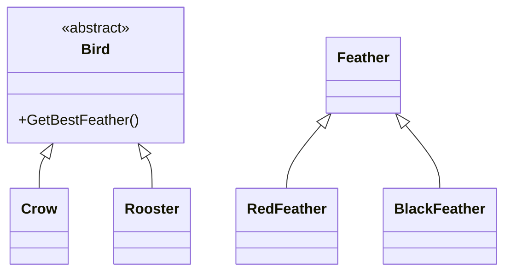

# Generics

---

### Goals

1. Explain the problem that generics solve
2. Describe how to use a generic type
3. Explain covariance and contravariance

---

### Roadmap
1. Overview
2. Using Generics
3. Custom Generics

---


## Motivations

---

### Without Generics
* All types in C# inherit from [System.Object](https://learn.microsoft.com/en-us/dotnet/api/system.object)
* Pre-generics collections stored everything as `object` references
* Problems:
  - No compile-time type checking
  - Lots of explicit casting
  - [Boxing/unboxing](https://learn.microsoft.com/en-us/dotnet/csharp/programming-guide/types/boxing-and-unboxing) value types impacts performance
  - Runtime errors instead of compile-time errors
  - No IntelliSense for collection contents

---

### Example: ArrayList

```csharp title="ArrayListExample.cs"
// Non-generic collection requires casting
ArrayList names = new ArrayList();
names.Add("Alice");
names.Add("Bob");
names.Add("Charlie");

// Must cast each item back to string
foreach (object item in names) {
    string name = (string)item;
    Console.WriteLine(name.ToUpper());
}

// Runtime error if types don't match!
names.Add(42); // Compiles fine
string whoops = (string)names[3]; // throws InvalidCastException
```

---


### Overview
* Generics create type-safe, reusable components
* Introduced in C# 2.0
* Use type parameters instead of specific types
* Prevents boxing/unboxing of value types
* Provides compile-time type checking

---


## Using Generics

---

### Things that can be generic
* Classes
* Structs
* Interfaces
* Methods
* Delegates
* Events

---

### Syntax
* [Type parameter](https://learn.microsoft.com/en-us/dotnet/csharp/programming-guide/generics/generic-type-parameters)
  - Placeholder for a specific type specified by client code
  - Angle bracket syntax `SomeGenericClass<T>{}`
  - By convention: `T` for single type, `TKey`/`TValue` for pairs
  - Can have multiple parameters: `T1 SomeGenericMethod<T1,T2>(){}`


---

### Examples (I)

```csharp title='GenericExample.cs'
// Generic approach using List<T>
List<int> numbers = new List<int>();
numbers.Add(1);
numbers.Add(2);
numbers.Add(3);

// No casting needed - type-safe at compile time
int sum = 0;
foreach (int item in numbers) {
    sum += item;
}
Console.WriteLine($"Sum: {sum}");
```

---

### Examples (II)

```csharp title='GenericExample.cs'
// Generic method with multiple type parameters
public static TValue GetValueOrDefault<TKey, TValue>(
    Dictionary<TKey, TValue> dict, 
    TKey key, 
    TValue defaultValue
) 
    => dict.TryGetValue(key, out TValue? value) ? value : defaultValue;


// Usage with type inference
var scores = new Dictionary<string, int> {
    ["Alice"] = 95,
    ["Bob"] = 87
};

int aliceScore = GetValueOrDefault(scores, "Alice", 0);  // 95
int charlieScore = GetValueOrDefault(scores, "Charlie", 0);  // 0
```

---

### Inference

* [Type inference](https://learn.microsoft.com/en-us/dotnet/csharp/programming-guide/generics/generic-methods#type-inference) lets compiler deduce types
* Works when types can be determined from arguments
* Not always possible - must specify types when ambiguous
* Makes code cleaner but can reduce readability


---

### Inference Examples
```csharp title='GenericExample.cs'
public static T GetFirst<T>(IEnumerable<T> xs){
    var enumerator = xs.GetEnumerator();
    if (!enumerator.MoveNext()){
        throw new InvalidOperationException("Sequence contains no elements");
    }
    return enumerator.Current;
}

static void Main(){
    int[] xs = [1, 2, 3, 4, 5];

    var first = GetFirst(xs);

    var otherFirst = GetFirst<int>(xs);
}

```
---

### Familiar Generic Types

* [List&lt;T&gt;](https://learn.microsoft.com/en-us/dotnet/api/system.collections.generic.list-1) - Dynamic array
* [Dictionary&lt;TKey,TValue&gt;](https://learn.microsoft.com/en-us/dotnet/api/system.collections.generic.dictionary-2) - Key-value pairs
* [Task&lt;T&gt;](https://learn.microsoft.com/en-us/dotnet/api/system.threading.tasks.task-1) - Asynchronous operations
* [Nullable&lt;T&gt;](https://learn.microsoft.com/en-us/dotnet/api/system.nullable-1) - Optional values
* [IEnumerable&lt;T&gt;](https://learn.microsoft.com/en-us/dotnet/api/system.collections.generic.ienumerable-1) - Collections
* [IComparable&lt;T&gt;](https://learn.microsoft.com/en-us/dotnet/api/system.icomparable-1) - Comparable types
* [EventHandler&lt;T&gt;](https://learn.microsoft.com/en-us/dotnet/api/system.eventhandler-1) - Event handlers

---

### Generic Methods

* [Array.Empty&lt;T&gt;](https://learn.microsoft.com/en-us/dotnet/api/system.array.empty) - Empty array singleton
* Enumerable:
  - [.Empty&lt;T&gt;](https://learn.microsoft.com/en-us/dotnet/api/system.linq.enumerable.empty) - Empty sequence
  - [.First&lt;T&gt;](https://learn.microsoft.com/en-us/dotnet/api/system.linq.enumerable.first) - First element
  - [.Single&lt;T&gt;](https://learn.microsoft.com/en-us/dotnet/api/system.linq.enumerable.single) - Single element
  - [.DefaultIfEmpty&lt;T&gt;](https://learn.microsoft.com/en-us/dotnet/api/system.linq.enumerable.defaultifempty) - Default value if empty
* [Task.FromResult&lt;T&gt;](https://learn.microsoft.com/en-us/dotnet/api/system.threading.tasks.task.fromresult) - Completed task with result

---


## Custom Generics

---

### Declaring Generic Types

```csharp
// Generic class with type parameter T
public class Box<T>{
    public T Content { get; set; }
}

// Usage
var intBox = new Box<int>();
var stringBox = new Box<string>();
```

---

### Generic Methods

```csharp
// Generic method
public T First<T>(List<T> items){
    return items[0];
}

// Usage
int number = First<int>(numberList);
string name = First(nameList); // Type inference
```

---

### Example: Result
#### Motivation
```csharp title="OutputParams.cs"
// Without generics: Functions return one value
// Output parameters work around this limitation
bool success = int.TryParse("123", out int result);

if (success) {
    Console.WriteLine($"Parsed value: {result}");
} else {
    Console.WriteLine("Failed to parse");
}

// Limitations:
// - Confusing syntax (what does 'out' mean?)
// - Error-prone (forgetting to check success)
// - Not composable in functional style
```

---

### Solution: Result

```csharp title="Result.cs"
public class Result<T>
{
    private readonly T? _value;
    private readonly string? _error;

    public bool IsSuccess => _error is null;

    public T Value => IsSuccess ? _value! : throw new InvalidOperationException("Result is a failure");
    public string Error => !IsSuccess ? _error! : throw new InvalidOperationException("Result is a success");

    private Result(T value, string? error = null)
    {
        _value = value;
        _error = error;
    }

    public static Result<T> Success(T value) => new(value);
    public static Result<T> Failure(string error) => new(default(T)!, error);
}
```

---

### Usage: ParseInt

```csharp
public static Result<int> ParseInt(string input){
    return int.TryParse(input, out int result) 
        ? Result<int>.Success(result) 
        : Result<int>.Failure("Failed to parse input");
}

var result = ParseInt("123");
if (result.IsSuccess){
    Console.WriteLine(result.Value);
} else {
    Console.WriteLine(result.Error);
}

```
---

### Usage: ParseBool

```csharp
public static Result<bool> ParseBool(string input){
    if (input == "true" || input == "Yes") return Result<bool>.Success(true);
    if (input == "false" || input == "No") return Result<bool>.Success(false);
    return Result<bool>.Failure("Invalid boolean input");
}

var result = ParseBool("true");
if (result.IsSuccess){
    Console.WriteLine(result.Value);
} else {
    Console.WriteLine(result.Error);
}
```

---

### Generic Constraints

* [Type constraints](https://learn.microsoft.com/en-us/dotnet/csharp/programming-guide/generics/constraints-on-type-parameters) ensure type parameters meet requirements
* Common constraints:
  - `struct` - Only value types
  - `class` - Only reference types
  - `new()` - Must have parameterless constructor
  - Interface - Must implement specific interface
* Enables use of type-specific operations
* Provides compile-time guarantees
* Improves type safety and code clarity

---

### Constraints

```csharp
// Type constraint
public class Calculator<T> where T : struct{
    // Only value types allowed
}

// Interface constraint
public T Create<T>() where T : IComparable, new(){
    return new T();
}
```

---

### Generic Interfaces

* Similar syntax to generic classes
* Common in .NET:
  - [IComparable&lt;T&gt;](https://learn.microsoft.com/en-us/dotnet/api/system.icomparable-1) - Type-safe comparison
  - [IEquatable&lt;T&gt;](https://learn.microsoft.com/en-us/dotnet/api/system.iequatable-1) - Type-safe equality
  - [IEnumerable&lt;T&gt;](https://learn.microsoft.com/en-us/dotnet/api/system.collections.generic.ienumerable-1) - Type-safe enumeration
* Can have constraints like classes
* Enables type-safe interface implementations
* Supports covariance/contravariance with `in`/`out`

---

### Generic Interfaces Examples

```csharp title='GenericInterfacesExample.cs'
public class Person : IComparable<Person>, IEquatable<Person> {
    public string Name { get; set; }
    public int Age { get; set; }

    public int CompareTo(Person? other) => 
        other is null ? 1 : Age.CompareTo(other.Age);

    public bool Equals(Person? other) => 
        other is not null && Name == other.Name && Age == other.Age;
}

// Usage
var people = new List<Person> {
    new() { Name = "Alice", Age = 30 },
    new() { Name = "Bob", Age = 25 }
};

people.Sort();  // Uses IComparable<T>
var alice = new Person { Name = "Alice", Age = 30 };
Console.WriteLine(alice.Equals(people[0]));  // Uses IEquatable<T>
```

---


## Covariance and Contravariance

---

### [Terminology](https://learn.microsoft.com/en-us/dotnet/csharp/programming-guide/concepts/covariance-contravariance/)

* **Covariance** - Use of **more derived** types than originally specified
  - `out` keyword for return types
  - Example: `IEnumerable<Derived>` can be assigned to `IEnumerable<Base>`

* **Contravariance** - Use of **more generic** types than originally specified
  - `in` keyword for parameter types
  - Example: `Action<Base>` can be assigned to `Action<Derived>`

* _Only applies to reference types, not value types_

---

### Motivation




---


### Return Covariance

* [Return type covariance](https://learn.microsoft.com/en-us/dotnet/csharp/language-reference/proposals/csharp-9.0/covariant-returns) enables overriding methods to return more specific types
* Built-in feature since C# 9
* No special syntax required - unlike generic covariance
* Works with class inheritance hierarchies
* Makes APIs more precise while maintaining type safety
* Allows subclasses to return derived types matching their specific implementation

---

### Return Covariance
```csharp

public abstract class Bird{
    public abstract Feather GetBestFeather();
}

public class Crow : Bird{
    public override BlackFeather GetBestFeather()
      => throw new NotImplementedException();
}

public class Rooster : Bird{
    public override RedFeather GetBestFeather()
      =>  throw new NotImplementedException();    
}

```


---


## Fin

---

### Goals

1. Explain the problem that generics solve
2. Describe how to use a generic type
3. Explain covariance and contravariance


