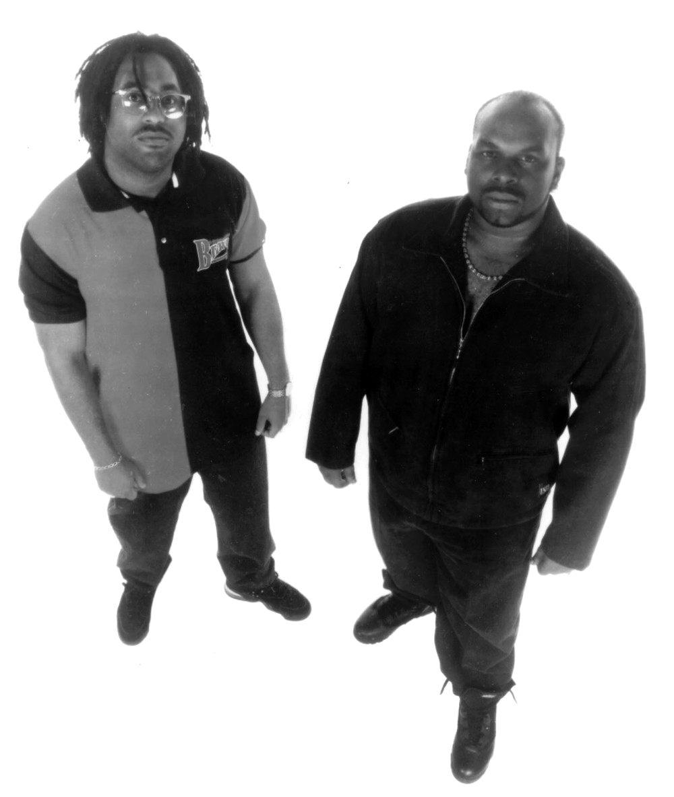

# First Principles

---

### Goals

1. Define “Design Pattern”
1. List some advantages and drawbacks
1. Give some examples

---

## What's Design?

---

### Design is Tradeoffs

<figure class='bc-framed-image' style='width:25%;margin-left:1rem;'>

</figure>

> Design, for my purposes, is about making tradeoffs.
> [Joel Spolsky](https://www.joelonsoftware.com/2006/01/26/great-design-what-is-design-first-draft/)

#### Design is:

- Making stuff
- Within constraints
- Optimizing priorities

---

### Example: Trashcan

<figure  style='width:30%;margin-left:1rem;'>

</figure>

#### Constraints

1. Keeps trash off streets
1. Cheap enough for the city to afford
1. Light enough to lift
1. Big enough for lots of trash
1. Doesn’t take up too much sidewalk space
1. Heavy enough to not blow away

---

### Design Over Time

<figure  style='height:60vh;width:auto;margin-left:1rem;'>

</figure>

- Choices mean winners and losers
- Nothing is free
- Examples:
  - TV remote buttons
  - Complexity and Extensibility
- Joel Spolsky: Design adds value faster than it adds cost.

---

### Fancy Definition

> **_Design_** explores and maps a multi-dimensional solution space.

---

## What's Patterns?

---

### On Building Stuff

- People have been building structures for millenia
- Traditions evolved in harmony with their context
- Before inventing new techniques, try to understand common problems and solutions

---

### Patterns are Traditions

- Modernists advocate creating things from first principles
- Traditionalists advocate tradition for its own sake:
  - Maybe there’s wisdom embedded within the tradition
  - Design is path dependent

---

### Without Patterns

<figure  style='width:30%;height:auto;'>

</figure>

- Start from first principles
- Avoid influence from traditional forms
- Associated with modernism
- Downsides:
  - Unnecessarily surprising
  - Silly
  - Naive

---

### Chesterton's Fence

> There exists ...a gate erected across a road. The more modern type
> of reformer goes gaily up to it and says, **"I don't see the use of this; let us
> clear it away."**  
> The more intelligent type of reformer will do well to answer:
> "If you don't see the use of it, I certainly won't let you clear it away.
> Go away and think. Then, when you can come back and tell me that you do
> see the use of it, I may allow you to destroy it."

---

### What's a Pattern?

- Lots of problems come with similar design constraints
- e.g. Cities. Building New York wasn’t that much different than building Cairo

> A **_pattern_** is a common solution to a common set of design constraints

---

### Same but different

<figure class='bc-framed-image' style='margin-left:2rem;'>

</figure>

> A **pattern** describes a problem which occurs over and over again in
> our environment, and then describes the core of the solution to that
> problem, in such a way that you can use this solution a million times
> over, without ever doing it the same way twice.
>
> -- _Christopher Alexander_

---

## Aside: Architecture

---

### Pattern: Access To Water

<figure  style='width:30%;'>

</figure>

- Lots of cities:
  - London
  - Manhattan
  - Rome
  - Cairo
- One pattern in common: access to water

---

### Anti-Pattern: Block Water

- **_Example_**: Boston had a big elevated highway between downtown and the ocean
  - Limited ‘access to water’
  - Limited transportation options

---

### Pattern Pride!

<figure  style='width:30%;'>

</figure>

- Bad pattern choices have costs
  - Human well being
  - Money
- A big dig was the right pattern
  - Better access to water
  - More transportation options
  - Most valuable real estate in the city

---

### Kitchen Patterns

<figure  style='width:30%;'>

</figure>
<figure  style='width:30%;clear:right;'>

</figure>

- Farmhouse Kitchen
  - Cooking
  - Eating
  - Hanging out
- Whitehouse Kitchen
  - In the basement
  - Residents don’t cook
  - Eating happens elsewhere

---

### Pattern Modesty

- Often a choice of patterns is self-evident given constraints
- But there’s still value:
  - Borrow from the best designs
  - Common vocabulary

---

## Patterns in Software

---

### Oldies, Goodies

<figure  style='width:30%;'>

</figure>

> I'm taking it back to the old school  
> 'Cause I'm an old fool  
> Who's so cool  
> -- [Tag team](http://example.com)

- Design patterns is an old concept
- Only a problem if you are trying to sell people new stuff

---

### Back in 1994

<figure  style='width:20%;'>

</figure>

- Gang of Four
- Modest catalog
- A pattern is:
  - Classic solution to a common problem
  - Good advice, pre-packaged
  - Not a library
  - Usually object-oriented

---

### Why Patterns?

#### Two reasons--

1. Leverage tried and true solutions
2. Use a common vocabulary

- Express intent
- Understand discusions
- Name things

---

### Patterns, Idioms, Architecture

- **Idiom** depends on a specific technology.
  - Ex. [RAII](https://en.wikipedia.org/wiki/Resource_acquisition_is_initialization)
- **Pattern** is somewhere in the middle
- **Architecture** is higher level
- **Architectural style** is higher still

---

### Patterns Can Be Abused

#### The hard thing about learning patterns is knowing when to use them.

- Patterns exist in tension with each other
- Not everything called a pattern is a good idea
- Not every good idea is a good idea for you

---

### A classic is

<figure  style='width:30%;'>

</figure>

- Something that withstands the test of time
- Or something that people a long time ago thought was cool
- Just because something’s old doesn’t mean it’s good… or bad.

---

### PG on Patterns

<figure class='bc-framed-image' style='width:25%;margin-left:2rem;'>

</figure>

> In the OO world you hear a good deal about "patterns". When I
> see patterns in my programs, I consider it a sign of trouble.  
> The shape of a program should reflect only the problem it needs
> to solve. Any other regularity in the code is a sign, to me at
> least, that I'm using abstractions that aren't powerful enough.
> -- [Paul Graham](www.paulgraham.com/icad.html)

---

### Complaints

1. Patterns are often badly applied
1. Patterns may point out other inadequacies

- In your programming language -- e.g. no metaprogramming
- In your libraries-- e.g. boost flyweight, spirit

---

## Case Study

---

### Database Connections

- Problem: Accessing relational databases from application code.
- The Java interfaces were heavily influenced by Design Patterns vocabulary, but in any case reflect far older ideas.

---

### Problem Statement

- Software needs persistence
- For **reasons**, an RDBMS is the mechanism here
- We want to:
  - Open connection
  - Do CRUD
  - Close connection
- As a general principle, our solution should produce Habitable, Testable, Secure, and Performant code

---

### Constraints

1. Vendor Neutrality
1. DB Identity Independence
1. DBAs Exist (Someone Else Does the Schema)

---

### Pattern: Layered Architecture

The JDBC architecture ensures vendor independence through a layered architecture with a separation of concerns:

- Application
- JDBC Infrastructure
- Vendor Driver

---

### Solution Notes

- Each layer implemented and tested independently
- Each component is owned by naturally independent entities.
  - e.g. The DB Vendor wouldn’t help implement applications.
- Vendor Neutrality is provided by the JDBC Manager.
- Location Independence is guaranteed by the JDBC API

---

### Consequences

- API and Vendor code are depend on a specific JDBC API/Framework version.
- Application developers will not have access to vendor-specific features
- Applications may be developed without any assistance from a vendor

---

### More Consequences

- The ideas of Layered Applications and Separation of Concerns predate the Design Patterns vocabulary
- Vocabulary transforms discussion.
  - Talk about what makes a good layered architecture and a stable separation of concerns
  - Talk about bad layerings or poorly chosen module boundaries (Anti-Patterns).
  - e.g. Don’t base a layering on Starbucks’ current org structure (MSFT frequently made this mistake).

---

### Resources: Books

<figure class='nars-book' style='width:15%;'>

</figure>

<figure class='nars-book' style='width:15%;'>

</figure>

<figure class='nars-book' style='width:15%;'>

</figure>

<figure class='nars-book' style='width:15%;clear:right;'>

</figure>

<figure class='nars-book' style='width:15%;'>

</figure>

<figure class='nars-book' style='width:15%;'>

</figure>

---

### Resources: Online

- [Awesome Design Patterns](https://github.com/DovAmir/awesome-design-patterns)
- [Java implementation samples-- lots of them](https://github.com/iluwatar/java-design-patterns)
- [Old-school catalog with UML diagrams](https://www.oodesign.com/)
- [Java catalog](https://java-design-patterns.com/patterns/)
- [Fowler PoEAA](https://martinfowler.com/eaaCatalog/)

---

### Lab: FizzBuzz

1. Open up labs\fizz_buzz
1. Make it not suck
