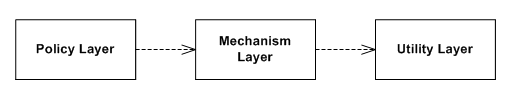
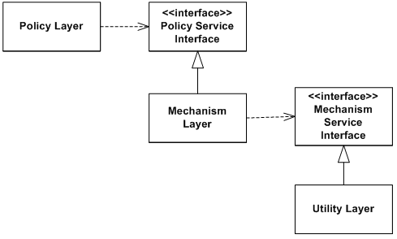
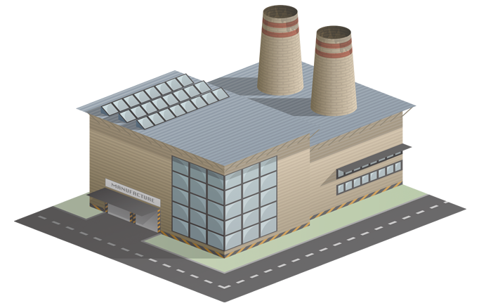
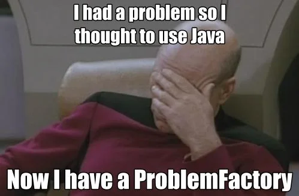
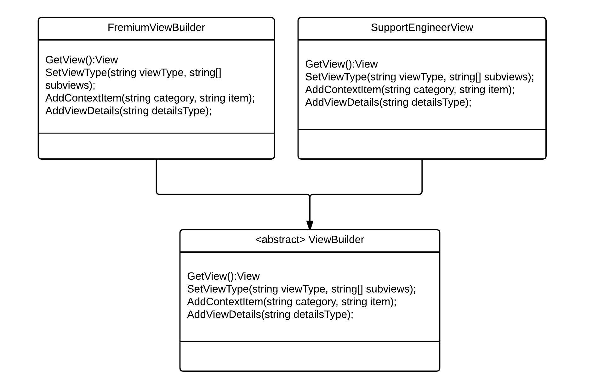

# Creation

---

### Goals

#### Explain the following

1. Singleton
1. Factory Variations
1. Abstract Factory
1. Builder

---

## Constructors Kind of Suck

---

### Overview

#### **_Initialization_** and **_Consumption_** are distinct concerns

- Instantiation is hard
  1. Initialization logic
  1. Creating complex objects can break encapsulation
- **Ideally** get an instance of an interface without caring about the implementation

---

### About Constructors

#### The simplest thing that could possibly work:

```typescript title='Cup.ts'
Cup cup = new Cup();
```

<br/>

#### Problems:

1. Choosing exactly which type of object to create
1. Depending on a particular implementation
1. Boilerplate parameters passed in on construction

<br/>

#### **Slogan**: [_`New`_ is _Glue_](https://ardalis.com/new-is-glue/)

---

### Program to an Interface

- AKA Dependency Inversion Principle
- Don't rely on a specific implementation

#### Depending on implementation:

<figure class='bc-slide-figure-2xl'>

</figure>

---

### Tight-Coupling Pseudocode

```java title='TightCoupling.java'
public class Policy{
  public void doPolicy(){ /* ... */ }
}
public class Mechanism{
  public void doMechanism(){
    Policy policy = new Policy();
    policy.doPolicy();
    //...
  }
}
public class Utility{
  public void doUtility(){
    Mechanism mechanism = new Mechanism();
    mechanism.doMechanism();
    //...
  }
}
```

---

### Dependencies Inverted

<figure class='bc-slide-figure-xl p-8'>

</figure>

---

### Inverted `Policy`

```java title='Policy.java'
public interface IPolicy{
  void doPolicy();
}

public class Policy implements IPolicy{
  public void doPolicy(){
    //...
  }
}

```

#### **Notice:** Now that `IPolicy` exists, client code can rely on the contract, not the implementation

---

### Inverted `Mechanism`

```java title='Mechanism.java'
public interface IMechanism{
  void doMechanism();
}
public class Mechanism implements IMechanism{
  // Depend on the interface
  private final IPolicy policy;

  // However it gets created, that's none of my business
  public Mechanism(IPolicy policy){
    this.policy=policy;
  }

  public void doMechanism(){
    this.policy.doPolicy();
    //...
  }
}
```

---

### Inverted `Utility`

```java title='Utility.java'

public class Utility{
  private final IMechanism mechanism;

  public Utility(){
    // New is still glue... but at least it's
    //     all in one place
    Policy policy = new Policy();
    this.mechanism = new Mechanism(policy);
  }

  public void doUtility(){
    this.mechanism.doMechanism();
    //...
  }
}
```

---

## Singleton

---

### [Overview](https://en.wikipedia.org/wiki/Singleton_pattern)

<div class='n-overview' style='width:75%;'>
  <div class='n-o-label'>Category</div>
  <div class='n-o-value'>Creational</div>

  <div class='n-o-label'>Problem</div>
  <div class='n-o-value'>
    <ul>
      <li>A resource is used in multiple places</li>
      <li>There should only be one instance</li>
      <li>ex: cache, factories, remote services.</li>
    </ul>
  </div>

  <div class='n-o-label'>Solution</div>
  <div class='n-o-value'>    
    An object has one instance and that instance is universally accessible.
  </div>
</div>

<figure  style='width: 40%;height:auto;'>

</figure>

---

### Eager Implementation (C++)

```cpp title='Cache.cpp'
class Cache{
   static Cache *instance;
   Cache() {/*setup goes here*/ }

   public:
   static Cache *getInstance() {
      if (!instance)
      	instance = new Cache;
      return instance;
   }
   //...
};
```

---

### Eager Implementation (Java)

```java title='Cache.java'
class Cache {
  // Eager instantiation prevents any threading issues
  // and it's easy to understand
  private static final Cache cache = new Cache();

  // Private constructor prevents clients from
  // newing up their own instances
  private Cache() { }

  public static Cache getInstance(){
    return cache;
  }
}
```

---

### [Lazy](https://en.wikipedia.org/wiki/Lazy_initialization) but Sloppy

```java title='Cache.java'
class Cache {
  private static Cache cache;
  private Cache() { }

  public static Cache getInstance(){
    if(cache==null){
      cache = new Cache();
    }
    return cache;
  }
}
```

#### _Watch Out!_ This common implementation isn't thread safe

---

### Lazy & Safe

```java title='Cache.java'
class Cache {
  private static final Object lock = new Object();
  private static Cache cache;
  private Cache() { }

  public static Cache getInstance(){
    if(cache==null)
      synchronized (lock)
        if(cache==null)
          cache = new Cache();
    return cache;
  }
}
```

#### Be safe, use the [double-checked lock](https://en.wikipedia.org/wiki/Double-checked_locking) pattern

---

### Consumption: Sloppy (Java)

```java title='Enfarculator.java'
class Enfarculator{

  public void enfarculate(){
    Cache.getInstance().doSomething();
    //...
    Cache.getInstance().doSomethingElse();
  }

  public void disEnfarculate(){
    Cache.getInstance().doSomething();
    //...
    Cache.getInstance().doThirdThing();
  }
}
```

---

### Shared State is Evil

<figure  style='width: 40%;height:auto;float:right;'>

</figure>
* Example: global variables
* Problems
  - Increased coupling
  - Spaghetti code
  - Mutable state is tough to parallelize

---

### Contraindications

> Because it's universally accessible, a singleton instance is essentially a global variable.

<div style='height:3rem'></div>

#### Potential problems

- Shared State -> Synchronization problems
- Hidden dependencies

---

### Consumption: Responsible

```java title='Enfarculator.java'
class Enfarculator{
  // Now the dependency isn't hidden
  private final ICache cache;

  // Ctor with dependency.
  public Enfarculator(ICache cache){ this.cache = cache; }

  // Default ctor uses the singleton.
  public Enfarculator(){ this(Cache.getInstance()); }

  public void enfarculate(){
    this.cache.doSomething();
    // ...
    this.cache.doSomethingElse();
  }
  // ...
}
```

---

### Demo: Fancy Singleton

- Variation that hides the concrete implementation

---

### Take Home

- **`Singleton`** does two things:
  - Ensure only 1 instance exists
  - Give everyone easy access to that instance
- Sometimes an anti-pattern:
  - Shared state
  - Hidden dependencies
- Useful if only for terminology. _Logical Singleton_ means--
  - Single instance
  - Lasts a lifetime

---

### Lab: Singleton

1. Open up labs\singleton
1. Make it not suck

---

## Factory

---

### [Factory](https://en.wikipedia.org/wiki/Factory_method_pattern)

<figure  style='width: 35%;height:auto;position:absolute;right:0;bottom:3rem;'>

</figure>

<div class='n-overview' style='width:85%;'>
  <div class='n-o-label'>Category</div>
  <div class='n-o-value'>Creational</div>

  <div class='n-o-label'>Related to</div>
  <div class='n-o-value'>Factory method, Creation Function, Abstract factory</div>

  <div class='n-o-label'>Problem</div>
  <div class='n-o-value'>Client code needs to use an interface-- but doesn't know either (1) which implementation to instantiate or (2) how to instantiate.</div>

  <div class='n-o-label'>Solution</div>
  <div class='n-o-value'>
    Lower coupling by separating object construction into its method or suite.
  </div>
</div>

---

### Implementation

#### Interface

```python title='Scarer.py'
class Scarer():
   def scare(self):
     pass
```

```java title='IScary.java'
interface IScary{
  void scare();
}
```

<br/>

#### Implementation

```python title='Monster.py'
class Monster(Scarer):
   def scare(self):
      print("Raaarrr!")
```

```java title='ScaryImplementations.java'
class Monster implements IScary {
  public void scare(){
    System.out.println("Raaar!");
  }
}
class Ghost implements IScary {
  public void scare(){
    System.out.println("Boo!");
  }
}
```

---

### Factory Method

#### It's just a function that makes something

```python title='ScarerFactory.py'
def getScarer(self):
   if self.is_haunted:
      return Ghost()
   return Monster()
```

```java title='ScaryFactory.java'
class ScaryFactory{
  private final boolean isHaunted;

  public ScaryFactory(boolean isHaunted){
    this.isHaunted=isHaunted;
  }

  public IScary getScary()  {
    if(this.isHaunted){
      return new Monster();
    }
    return new Ghost();
  }
}
```

---

### Consumption

```python
scarer = factory.getScarer()
```

```java
IScary scarer = ScaryFactory.getInstance().getScary();
```

#### Notes

- Factory instance exposed as a **Singleton**
- The consumer doesn't know the type it's getting
  - Just the interface

---

### [Abstract Factory](https://en.wikipedia.org/wiki/Abstract_factory_pattern)

- Just a set of methods for creating related things
- E.g. Cross-platform UI Toolkit
  - Button
  - Textbox
  - Etc
- E.g. Database vendor-neutral interfaces
  - `IDBConnection`
  - `IDBCommand`
  - `IDBParameter`
  - Etc ...

---

### Factory Downsides

- Maybe you don't need it
- Excessive abstraction
  - `SimpleBeanFactoryAwareAspectInstanceFactory`
  - `AbstractSingletonProxyFactoryBean`
- Sometimes creating stuff takes several steps
  - A creation method is just a method
  - Clients have to know about implementations

<figure class='bc-slide-figure-2xl' style='height:auto;position:absolute;right:1rem; bottom:5rem;'>

</figure>

---

## Builder

---

### Overview

<figure  style='width: 25%;position:absolute;right:1rem;bottom:3rem;'>

</figure>

<div class='n-overview' style='width:85%;'>
  <div class='n-o-label'>Category</div>
  <div class='n-o-value'>Creational</div>

  <div class='n-o-label'>Problem</div>
  <div class='n-o-value'>Creating an object takes several steps</div>

  <div class='n-o-label'>Solution</div>
  <div class='n-o-value'>
    Separate the construction of an complex object from its representation so that the same construction process can create different representations.
  </div>
</div>

---

### Motivation

- Think `Builder` when you see:
  - Big constructors
  - Default arguments
  - Boilerplate

```java
var product = new Product(
  1,
  null,
  "TV 45'",
  null,
  '',
  40000,
  "Pinnacle 4000"
);


```

---

### Usage

```java
var product = new ProductBuilder()
                  .id(1)
                  .description("TV 45'")
                  .value(40000)
                  .name("Pinnacle 4000")
                  .build();
```

- Builders are good when:
  1. Clients provide details on the object under construction
  1. Construction happens in steps
- Terminology: The style above is called a [Fluent Builder](https://dzone.com/articles/fluent-builder-pattern)

---

### E.g. Immutable Strings

- Lots of times, strings are immutable
  - E.g. Java, .NET, JavaScript, etc...
  - Also known as: [string interning](https://en.wikipedia.org/wiki/String_interning)
- Excessive instantiation degrades performance

#### Don't do this:

```java
String prepend(String target, int pad){
   var result = target;
   for(int i =0; i<pad; i++){
      result = ' ' + result;
   }
   return result;
}
```

---

### In the wild: [`StringBuilder`](https://docs.oracle.com/javase/7/docs/api/java/lang/StringBuilder.html)

#### Do this:

```java
String prepend(String target, int pad){
   var builder = new StringBuilder();
   for(int i =0; i<pad; i++){
      builder.append(' ');
   }
   builder.append(target);
   return builder.toString();
}
```

#### Notice:

- `StringBuilder` lets you build-up state before committing to the final form

---

### Variation: Abstract Builder

<figure  style='width: 70%;height:auto; margin:0 10rem 0 10rem'>

</figure>

---

### Lab: Builder

1. Open up labs\builder
1. Make it not suck
