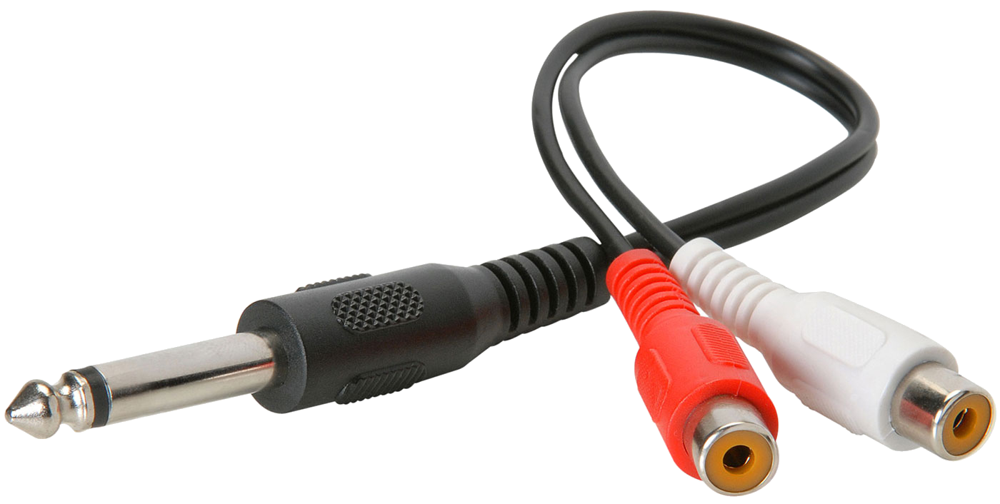
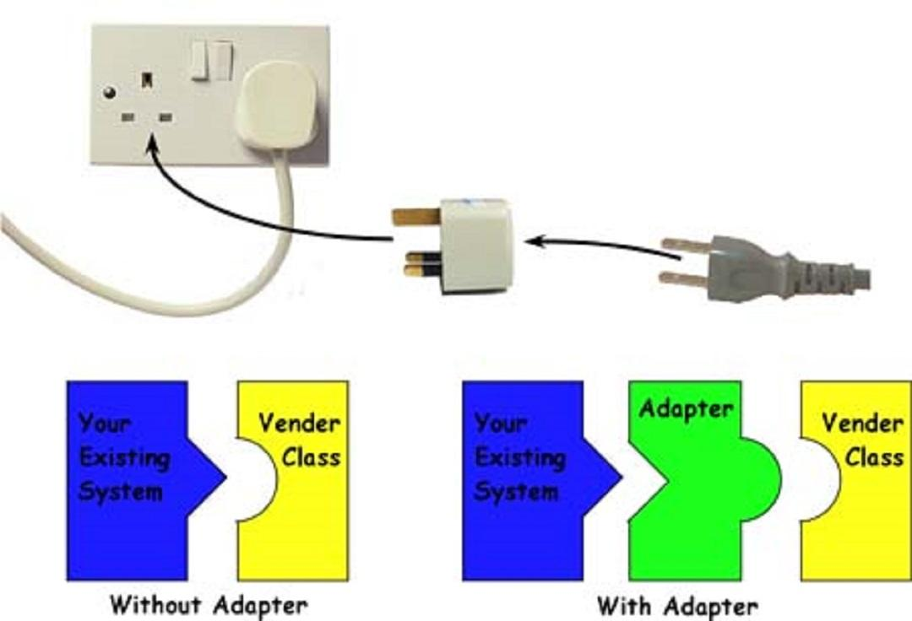
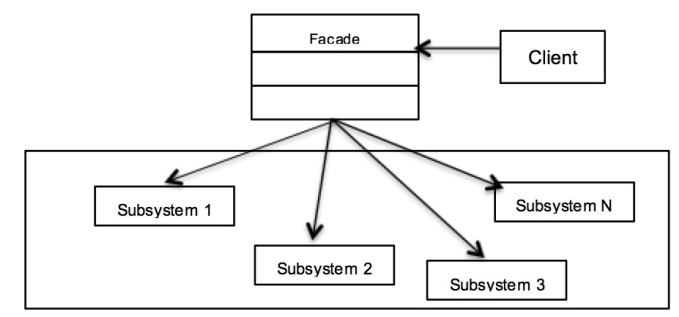
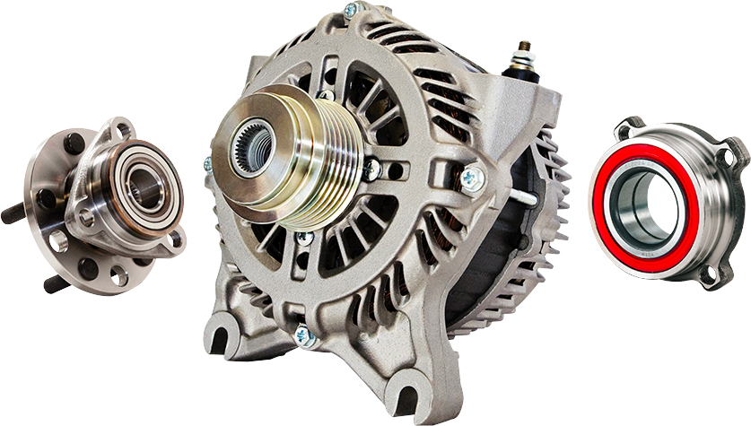
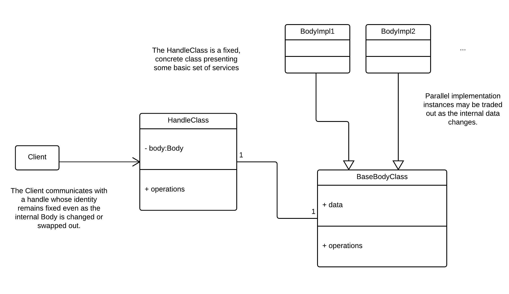
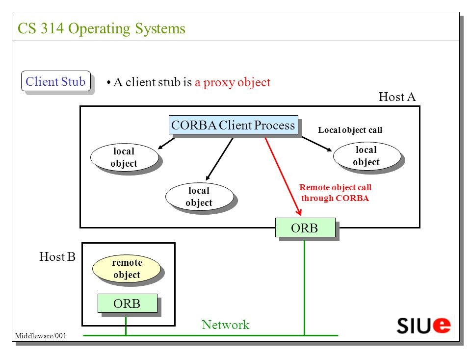
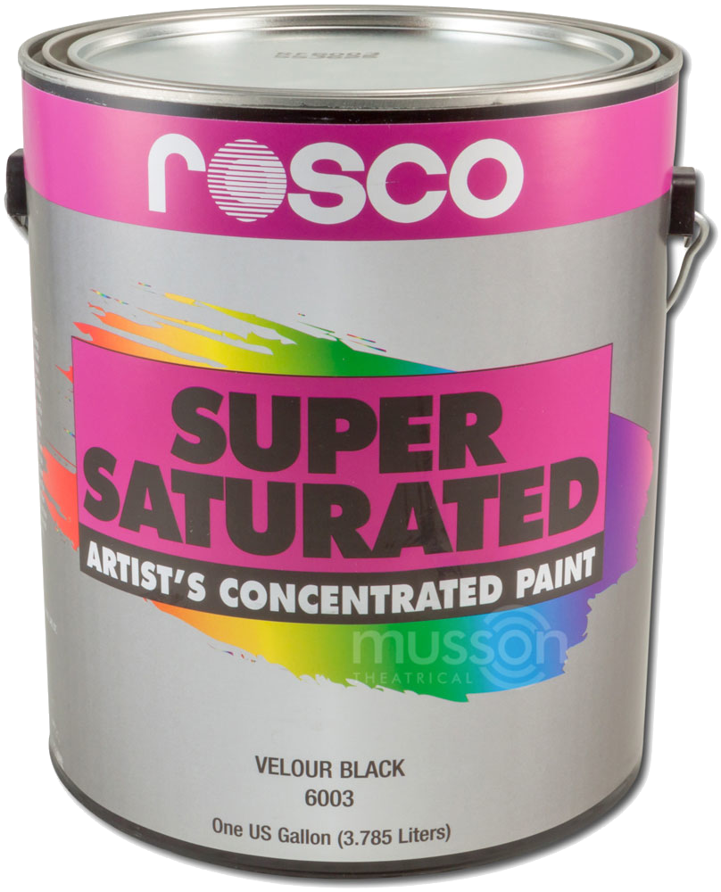
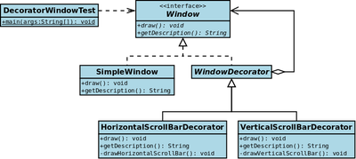

# Structure

---

### Goals

#### Discuss and implement these patterns:

1. Adapter
1. Facade
1. Composite
1. Handle-body
1. Proxy
1. Decorator
1. Flyweight

---

## Adapter

---

### [Overview](https://en.wikipedia.org/wiki/Adapter_pattern)

<figure  style='width: 35%;position:absolute; right:1rem; bottom:3rem;'>

</figure>

<div class='n-overview' style='width:85%;'>
  <div class='n-o-label'>Category</div>
  <div class='n-o-value'>Structural</div>

  <div class='n-o-label'>Problem</div>
  <div class='n-o-value'>It’s impossible (or awkward) for 2 pieces of software to interact as-is.</div>

  <div class='n-o-label'>Solution</div>
  <div class='n-o-value'>
    Convert the interface of a class into another interface clients expect. Adapter lets classes work together that couldn’t otherwise because of incompatible interfaces.
  </div>
</div>

---

### Use Case

#### External Components

<figure  style='width:25%;'>

</figure>

- (Almost) always wrap external components
- Essential for gradual refactoring
  - Legacy code consuming newer implementations
  - Newer code depending on functionality not yet migrated

---

### Scenario

#### What my code expects

```java title='ILogger.java'
interface ILogger{
   void info(String message);
   void warn(String message);
   void error(String message);
}
```

#### Interface of 3rd Party Library

```java title='ThirdPartyLogger.java'
class ThirdPartyLogger{
  public void log(Integer severity, String message){
    System.out.print("[" + severity + "] ");
    System.out.println(message);
  }
}
```

---

### Naive Implementation

```java title='AdaptedLogger.java (Naive)'
class AdaptedLogger extends ThirdPartyLogger implements ILogger{
   public void info(String message){
     this.log(1, message);
   }
   public void warn(String message){
     this.log(2, message);
   }
   public void error(String message){
     this.log(3, message);
   }
}
```

#### Watch Out!

---

### Naive Problems

- Approaches to reuse:
  1. Inheritance (subclass)
  1. Composition (containment)
- Bad adapter implementations just subclass
  - 3rd party code not completely hidden

#### Best Practice: Prefer composition to inheritance

---

### Better Implementation (C++)

```cpp title='ThirdPartyAdapter.cpp'
class ThirdPartyAdapter : Logger{
public:
  3rdPartyLogger wrapped = 3rdPartyLogger();
  void info(string message){
    wrapped.log(1, message);
  }
  void warn(string message){
    wrapped.log(2,message);
  }
  void error(string message){
    wrapped.log(3,message);
  }
}
```

---

### Better Implementation (Java)

```java title='AdaptingLogger.java'
class AdaptingLogger implements ILogger{
  private final ThirdPartyLogger wrapped;

  public AdaptingLogger(ThirdPartyLogger wrapped){
    this.wrapped=wrapped;
  }
  public void info(String message){
    this.wrapped.log(1, message);
  }
  public void warn(String message){
    this.wrapped.log(2, message);
  }
  public void error(String message){
    this.wrapped.log(3, message);
  }
}
```

```python
class AdaptingLogger(Logger):
    wrapped = None
    def __init__(self, toWrap):
        self.wrapped=toWrap

    def info(self,message):
        self.wrapped.log(1, message);

    def warn(self,message):
        self.wrapped.log(2, message);

    def error(self, message):
        self.wrapped.log(3, message);
```

---

### Take Home

- An **`Adapter`** transforms an interface
- Often used for 3rd party tools
  - Avoids cluttering-up lots of files
  - Enables easier swapping-out
- Prefer composition to inheritance

---

## Facade

---

### [Overview](https://en.wikipedia.org/wiki/Facade_pattern)

<figure  style='width:20%;'>

</figure>
<div class='n-overview' style='width:75%;'>
  <div class='n-o-label'>Category</div>
  <div class='n-o-value'>Structural</div>

  <div class='n-o-label'>Problem</div>
  <div class='n-o-value'>
    <ul>
      <li>Lots of components are hard to use</li>
      <li>External developers don’t know the details of your software</li>
    </ul>
  </div>

  <div class='n-o-label'>Solution</div>
  <div class='n-o-value'>
    Hide internal complexity behind a simplified interface
  </div>

  <div class='n-o-label'>Variation</div>
  <div class='n-o-value'>
    <a 
      href='https://docs.microsoft.com/en-us/azure/architecture/microservices/design/gateway'
      target='_blank'
    >
      API Gateway
    </a>
  </div>

</div>

---

### Facades Wrap Subsystems

<figure  style='width:80%;margin: 0 15rem 0 10rem'>

</figure>

---

### Motivation

```java title='Hardware.java'
class Memory{
  public void init(){}
  public void allocate(Integer address, int quantity){}
  public void clear(Integer address){}
}
class CPU{
  public void execute(Integer[] bits){}
  public void panic(){}
}
class Disk{
  public int[] read(Integer address){
    return new int[0];
  }
}
```

---

### Sans-Facade

```java title='HardwareClient.java'
// Client has to know about each subsystem
var memory = new Memory();
memory.init();

var disk = new Disk();
var bootstrap = this.disk.read(0);

var cpu = new CPU();
cpu.execute(bootstrap);
```

---

### Implementation...

#### Facade

```java title='Desktop.java'
class Desktop{
  private final Memory memory = new Memory();
  private final CPU cpu = new CPU();
  private final Disk disk = new Disk();

  public void start(){
    this.memory.init();
    var bootstrap = this.disk.read(0);
    this.cpu.execute(bootstrap);
  }
}
```

---

### Facade Client

```java title='DesktopClient.java'
Desktop desktop = new Desktop();
desktop.start();
```

---

### Take Home

- Distictions
  - **`Adapter`** changes an interface
  - **`Facade`** wraps-up several components / subsystems to give clients a single interface
- Facades are great for
  - Organizational boundaries
  - Rich 3rd party ecosystems

---

## Composite

---

### [Overview](https://en.wikipedia.org/wiki/Composite_pattern)

<figure  style='width:30%;position:absolute; right:1rem; bottom:3rem;'>

</figure>

<div class='n-overview' style='width:80%;'>
  <div class='n-o-label'>Category</div>
  <div class='n-o-value'>Structural</div>

  <div class='n-o-label'>Problem</div>
  <div class='n-o-value'>
    Dealing with plurality can be confusing
  </div>
  
  <div class='n-o-label'>Solution</div>
  <div class='n-o-value'>
    <ul>
      <li>Compose objects into tree structures to represent part-whole hierarchies.</li>
      <li>Composite lets clients treat individual objects and compositions of objects uniformly.</li>
    </ul>
  </div>

</div>

---

### Use Cases

<figure  style='width:50%;'>

</figure>

- Bill of Materials (BoM)
- UI Widgets
  - Stacking containers
- Org Charts
- Email distribution lists

---

### Example: Recipe

```java title='Recipe.java'
interface IIngredient{
  String getName();
  int getQuantity();
}

class Recipe{
  private final String name;
  private final String[] steps;
  private final IIngredient[] ingredients;
  // ...
}
```

---

### Simple Ingredient

```java title='WholeIngredient.java'
class WholeIngredient implements IIngredient{
  public WholeIngredient(String name, int quantity){
    this.name=name;
    this.quantity=quantity;
  }
  public String getName(){
    return this.name;
  }
  public int getQuantity(){
    return this.quantity;
  }
  private final String name;
  private final int quantity;
}
```

---

### Implementation

```java title='PreparedIngredient.java'
class PreparedIngredient implements IIngredient{
  public PreparedIngredient(String name, int quantity, List<IIngredient> constituents){
    this.name=name;
    this.quantity=quantity;
    this.constituents=constituents;
  }
  private final String name;
  private final int quantity;
  private final List<IIngredient> constituents;

  public String getName(){
    return this.name;
  }
  public int getQuantity(){
    return this.quantity;
  }
}
```

---

### Implementation...

```java
public static IIngredient getNoodle(){
  var constituents = new ArrayList<IIngredient>();
  constituents.add(new WholeIngredient("wheat", 7));
  constituents.add(new WholeIngredient("salt", 3));
  return new PreparedIngredient("noodle", 4, constituents);
}

public static IIngredient getWater(){
  return new WholeIngredient("water", 9);
}
```

---

### Lab

- Open up labs\composite
- Make it not suck

---

## Bridge / Handle-Body

---

### [Overview](https://en.wikipedia.org/wiki/Bridge_pattern)

<figure  style='width:45%;position:absolute; right:1rem;bottom:3rem;'>

</figure>

<div class='n-overview' style='width:80%;'>
  <div class='n-o-label'>Category</div>
  <div class='n-o-value'>Structural</div>

  <div class='n-o-label'>Problem</div>
  <div class='n-o-value'>
    <ul>
      <li>Abstraction has different implementations.</li>
      <li>OR Implementation is a moving target.</li>
    </ul>
  </div>
  
  <div class='n-o-label'>Solution</div>
  <div class='n-o-value'>
    <ul>
      <li>Build separate class hierarchies for abstraction and implementation.</li>
    </ul>
  </div>
</div>

---

### Bridge

#### GoF says:

> Decouple an abstraction from its implementation so the two
> can vary independently.

---

### Terminology

- **Bridge** makes sense in terms of org boundries
  - e.g. Working with code from the Engineering team
- **Handle-body** makes more sense when managing abstractions

---

### Bridge Recipe

- Wrap a changeable type in a fixed outer shell
  - Provides a fixed interface for clients
  - Delegates to some internal object whose identity may actually change dynamically at runtime

---

### Example: String

<figure  style='width:50%;'>

</figure>

#### Old-school C++ strings

- Wrapper around a `StringImpl` class
- Dynamically created with `new` as the string contents changed

---

### Example: ECommerce

```java
// This is the service, developed by the Services team
// It changes based on their workload and management priorities
interface IOrderService{
  Order getOrder(Integer id);
  Order[] getOrders(Integer count, Field sortBy);
}

// This is a bridge, developed and used by the UI team
// It changes based on the needs of us UI folks
interface IOrderBridge{
  Order getOrder(Integer id);
  Order[] getOrders(Integer count, Field sortBy);
  Order[] getOrders(Integer[] ids);
}
```

---

### Bridge Implementation

```java
class OrderBridge implements IOrderBridge{
  private final IOrderService service;
  public OrderBridge(IOrderService service){
    this.service = service;
  }

  public Order getOrder(Integer id){
    return service.getOrder(id);
  }

  public Order[] getOrders(Integer[] ids){
    // TODO: This is just a stub. At some point, they'll add
    //       the functionalty to the service layer.
    var orders = new Order[ids.size()];
    for(Integer i = 0; i< ids.size(); i++){
      orders[i] = getOrder(ids[i]);
    }
    return orders;
  }
  // ...
}
```

---

### Advantage: Extensibility

- **Handle-Body** idiom makes interfaces more extensible
- **Handle** guarantees minimum functionality
- **Body** may be modified dynamically
- Useful when sharing large components across
  - Module boundaries
  - Organizational boundaries

---

### Interactions

- The Handle-Body idiom shields external clients from
  - Complex identity changes
  - Dynamic behavior
- Often used when implementing
  - Utility classes
  - State Pattern
- Prefer an [adapter](https://en.wikipedia.org/wiki/Adapter_pattern) when:
  - The target isn’t moving
  - The interface is opaque

---

### Bridge Benefits

- Writing class instances that may internally delegate to very different object types
- When writing a long-lived library that will be subject to ongoing refactoring
- When protecting data shared across module boundaries
- Handle-Body systems support Copy-On-Write, which can improve efficiency of operations against large data objects

---

### Contraindications

#### Biggest hassle: Double the number of classes

- Which means
  - Boilerplate code
  - Less habitability

---

## Proxy

---

### [Overview](https://en.wikipedia.org/wiki/Proxy_pattern)

<figure  style='width:15%;position:absolute; right:1rem; bottom:2.5rem;'>

</figure>
<figure  style='width:15%;position:absolute; right:8rem; bottom:2.5rem;filter:grayscale(90%);'>

</figure>

<div class='n-overview' style='width:80%;'>
  <div class='n-o-label'>Category</div>
  <div class='n-o-value'>Structural</div>

  <div class='n-o-label'>Problem</div>
  <div class='n-o-value'>
    <ul>
      <li>There are some special rules for creating / accessing some resource.</li>
      <li>Consumers mest remain ignorant about the details.</li>
    </ul>  
  </div>
  
  <div class='n-o-label'>Solution</div>
  <div class='n-o-value'>
    <ul>
      <li>Provide a surrogate or placeholder for another object to control access to it.</li>
    </ul>
  </div>
</div>

---

### More Wrapping

- **Proxy** stands in for another object
  - Might be remote
  - Or not yet instantiated
- Serves as a target for calls against some other object

---

### Use Cases

1. **Remote proxy** to represent out-of-process functionality
1. **Virtual proxy** to amortize startup costs
1. **Authentication proxy** to control access
1. **Smart reference** to avoid bare pointers

---

### Proxy History

<figure  style='width:50%;'>

</figure>

- [Network transparency](https://en.wikipedia.org/wiki/Network_transparency) used to be a thing
- Big deal in the 1990s and early 2000s for distributed operations.
- Less important now--
  - You can't ignore the network
  - Clients became more willing to accept networked operations

---

### Motivation

```java
interface IEnfarculator{
  void enfarculate();
}

class Enfarculator implements IEnfarculator{
  public void enfarculate(){}
  public Enfarculator(){
    //Expensive setup.
  }
}
```

---

### Implementation...

```java
class LazyEnfarculator implements IEnfarculator{
  private final IEnfarculator target;

  public void enfarculate(){
    if(this.target == null){
      this.target=new Enfarculator();
    }
    this.target.enfarculate();
  }
  public LazyEnfarculator(IEnfarculator target){
    //cheap setup.
    this.target = target;
  }
}
```

---

### Take Home

- A **`Proxy`** is a thing that stands in for something else
- Protects clients from certain implementation details
- Use cases:
  - Remote resources
  - Authentication
  - Lazy-loading
- **But remember** that sometimes clients have to care about the details

---

## Decorator

---

### [Overview](https://en.wikipedia.org/wiki/Decorator_pattern)

<figure  style='width:10vw;position:absolute; right:1rem;bottom:3rem;'>

</figure>

<div class='n-overview' style='width:80%;'>
  <div class='n-o-label'>Category</div>
  <div class='n-o-value'>Structural</div>

  <div class='n-o-label'>Problem</div>
  <div class='n-o-value'>
    <ul>
      <li>Add responsibilities dynamically</li>
      <li>Avoid the God class</li>
      <li>Avoid inheritance</li>
    </ul>
  </div>
  
  <div class='n-o-label'>Solution</div>
  <div class='n-o-value'>
    <ul>
      <li>Wrap a component</li>
      <li>Defer to the core behavior</li>
      <li>Specialize as necessary</li>
    </ul>
  </div>
</div>

---

### More Wrapping

<figure class='bc-framed-image' style='margin-left:3rem;'>

</figure>

> So many different flows  
> This one for this song  
> -- Jay Z

<br/>

- **Wrapper** is a common term
- But it's not very specific

---

### Example: Windows

- Clients use an interface called **Window**
- Derived types add behavior for:
  - Horizontal scrolling
  - Vertical scrolling
- Now I want to add border functionality

---

### Solution: Decorator

<figure  style='width:80%; margin: 0 10rem 0 10rem;'>

</figure>

---

### Motivation

```java
interface IWindow{
  void draw();
}

class Window implements IWindow{
  public void draw(){
    System.out.println("Drawing window");
  }
}
```

---

### Base Implementation

```java
// Base decorator class that defers everything
//   to its target
class WindowDecorator implements IWindow{
  protected final IWindow decorated;

  public WindowDecorator(IWindow decorated){
    this.decorated=decorated;
  }

  public void draw(){
    this.decorated.draw();
  }
}
```

---

### Specialization

```java
class ScrollingWindow extends WindowDecorator{
  @Override
  public void draw(){
    System.out.println("Draw scroll bars");
    this.decorated.draw();
    System.out.println("Subscribe to click events");
  }
}
class ResizableWindow extends WindowDecorator{
  @Override
  public void draw(){
    System.out.println("Draw resizing handle");
    this.decorated.draw();
    System.out.println("Subscribe to click events");
  }
}
```

---

### Usage

```java
class App {

  public static void main(String[] args) {
    System.out.println("Decorator:\n");

    var window = new Window();
    window.draw(); // Vanilla functionality

    window = new ScrollingWindow(window);
    window.draw(); // Scrollable

    window = new ResizableWindow(window);
    window.draw(); // Resizable + Scrollable

  }
}
```

---

### Use Cases

- Use a Decorator to:
  - Attach additional responsibilities
  - Avoid subclassing
- Java Examples
  - [`InputStream`](https://docs.oracle.com/javase/8/docs/api/java/io/InputStream.html)
  - [`OutputStream`](https://docs.oracle.com/javase/8/docs/api/java/io/OutputStream.html)
  - [`Reader`](https://docs.oracle.com/javase/8/docs/api/java/io/Reader.html)
  - [`Writer`](https://docs.oracle.com/javase/8/docs/api/java/io/Writer.html)

---

### Complaints

#### Kind of sleazy

- No coordination between layers
  - e.g. Scrollbars, Tile controls, etc.
- Often higher level abstraction is available or required

---

## Flyweight

#### (Optional)

---

### [Overview](https://en.wikipedia.org/wiki/Flyweight_pattern)

<figure  style='width:25%;position:absolute; right:1rem;bottom:2.5rem;'>

</figure>

<div class='n-overview' style='width:80%;'>
  <div class='n-o-label'>Category</div>
  <div class='n-o-value'>Structural</div>

  <div class='n-o-label'>Problem</div>
  <div class='n-o-value'>
    <ul>
      <li>Large numbers of objects should be supported efficiently</li>
      <li>Creating large numbers of objects should be avoided</li>
    </ul>
  </div>
  
  <div class='n-o-label'>Solution</div>
  <div class='n-o-value'>
    <ul>
      <li>Share immutable state</li>
      <li>Allocate once</li>
    </ul>
  </div>

</div>

---

### Examples

- [Strings](https://en.wikipedia.org/wiki/String_interning)
- [Game stuff](https://refactoring.guru/design-patterns/flyweight)
  - [Sprites](https://www.devmaking.com/learn/design-patterns/flyweight-pattern/)
  - Textures

<figure  style='width:10%;position:absolute; right:1rem;bottom:2.5rem;transform:scaleX(-1);'>

</figure>

---

### Implementation

```java
interface ISprite{
  void kick();
  void punch();
  void block();
}

class LuKang implements ISprite{
  public void kick(){};
  public void punch(){};
  public void block(){};
}
```

---

### Implementation...

```java
class SpriteFactory{
  Map<String, ISprite> sprites = new HashMap<String, ISprite>();

  private ISprite build(String name){
    switch (name){
      case "LuKang":
        return new LuKang();
    }
    throw new Exception("Unknown sprite");
  }
  public ISprite getSprite(String name){
    if (!this.sprites.containsKey(name)){
      this.sprites.put(name, this.build(name));
    }
    return this.sprites.get(name);
  }
```
