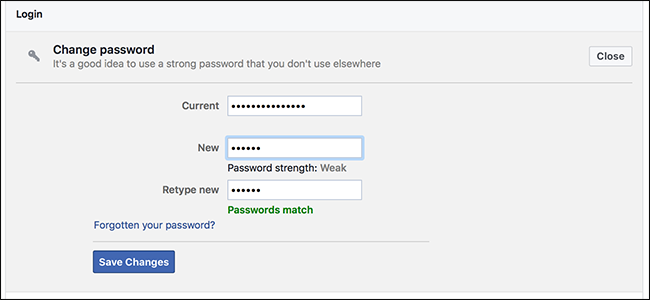
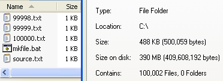
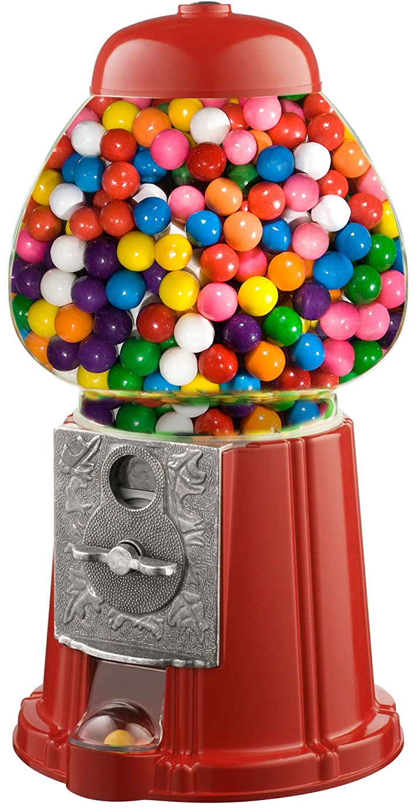
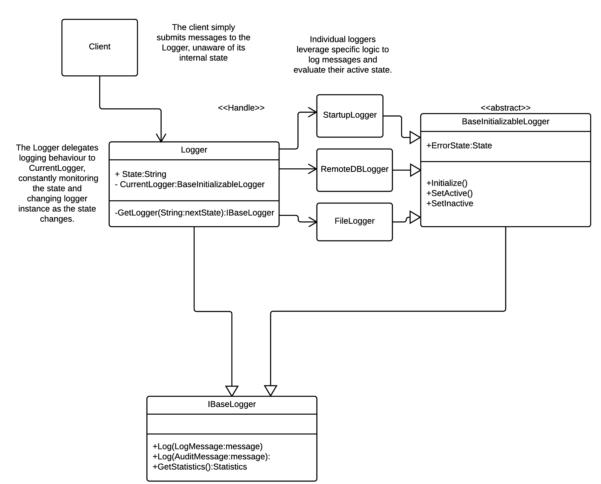

# Behavior

---

### Goals

#### Describe and implement:

- Observer
- Visitor
- Strategy
- State

---

## Overview

---

### Behavioral Patterns

- Represent the _actual_ work of an application.
- This category includes such things as
  - Iterators
  - Delegation
  - Algorithm chaining

---

### Structure > Behavior

> In many respects, modern software engineering practice
> involves downgrading behaviour in favor of structure

- Aka [Defunctionalization](http://www.pathsensitive.com/2019/07/the-best-refactoring-youve-never-heard.html)
- People make far more mistakes managing behavior than they do managing structure.
- Compilers help too

---

### The Long List

#### The remaining GoF behavioral patterns are:

- [Chain of Responsibility](https://en.wikipedia.org/wiki/Chain-of-responsibility_pattern)
- [Interpreter](https://en.wikipedia.org/wiki/Interpreter_pattern)
- [Mediator](https://en.wikipedia.org/wiki/Mediator_pattern)
- [Memento](https://en.wikipedia.org/wiki/Memento_pattern)

---

## Observer

---

### [Overview](https://en.wikipedia.org/wiki/Observer_pattern)

<figure  style='width:20%;position:absolute; right:0; bottom:2.5rem;'>

</figure>

<div class='n-overview' style='width:85%;'>
  <div class='n-o-label'>Category</div>
  <div class='n-o-value'>Behavioral</div>

  <div class='n-o-label'>Related to</div>
  <div class='n-o-value'>Observable</div>

  <div class='n-o-label'>Problem</div>
  <div class='n-o-value'>
    <ul>
      <li>Several components need to know about important state updates</li>
      <li>You don’t want to increase coupling</li>
    </ul>
  </div>

  <div class='n-o-label'>Solution</div>
  <div class='n-o-value'>
    <ul>
      <li>Set up a publish/subscribe mechanism</li>
      <li>Notify interested parties on state change</li>
    </ul>
  </div>
</div>

---

### Example: UI

#### Everone listens to the password box

<figure  style='width:70%; margin:1rem 15rem 0 15rem'>

</figure>

---

### Example: Commands

<figure  style='width:50%;'>

</figure>

- Key players:
  - **Observer** recieves a registered `Command`
  - **Subject** represents the state to be shared

---

---

### Interfaces

```python
class Event:
    def __init__(self):
        self.observers = []

    def subscribe(self, observer):
        self.observers.append(observer)

    def fire(self, data):
        [o.notify(self) for o in self.observers]
```

```java
interface IObserver<Tstate> {
  void update(Tstate state);
}

interface IPublisher<T>{ // OR ISubject<T>
  void register(IObserver<T> o);
  void unregister( IObserver<T> o);
  void publishUpdate(T newValue);
}
```

---

### Implementation

```java
class PasswordPublisher implements IPublisher<string> {
  private List<IObserver<string>> observers;

  public void register(Observer<string> o){
    this.observers.add(o);
  }

  public void unregister(Observer<string> o){
    this.observers.remove(o);
  }

  public void publishUpdate(string password){
    for(int i=0;i<observers.size();i++){
      observers.get(i).update(password);
    }
  }
}
```

---

### Real Life Observers

- Don't roll your own observer implementation
- Instead use:
  - Built-in events
  - Libraries
    - [Flow](https://docs.oracle.com/en/java/javase/11/docs/api/java.base/java/util/concurrent/Flow.html)
  - [ReactiveX](http://reactivex.io/)

---

### Complications

- Can be fraught
- Be careful with
  - Lifecycle management
  - Backpressure
  - Exception handling
- This pattern is critical to real time and UI systems

---

### Lab: Observable

1. Open up labs\observer
1. Make it not suck

---

## Visitor

---

### [Overview](https://en.wikipedia.org/wiki/Visitor_pattern)

<figure  style='width:15%;position:absolute; right:0; bottom:2.5rem;'>

</figure>

<div class='n-overview' style='width:85%;'>
  <div class='n-o-label'>Category</div>
  <div class='n-o-value'>Behavioral</div>

  <div class='n-o-label'>Problem</div>
  <div class='n-o-value'>
    <ul>
      <li>You want to treat objects in a data structure differently based on their concrete type</li>
      <li>You don’t want to augment the types themselves</li>
    </ul>
  </div>

  <div class='n-o-label'>Solution</div>
  <div class='n-o-value'>
    <ul>
      <li>Extract the operations to be performed into a type.</li>
      <li>Rely on dispatch to call the appropriate method.</li>
    </ul>
  </div>
</div>

---

### From the Bible

#### GoF says

> Represent an operation to be performed on elements of an object
> structure. Visitor lets you define a new operation without changing
> the classes of the elements on which it operates.

#### Best discussion

- Eric Lippert - [Wizards and Warriors](https://ericlippert.com/2015/04/27/wizards-and-warriors-part-one/)

---

### Issue#1: Navigating Hierarchies

<figure  style='width:55%'>

</figure>

- Example: File system
- Existing Operation:
  - `getSize`
- New operations:
  - `getSizeOnDisk`

---

### Issue#2: Clean Dispatch

- Type checking is
  - Usually a bad idea
  - Sometimes impossible to avoid
- Alternative technique: Generic visit method for dispatch

---

### Example: Cars

- Add functionality to format a car as
  - html
  - json
- Be SOLID

```java
class Engine extends CarPart{
  public final Piston[] pistons = {
    new Piston("Rosetti"),
    new Piston("Rosetti"),
    new Piston("Famton"),
    new Piston("Famton"),
  };

  public Engine(){
    super("Custom");
  }
}
```

---

### Naive Approach

```java
class CarPrinter{
  public void print(CarPart part){
    if(part instanceof Car){
      this.printCar((Car)part);
    }
    if(part instanceof Engine){
      this.printEngine((Engine) part);
    }
    ///...
  }
}
```

---

### Better

#### Visitor

```java
interface ICarPartVisitor {
    void visit(Body body);
    void visit(Car car);
    void visit(Engine engine);
    void visit(Wheel wheel);
}
```

#### Hierarchy Base

```java
abstract class CarPart {
  public abstract void accept(ICarPartVisitor visitor);
  // ...
}
```

---

### Example (Cont.)

#### Hierarchy Member

```java
class Wheel extends CarPart {
  public void accept(ICarPartVisitor visitor) {
      visitor.visit(this);
  }
}
```

---

### Example (Cont.)

#### Visitor

```java
class Wheel extends CarPart {
  public void accept(ICarPartVisitor visitor) {
      visitor.visit(this);
  }
}
```

---

### Lab

1. Open up labs\visitor
1. Make it not suck

---

## Strategy

---

### [Overview](https://en.wikipedia.org/wiki/Strategy_pattern)

<figure  style='width:35%;position:absolute; right:0; bottom:2.5rem;'>

</figure>

<div class='n-overview' style='width:85%;'>
  <div class='n-o-label'>Category</div>
  <div class='n-o-value'>Behavioral</div>

  <div class='n-o-label'>Problem</div>
  <div class='n-o-value'>
    <p>I want to loosely couple an algorithm to its consumption.</p>
  </div>

  <div class='n-o-label'>Solution</div>
  <div class='n-o-value'>
    <ul>
      <li>Define a family of algorithms.</li>
      <li>Encapsulate each one.</li>
      <li>Conform to a common interface.</li>
    </ul>
  </div>
</div>

---

### Details

- Structurally simple
- Each implementation represents a specific choice
- Often each strategy is a Singleton-- at least logically

---

### Benefits

> The strategy system provides a nice way of trying out alternate algorithms
> one at a time.

#### Examples:

- Write-first vs Fire-and-forget logging schemes
- Sort algorithms for differently-sized collections

#### Alternatives:

- Higher order functions

---

### Implementation

#### Interface

```java
interface ISortStrategy{
  void sort(int[] xs);
}
```

#### Consumption

```java
public static void print(int[] xs, ISortStrategy strategy){
  strategy.sort(xs);
  for(int x : xs){
    System.out.println(x);
  }
}
```

---

### HoF Alternative

```java
import java.util.function.Consumer;

public static void print(int[] xs, Consumer<int[]> sorter){
  sorter.accept(xs);
  for(int x : xs){
    System.out.println(x);
  }
}
```

---

### In the Wild

- Angular Material [Overlay](https://material.angular.io/cdk/overlay/overview) component
  - [PositionStrategy](https://material.angular.io/cdk/overlay/api#PositionStrategy)
  - [ScrollStrategy](https://material.angular.io/cdk/overlay/api#ScrollStrategy)
- Java
  - [Deflater](https://docs.oracle.com/javase/8/docs/api/java/util/zip/Deflater.html)
  - [Collator](https://docs.oracle.com/javase/8/docs/api/java/text/Collator.html)
  - _Lots_ of examples in `java.awt.**`

---

### Lab

1. Open up labs\strategy
1. Make it not suck

---

## State

---

### [Overview](https://en.wikipedia.org/wiki/State_pattern)

<figure  style='width:20%;position:absolute; right:1rem; bottom:2.5rem;'>

</figure>

<div class='n-overview' style='width:80%;'>
  <div class='n-o-label'>Category</div>
  <div class='n-o-value'>Lorem</div>

  <div class='n-o-label'>Problem</div>
  <div class='n-o-value'>
    <ul>
      <li>Behavior changes when state changes.</li>
      <li>State changes need protection.</li>
    </ul>    
  </div>
  
  <div class='n-o-label'>Solution</div>
  <div class='n-o-value'>
    <ul>
      <li>Define a state abstraction</li>
      <li>Implement the abstraction for each possible state</li>
    </ul>
  </div>
</div>

---

### GoF Definition:

> Allow an object to alter its behavior when its internal state changes.

---

### Overview

- Behavior changes based on environment
- Useful for protecting state transitions
- Common implementation details:
  - Handle-Body system
  - Clients pass requests to the Handle
  - Handle delegates execution to the active Body instance

---

### Example

#### Gumball machine

<figure  style='width:20%;'>

</figure>

- States:

  - Empty
  - QuarterInserted

- Operations:
  - Insert quarter
  - Eject quarter
  - Dispense gumball

---

### Naive Approach

```python
class Status(Enum):
   Empty = 1
   QuarterInserted = 2

def turnCrank(self):
   if self.status == Status.Empty:
      return
   #Do crank stuff here
   self.status = Status.Empty

def ejectQuarter(self):
   if self.status == Status.Empty:
      return
   #Do Ejection stuff here
   self.status = Status.Empty

```

```java
enum Status{
  Empty,
  QuarterInserted,
  Dispensing
}

interface IGumballMachine{
  void turnCrank();
  void ejectQuarter();
  void insertQuarter();
  Status getStatus();
}
```

---

### Example...

```java
class GumballMachine{
  public Status status = Status.Empty;

  public void turnCrank(){

    if(this.status != Status.QuarterInserted){
      return;
    }
    this.status = Status.Dispensing;
    // Do dispense here
    this.status = Status.Empty;
  }

  public void ejectQuarter(){
    if(this.status != Status.QuarterInserted){
      return;
    }
    this.status = Status.Empty;
  }
}
```

---

### Better

```java
class GumMachine{
  public GumState state = GumState.empty;

  public void turnCrank(){
    this.state = this.state.next(GumState.dispensing);
    //Do dispense here
    this.state = this.state.next(GumState.empty);
  }

  public void ejectQuarter(){
    this.state = this.state.next(GumState.empty);
  }
}
```

---

### Implementation

```java
abstract class GumState{
  public abstract GumState toNext(GumState target) throws Exception;
  public static final GumState empty=new Empty();
  public static final GumState dispensing = new Dispensing();
  public static final GumState quarterInserted = new QuarterInserted();
}

class Empty extends GumState{
  public GumState toNext(GumState target) throws Exception{
    if(target != GumState.quarterInserted){
      throw new Exception("Bogus transition");
    }
    return target;
  }
}
```

---

### Example: Watchdog Service

- **Service monitor** gets heartbeat messages from a source service
- Normally, the watchdog just validates the heartbeet
- If the heartbeat vanishes
  - Recycle the target service
  - Email the operations team
  - Retry until heartbeat comes back

---

### Example: Logging System

- High security systems need lots of logging
- One option is to use three states:
  - **Local Logging** for startup, shutdown, and times when external logging fails
  - **Error logging** for immediate writes
  - **Steady State logging** in which state log entries are aggregated together and logged en masse

---

### Implementation

<figure  style='width:55%; margin: -1rem 15rem 0 15rem'>

</figure>

---

### Selling Points

- Most applicable when some clear cut, external state is active.
- Ensure proper state transitions
- Good examples:
  - Startup and shutdown behavior
  - Network access
- Bad examples
  - State system based upon stock market changes

---

### Lab

1. Open up labs\state
1. Make it not suck
