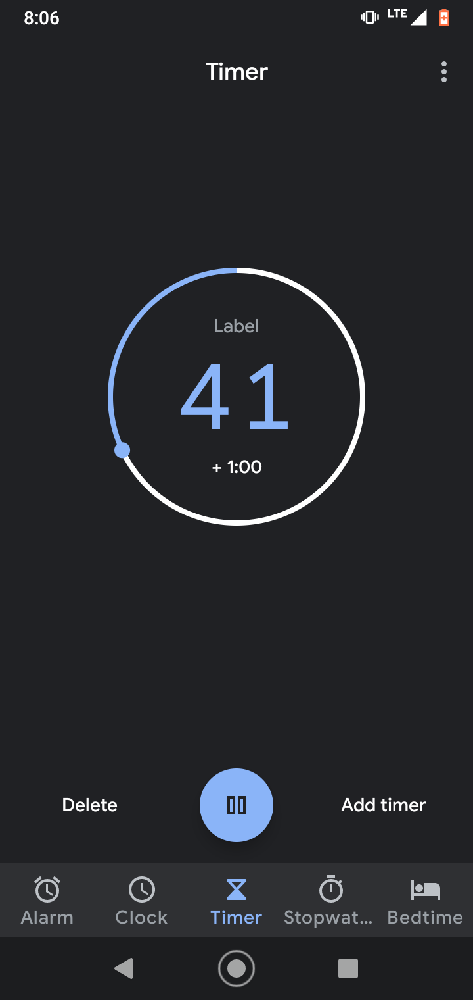

# More Behavior

---

### Goals

#### Describe and implement:

- Iterator
- Command
- Template Method

---

## Iterator

---

### [Overview](https://en.wikipedia.org/wiki/Iterator_pattern)

<figure  style='width:20%;position:absolute; right:0; bottom:2.5rem;'>

</figure>

<div class='n-overview' style='width:85%;'>
  <div class='n-o-label'>Category</div>
  <div class='n-o-value'>Behavioral</div>

  <div class='n-o-label'>Related to</div>
  <div class='n-o-value'>Observable</div>

  <div class='n-o-label'>Problem</div>
  <div class='n-o-value'>
    <ul>
      <li>You need to traverse a sequence of items</li>
      <li>You don't care about the storage mechanism</li>
    </ul>
  </div>

  <div class='n-o-label'>Solution</div>
  <div class='n-o-value'>
    <ul>
      <li>Define an abstraction for traversing a data structure</li>
      <li>Clients use the iterator; not the structure itself</li>
    </ul>
  </div>
</div>

---

### Motivation

- Collections
  - Can't represent infinite sequences
  - Can be wasteful
- Clients
  - Just want a sequence
  - Don't care about memory layout, etc

```java
var repo = new AccountRepository();
var accounts = repo.getAccounts();

for(int i =0; i< 3; i++){
  System.out.println(accounts[i].givenName);
}
```

---

### Iterator

> In object-oriented programming, the **iterator** pattern is a design pattern in
> which an iterator is used to traverse a container and access the container's elements.

- In practice, **Iteration is:**
  - Sequential
  - Pull-based
  - Not indexed
  - Not seekable
  - Not reversable
  - Read-only

---

### UML

<figure  style='width:75%;margin-right:5rem;'>

</figure>

---

### Example: Interface

#### Java-flavored

```java
interface Iterator<E> {
    E next();
    boolean hasNext();
}
```

#### Variation

```java
interface IIterator<T> {
    void next();
    boolean hasNext();
    T getItem();
}
```

---

### Example: Implementation

```java
class ArrayIterator<T> implements Iterator<T>{
  private final T[] contents;
  private int position =-1;

  public ArrayIterator(T[] contents){
    this.contents = contents;
  }

  public T next(){
    this.position++;
    return this.contents[this.position];
  }

  public boolean hasNext(){
    return this.contents.length > 0 &&
           this.contents.length > this.position;
  }
}
```

---

### Example: Consumption

```java
class Main{

  public static void main(){
    Integer[] fibs = [1, 1, 2, 3, 5];
    var iterator = new ArrayIterator<Integer>(fibs);
    printNumbers(iterator);
  }

  // Notice: this function doesn't care about the storage
  //    mechanism-- all it wants is a way to navigate a sequence
  public static void printNumbers(Iterator<Integer> iterator){
    while(iterator.hasNext()){
      System.out.println(iterator.next());
    }
  }

}
```

---

### Java's [Iterator](https://docs.oracle.com/javase/8/docs/api/java/util/Iterator.html)

#### Don't Roll Your Own

- `boolean	hasNext()`
  - Returns true if the iteration has more elements.
- `E	next()`
  -Returns the next element in the iteration.
- `default void	remove()`

---

### [`Iterable`](https://docs.oracle.com/javase/8/docs/api/java/lang/Iterable.html)

- **`Iterable<T>`** is anything that can give you an **`Iterator<T>`**
- _Implementing this interface allows an object to be the target of the "for-each loop" statement._

---

### Iterator Magic

- Standard collections are all `Iterable`

```java

Integer[] xs = {8,11,298,0};
for(var x : xs){
  System.out.println("x: " + x);
}

List<Integer> ys = Arrays.asList(xs);
for(var y : ys){
  System.out.println("y: " + y);
}

```

---

### Custom, Infinite Iterator

```java
class Odds implements Iterator<Integer>, Iterable<Integer>{
  private Integer next = 1;
  public boolean hasNext(){
    return true;
  }
  public Integer next(){
    var current = next;
    next += 2;
    return current;
  }
  public Iterator<Integer> iterator(){
    return this;
  }
}
```

---

### Selling Points

- Don't care about the memory layout
- Enables FP goodness
- Kick out early
- Deep math stuff
  - Compliment of Observable

---

### Lab

1. Open up Iterator
1. Make it not suck

---

## Command

---

### [Overview](https://en.wikipedia.org/wiki/Command_pattern)

<figure  style='width:15%;position:absolute; right:0; bottom:2.5rem;'>

</figure>

<div class='n-overview' style='width:85%;'>
  <div class='n-o-label'>Category</div>
  <div class='n-o-value'>Behavioral</div>

  <div class='n-o-label'>Problem</div>
  <div class='n-o-value'>
    <ul>
      <li>Initiating a request tightly coupled it its fulfillment.</li>
      <li>You want a history of actions</li>
      <li>Other components want to know</li>
    </ul>
  </div>

  <div class='n-o-label'>Solution</div>
  <div class='n-o-value'>
    <ul>
      <li>Create an abstraction to represent the action</li>
    </ul>
  </div>
</div>

---

### Use Cases

- Undo / Redo
- Telemetry & Logging
- Redux-style Architecture

---

### Case Study: Timer

<figure  style='width:20%;padding-right:6rem;'>

</figure>

<figure  style='width:20%;padding-right:6rem;'>

</figure>

<figure  style='width:20%; padding-right:6rem;'>

</figure>

---

### Timer Capabilites

1. **Start** (When not started or expired)
1. **Pause** (When running)
1. **Stop** (When expired)
1. **Reset** (When paused)
1. **Delete**

---

### Naive Solution

```java
class EmployeeForm{
  private EmployeeRepository repo;

  void handlePromotionClick(int userID){
    var user = this.repo.get(userID);
    user.salary = user.salary * 1.1;
    this.repo.save(user);
  }
}
```

---

### Better

```java
class UserCommand{
  public int userID;
}

class Promote extends UserCommand{
  public int salaryBump;
}

class UserService{
  public void execute(UserCommand command){
    //...
  }
}
```

---

### Naive Solution to Timer

```java
class TimerForm{
  private TimerController controller;

  void handlePauseClick(Object args){
    this.controler.doPause();
    this.resetButton.enabled = true;
    this.resetButton.visible = true;

    this.digitView.blinking = true;

    this.toggleButton.mode = PlayMode.Paused;
  }
}
```

---

### Comands for Timer

```java
class TimerCommand{
  public int timerID;
}

class Start extends TimerCommand{}
class Pause extends TimerCommand{}
class Stop extends TimerCommand{}
class Reset extends TimerCommand{}
class Delete extends TimerCommand{}


```

---

### Command Dispatch

```java

class TimerForm{
  private TimerController controller;

  void handlePauseClick(Object args){
    this.controler.dispatch(new Pause());
  }
}


```

---

### Controller

```java
class TimerController{

  public void dispatch(TimerCommand command){
    if(command instanceof Start){
      // ...
      return;
    }

    if(command instanceof Pause){
      // ...
      return;
    }
    // ...
  }
}


```

---

### In the Wild

<figure  style='width:75%;margin-right:10rem;'>

</figure>

---

## Template Method

---

### [Template Method](https://en.wikipedia.org/wiki/Template_method_pattern)

<figure  style='width:15%;position:absolute; right:0; bottom:2.5rem;'>

</figure>

<div class='n-overview' style='width:85%;'>
  <div class='n-o-label'>Category</div>
  <div class='n-o-value'>Behavioral</div>

  <div class='n-o-label'>Also known as</div>
  <div class='n-o-value'>Hole in the middle.</div>

  <div class='n-o-label'>Problem</div>
  <div class='n-o-value'>
    <p>Doing the same thing with slight variations creates a lot of code that’s almost identical.</p>
  </div>

  <div class='n-o-label'>Solution</div>
  <div class='n-o-value'>
    <ul>
      <li>Define the skeleton of an algorithm in an operation.</li>
      <li>Deferring some steps to subclasses.</li>
    </ul>
  </div>
</div>

---

### Duplication is Evil

<figure  style='width:35%;'>

</figure>

- Acronym: Don’t Repeat Yourself
- Comes in many forms
- Evil because:
  - Hurts readability
  - Fixing it in two different places
  - **Getting it right** in two different places

---

### Implementation Notes

- Base Class implements
  - Default concrete method
  - OR placeholder
- Subclasses--
  - Override for specific behavior
  - OR skip default behavior with
    - Empty implementation
    - OR `throw new NotImplementedException()`

---

### Dumbest Possible Example

#### Base Class

```java
public abstract class ImportantOperation{
  protected virtual void executeInternal();

  public final void execute(){
    setupState();
    try{
      // Run the 'hole in the middle'
      this.executeInternal();
    }
    catch{
      /* Log or something */
    }
    finally{
      teardownState();
    }
  }
}
```

---

### Derived

```java
class ImportantFileOperation extends ImportantOperation{
  protected override void executeInternal(){
    // Do file stuff here, knowing things get
    //   cleaned up correctly.
  }
}
```

```java
class ImportantNetworkOperation extends ImportantOperation{
  protected override void executeInternal(){
    // Do network stuff here, knowing things get
    //   cleaned up correctly.
  }
}
```

---

### Details

- Break down a high level operation
  - Steps implemented by derived classes-- optionally
- Example: Old-School ASP [Page](https://docs.microsoft.com/en-us/dotnet/api/system.web.ui.page?view=netframework-4.8)
  - `OnPreInit`
  - `OnInit`
  - `OnInitComplete`
  - `OnPreRender`
  - `Render`
  - Etc...

---

### Custom Logging [Page](https://docs.microsoft.com/en-us/dotnet/api/system.web.ui.page?view=netframework-4.8)

```java
public LoggingPage : Page{
  public override void OnPreInit(EventArgs e){
    System.Console.WriteLine("Doing PreInit");
    base.OnPreInit(e);
  }
  public override void OnInit(EventArgs e){
    System.Console.WriteLine("Doing Init");
    base.OnInit(e);
  }
  // Etc...
}
```

---

### Example: Transaction

#### Sales Workflow

1. **Validate:** Ensure the seller has stock to sell, the buyer has funds
1. **Prepare:** Reserve stock and funds
1. **Commit:** Exchange stock and funds
1. **Rollback:** Reverse operation in case of problems

---

### Implementation: Client

```java
class SaleManager{
  // Pretend this gets injected or something
  private final SalesTransation tran = new EquitySalesTransaction();

  public bool doSale(){
    if(!tran.Validate()){
        return false;
    }
    try {
        tran.Prepare();
        tran.Commit();
        return true;
    }
    catch(Exception exc){
        // log, etc
        tran.Rollback();
        return false;
    }
  }
}
```

---

### Implementation: Base Class

```java
abstract class SalesTransaction{
  public abstract boolean validate();
  public abstract void prepare();
  public abstract void commit();
  public abstract void rollback()
}
```

#### Variation:

Instead of abstract methods, these could provide a default
or empty implementation.

---

### Implementation: Subclass

```java
class EquitySalesTransaction extends SalesTransaction{
  public EquitySalesTransaction(
    Account owner,
    Account destination,
    Symbol stock,
    int quantity){
    // Do initialization here
  }
  public override bool validate(){
    return this.owner.ownsStock(stock, quantity);
  }
  public override void prepare(){
    this.owner.escrow(stock,quantity);
  }
  //Etc...
}
```

---

### Notes

- Very common in:
  - Transaction management
  - Mission critical contexts
- **_Most importantly_**, create robust operations by layering less secure operations within standard error handling blocks
- Crashes are still possible--
  - Memory leaks
  - Stack overflows

---

### Alternative: [HoF](https://en.wikipedia.org/wiki/Higher-order_function)

- Functional alternative
- Take a sequence of operations as input parameters
- Top-level function mimics the protected abstract function in OO contexts

---

### HoF Example

```python
def run(preCommit = lambda:None, postCommit = lambda:None):
    prepare()
    preCommit()
    commit()
    postCommit()
```

```java
class SaleManager{
  public SaleManager(
    Predicate<SaleInfo> validate,
    Consumer<SaleInfo> prepare,
    Consumer<SaleInfo> commit,
    Consumer<SaleInfo> rollback
  ){ /* ... */}

  public bool doSale(SaleInfo sale){
    if(!this.validate.apply(sale)){
        return false;
    }
    try {
        this.prepare.apply(sale);
        this.commit.apply(sale);
        return true;
    }
    catch(Exception exc){
        this.rollback.apply(sale);
        return false;
    }
  }


```

---

### In the Wild: [ASP.NET Core](https://docs.microsoft.com/en-us/aspnet/core/fundamentals/middleware/?view=aspnetcore-5.0)

```java
public void Configure(
  IApplicationBuilder app,
  IWebHostEnvironment env
){
  // Each extension method is just a function to handle a request.
  // Order matters.
  app.UseHttpsRedirection();
  app.UseStaticFiles();
  app.UseRouting();

  app.UseAuthentication();
  app.UseAuthorization();

  app.UseResponseCaching();
}
```

---

### Lab

- Open up labs\template_method
- Make it not suck
