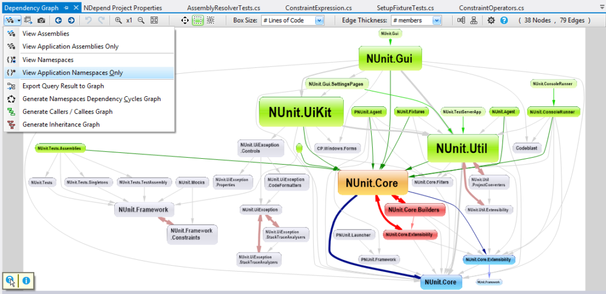
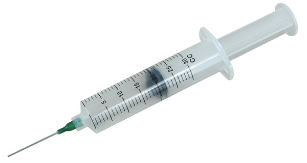
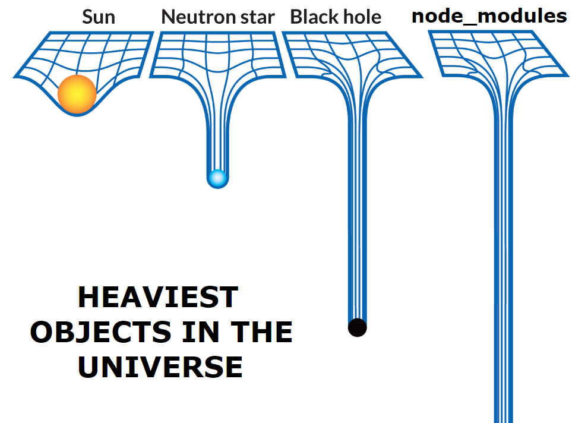
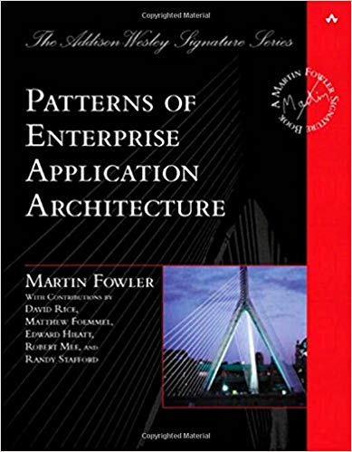

# Dependencies

---

### Goals

1. Define dependency injection (DI)
1. Describe Inversion of Control (IoC)

---

## Injection

---

### Dependencies

- Unmanaged dependencies make refactoring code hard
- Tightly-couple things
- Build in seams, extensibility points

<figure  style='width:55%;'>

</figure>

---

### Consider the following...

#### Naive Pseudocode

```java
class UserController{
  void Save(User u){
    var s = new UserServiceImplementation();
    if(u.isNew()){
      s.Create(u);
      return;
    }
    s.Update(u);
  }
}
```

---

### Hidden Dependencies

#### Problems with the naive approach:

- New is glue
- Dependencies aren't obvious to client code
- It's hard to isolate your code from the code it depends on

---

### [Explicit Dependency Principle](https://docs.microsoft.com/en-us/dotnet/architecture/modern-web-apps-azure/architectural-principles#explicit-dependencies)

<figure  style='width:40%;position:absolute; right:1rem;bottom:3rem;'>

</figure>

- _Explicitly_ require all collaborating objects
- Applies to
  - Classes / Constructors
  - Methods

---

### DI Defined

> In software engineering, **dependency injection** is a
> technique whereby one object supplies the dependencies
> of another object.

Flavors:

- Constructor
- Property
- Method

---

### Better Implementation

1. Rely on an interface instead of an implementation

- e.g. `IUserService`

2. Concrete implementation inherits interface
3. Constructor takes a reference to `IUserService`

---

### Dependencies Injected

```java
class UserController{
  private final IUserService service;
  public UserController(IUserService service){
    this.service = service;
  }
  void Save(User u){
    if(u.isNew()){
      this.service.Create(u);
      return;
    }
    this.service.Update(u);
  }
}
```

---

### Tip: Stateless Too

- Stateless operations are logically static.
- But instances are easy to pass around.

#### Injectable Arithmetic

```python
class Math:
    def add(self, left, right):
        return left + right
    def subtract(self, left,right):
        return left - right
    def multiply(self, left, right):
        return left * right
    def divide(self, left, right):
        return left / right
```

```java
interface IMath{
  int Add(int a, int b);
  int Subtract(int a, int b);
  //...
}

class CalculatorForm{
  private final IMath math;
  public CalculatorForm(IMath math){
    this.math=math;
  }
  //...
}
```

---

### Tip: Get Functional

- DI isn’t just for object-oriented code
- Don’t be shy about injecting:
  - Dependencies in to pure functions
  - Functions _as_ dependencies

```python
 # Function as argument
def getAverage(numbers, add):
  total = 0
  for n in numbers:
      total = add(total, n)
  return total / (len(numbers))

 # Invocation
xs = [1, 2, 3]
average = getAverage(xs, lambda a, b: a + b)
```

```java
public static Integer Average(
  Integer[] xs,
  BinaryOperator<Integer> add
){
  Integer total=0;
  for(int i =0; i<xs.length;i++){
    total = add.apply(total, xs[i]);
  }
  return total/xs.length;
}
```

```cpp
int getAverage(vector<int> const &ns,const function<int(int,int)> add){
	auto sum = 0;
	for(int i = 0; i<ns.size();i++){
		sum = add(sum,i);
	}
	return sum/ns.size();
}
```

---

### Discussion: What Counts?

<figure  style='width:30%;'>

</figure>

- We’re not writing assembly code
- Every piece of software relies on 3rd party code
  - UI Components
  - Standard library

#### Which dependencies need injecting?

---

## Inverting Control

---

### There's Still a Problem

- This constructor parameter just pushes the problem upstream.
- _Someone_ has to:
  1. Instantiate the service
  2. Manage its lifetime

```java
class UserController{
  private final IUserService service;

  public UserController(IUserService service){
    this.service = service;
  }
  //...
}
```

---

### IoC Defined

- Inversion of Control
- Term predates “Dependency Injection”
- Overall strategy for instantiating and injecting dependencies

---

### Low-budget IoC

```java
class UserController{
  UserService service;

  //Used by unit tests
  UserController(UserService service){
    service = service;
  }

  //Used at runtime.
  UserController():
    this(new UserServiceImplementation()){
  }
}
```

```python
class UserController():
    service=None
    def __init__(self, service = UserService()):
        self.service=service

```

---

### IoC Container

- Runtime tool
- Marries-up types with dependencies based on
  - Configuration
  - Static type information
  - Reflection
- Often a library
- Increasingly built in to frameworks like
  - [Angular](https://angular.io/guide/dependency-injection)
  - [ASP.NET (Core)](https://docs.microsoft.com/en-us/aspnet/core/fundamentals/dependency-injection?view=aspnetcore-5.0)

---

### Example

```cpp
Application(){
   Hypodermic::ContainerBuilder builder;

   builder.registerType<ConsoleMessageWriter>()
          .as<IMessageWriter>();

   m_container = builder.build();
}
```

```java
public class BillingModule extends AbstractModule {
  @Override protected void configure() {
    bind(TransactionLog.class).to(DatabaseTransactionLog.class);
    bind(IBillService.class).to(BillService.class);
  }
}
//
public static void main(String[] args) {
  var injector = Guice.createInjector(new BillingModule());
  var service = injector.getInstance(IBillService.class);
  //...
}
```

---

### Resources

- Fowler!! Fowler! Fowler!
  - [InversionOfControl](https://martinfowler.com/bliki/InversionOfControl.html)
  - [Inversion of Control Containers and the Dependency Injection pattern](https://martinfowler.com/articles/injection.html)

<figure class='nars-book' style='height:35vh;'>

</figure>
