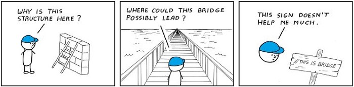
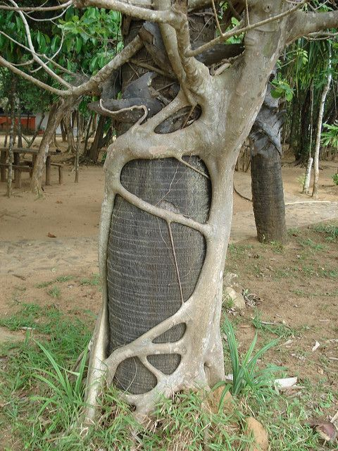
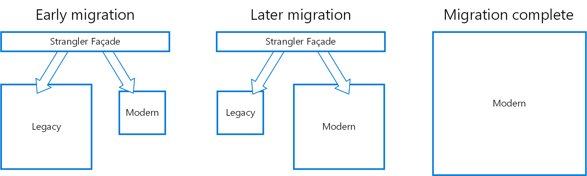

# Refactoring

---

### Goals

- Sell unit tests to skeptics
- List 3 code smells
- Describe 3 refactoring techniques

---

## Overview

---

### Definitions

<figure class='bc-framed-image' style='width:20%; margin-left:3rem;'>

</figure>

> **Refactoring (noun)**: a change made to the internal structure of
> software to make it easier to understand and cheaper to modify
> without changing its observable behavior.

- Refactoring improves the design of existing code.
- Often refactoring happens prior to adding new features.

---

### Unit tests and Refactoring

<figure  style='width:30%; position:absolute;right:0;bottom:0;'>

</figure>

- Rember: Refactoring means **non-functional** changes
- Refactoring may break things
- A good suite of tests is essential
- War story: _the guy who broke everything_

---

### Code smells

<figure class='bc-framed-image' style='width:20%; margin-left:3rem;'>

</figure>

- Refactoring is often more straightforward than identifying what to refactor.
- Smells aren’t bugs
- Learn to smell code--
  - Warning signs that refactoring may be necessary
  - Not every code smell is a problem
  - Even problematic code smells may not be worth fixing

---

## Six Smells

---

### Smell Category: Size

- Problem:
  - Classes are big, functions are long
- Also known as
  - God class, Big Ball of Mud
- Risk
  - Size is often associated with low cohesion.

---

### Smell Category: Duplication

- Problem:
  - Two fragments of code are nearly identical
- Also known as
  - Copy-and-paste programming
- Risk
  - Changes need to happen in 2 places.

---

### Smell Category: Comments

<figure  style='width:95%; margin-top:5rem;'>

</figure>
---

### Smell Category: Code not run

- Cut out everything that doesn’t run.
- Remember that all of history stays in source control.

```java
//Unreachable code
void doStuff(){
  return 10;
  enfarculate();
}

//Commented out
void doOtherStuff(){
//  if(shouldEnfarculate()){
//	enfarculate();
//  }

  return 10;
}
```

---

### Code Smell: Primitive Obsession

- Problem
  - Use of primitives instead of small objects for simple tasks (such as currency, ranges, special strings for phone numbers, etc.)
- Risk
  - Abstractions are uncaptured

---

### Automating Smell-Detection

- Linting
- Gated check-ins

---

## Five Refactors

---

### Rename

<figure  style='width:30%;'>

</figure>

- Naming is one of the 2 hard problems in computer science
- Renaming is easy and low risk--
  - Variables
  - Types
  - Members

---

### Extract Conditionals

#### Before

```java
function doStuff(){
  if (platform.toUpper().indexOf("MAC") > -1
     && browser.toUpper().indexOf("IE") > -1
  ){
    runEnfarculator();
  }
}
```

---

### Extract Conditionals

#### After

```java
function isMac(platform){
  return platform.toUpper().indexOf("MAC") > -1;
}
function isIE(browser){
  return browser.toUpper().indexOf("IE") > -1;
}
function shouldEnfarculate(platform, browser){
  return isMac(platform)
         && isIE(browser);
}

function doStuff(){
   if (shouldEnfarculate(platform, browser)){
      runEnfarculator();
   }
//....
```

---

### De-functionalization

Replace code with data structures

#### Before

```java
class Dispatcher{

  void dispatchTo(){
//...
  }

  void dispatchAll(){
     dispatchTo(mobileUsers)
     dispatchTo(analyticsService)
     dispatchTo(serviceBus)
  }
}

```

---

### De-functionalization

#### After

```java
class Dispatcher{
  destinations = [
    mobileUsers,
    analyticsService,
    serviceBus,
  ];
  void dispatchTo(){
  //...
  }

  void dispatchAll(){
    destinations.forEach(dispatchTo);
  }
}
```

---

### Early Exit

#### Before

```java
bool open_some_object(Object &object){
   if(!object.isOpen()){
      if(!object.isOpenable()){
         return false;
      }
      else{
         if(object.open()){
            return true;
         }
         else{
            return false;
         }
      }
   }
   else{
      return false;
   }
}
```

---

### Early Exit

#### After

```java
bool open_some_object(Object object){
  if(object.isOpen()){
    return false;
  }

  if(!object.isOpenable()){
    return false;
  }

  return object.open;
}
```

---

### Strangler Pattern

<figure  style='width:30%;'>

</figure>

- Incrementally migrate a legacy system by gradually replacing specific pieces of functionality with new applications and services.
- Good for large scale refactors

---

### Progress

<figure  style='width:90%; filter: grayscale(100%);'>

</figure>

---

### Iron Law: Be Consistent

- Technology choices
- Paradigms
- Style
- Process
