# Potpourri

---

### Goals

1. Lorem
1. Ipsum
1. Sic

---

## Scaling

---

### Best: Scale **Up**

- The scoundrel developer solution is:
  - Get a bigger server!
- The first rule of distributed applications is: do not distribute your application
- Problems:
  - Only goes so far
  - Not elastic
    <figure  style='width:40vw;position:absolute;right:0;bottom:3vw;'>
    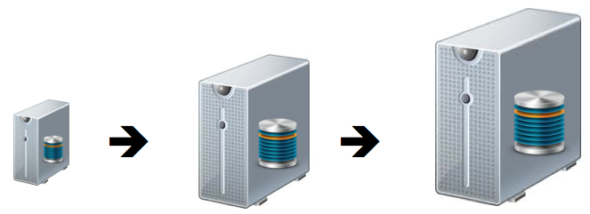
    </figure>

---

### Scale **Out** (Traditional)

#### Add more commodity hardware

- Advantages:
  - Cheaper than scaling up (Cheaper hardware)
  - Adds redundancy
- Challenges
  - Orchestration
  - Still not elastic!
    <figure  style='width:45vw;position:absolute;right:0;bottom:3vw;'>
    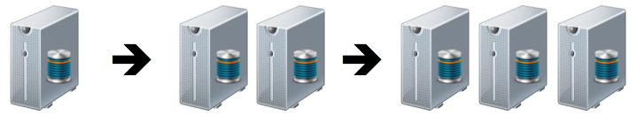
    </figure>

---

### Elasticity

- Grow or shrink infrastructure resources dynamically in response to workload
- Also known as **Autoscaling**.

<figure  style='width:50vw;position:absolute;right:15vw;bottom:5vw;'>
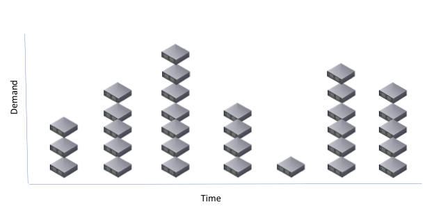
</figure>

---

### Container Implications

- Containers are different than traditional deployments
  - Deployments are repeatable
  - Provisioning is cheap
  - Instances are ephemeral
- **But**
  - There's lots to learn
  - Old-school patterns need augmenting

<figure  style='width:25vw;position:absolute;right:1vw;bottom:2vw;'>
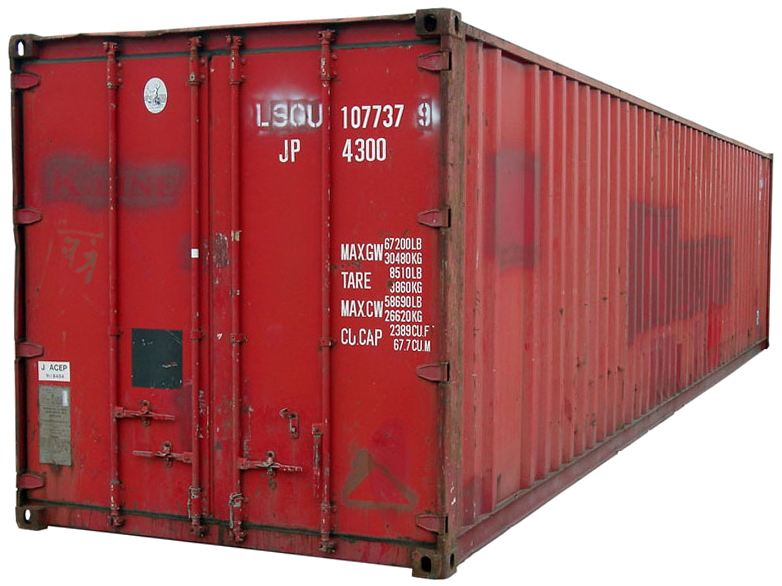
</figure>

---

## API Gateway

---

### Motivation

- Lorem
- Ipsum

<figure  style='width:30%;position:absolute; right:1vw;bottom:3vh;'>
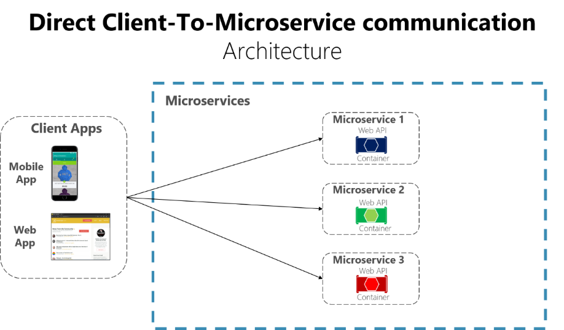
</figure>

---

### [Overview](https://docs.microsoft.com/en-us/dotnet/architecture/microservices/architect-microservice-container-applications/direct-client-to-microservice-communication-versus-the-api-gateway-pattern)

<figure  style='width:30%;position:absolute; right:1vw;bottom:3vh;'>
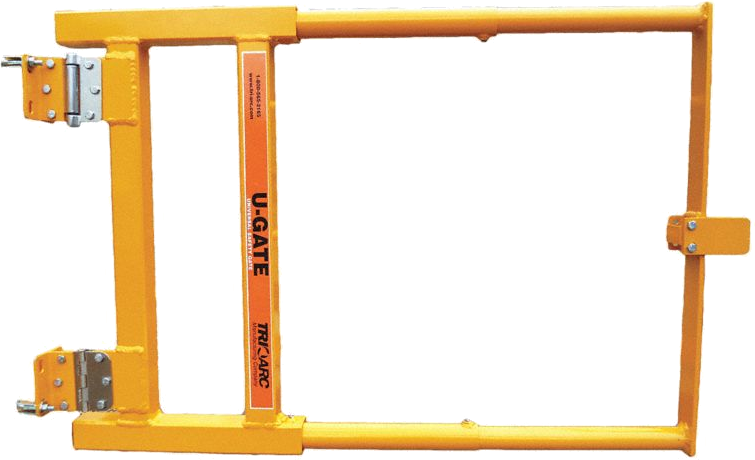
</figure>

  
Category

  
<h4>Cloud</h4>

  
Problem

  

    <ul>
      <li>Lots of small, independent services are hard for clients to use</li>
      <li>Avoid duplication</li>
    </ul>
  

  
  
Solution

  

    <ul>
      <li>Create a component to route external requests</li>
      <li>Consolidate common functionality like authentication, instrumentation, aggregation, etc</li>
    </ul>
  

## 

### Diagram

<figure  style='width:80%;position:absolute; right:5vw;bottom:4vh;'>
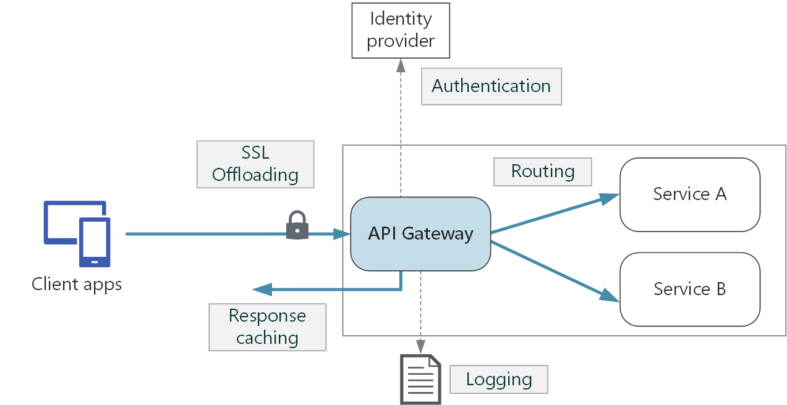
</figure>

---

## Sidecar

---

### Overview

<figure  style='width:35%;position:absolute; right:1vw;bottom:4vh;'>
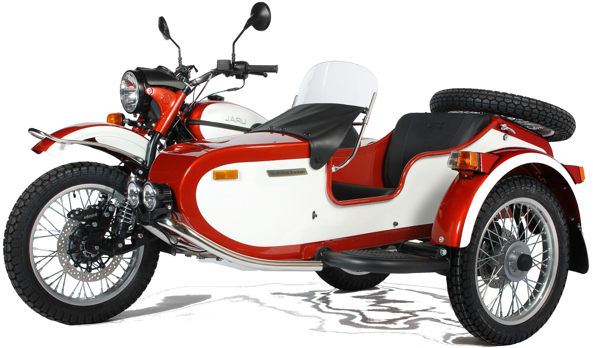
</figure>

  
Category

  
Cloud

  
Problem

  

    <ul>
      <li>Lorem</li>
      <li>Ipsum</li>
      <li>Sic</li>      
    </ul>
  

  
  
Solution

  

    <ul>
      <li>Lorem</li>
      <li>Ipsum</li>
      <li>Sic</li>       
    </ul>
  

---

### Diagram

<figure  style='width:70%;position:absolute; right:6vw;bottom:6vh;'>
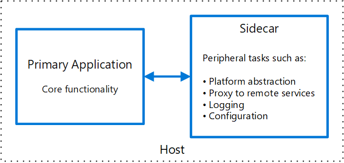
</figure>

---

## Circuit Breaker

---

### Overview

<figure  style='width:15vw;position:absolute; right:1vw;bottom:3vh;'>
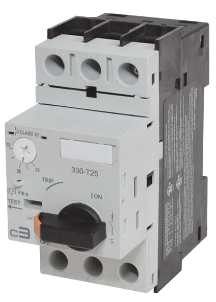
</figure>

  
Category

  
Cloud

  
Problem

  

    <ul>
      <li>Lorem</li>
      <li>Ipsum</li>
      <li>Sic</li>      
    </ul>
  

  
  
Solution

  

    <ul>
      <li>Lorem</li>
      <li>Ipsum</li>
      <li>Sic</li>       
    </ul>
  

---

### Diagram

<figure  style='height:70%;position:absolute; right:8vw;bottom:6vh;'>
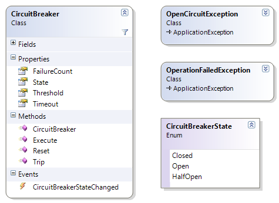
</figure>

---

### Diagram

<figure  style='height:70%;position:absolute; right:8vw;bottom:6vh;'>
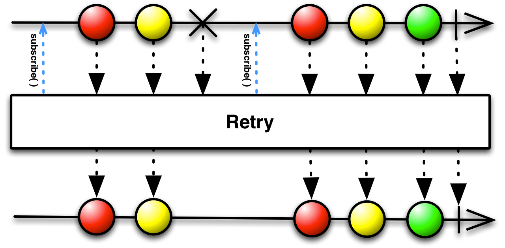
</figure>

---

## BFF

---

### Overview

<figure  style='width:15vw;position:absolute; right:1vw;top:3vh;'>

</figure>

  
Category

  
Cloud

  
Problem

  

    <ul>
      <li>Lorem</li>
      <li>Ipsum</li>
      <li>Sic</li>      
    </ul>
  

  
  
Solution

  

    <ul>
      <li>Lorem</li>
      <li>Ipsum</li>
      <li>Sic</li>       
    </ul>
  

---

### General Purpose API

<figure  style='height:70%;position:absolute; right:8vw;bottom:6vh;'>
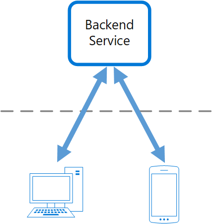
</figure>

---

### Diagram

<figure  style='height:70%;position:absolute; right:8vw;bottom:6vh;'>
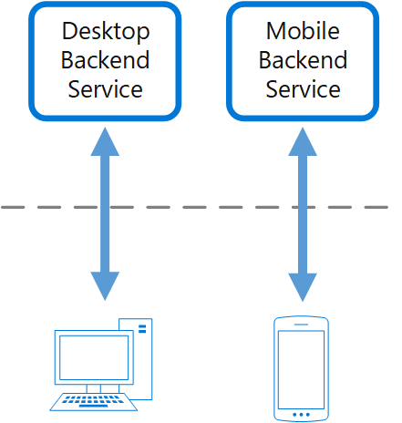
</figure>

---

### Resources

<figure  style='height:10%;'>
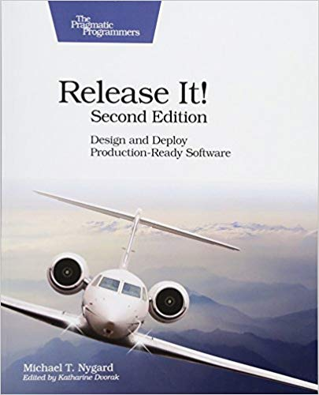
</figure>
