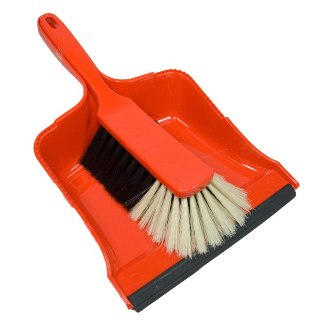

### About Me

- Software generalist
- Modern Powershell enthusiast
- Recovering Microsoft partisan
- **_Contact info in Zoom Chat_**

---

### Agenda

<ol>
  <li>Basics</li>
  <li>Objects & Modules</li>
  <li>Quality & Patterns</li>
</ol>

---

### Goals

1. Good parts
1. Best practices
1. Where to get help

---

### Credo

<figure class='bc-framed-image' style='float:right;'>

</figure>

1. Struggle
1. Repetition
1. Articulation

---

### Beer Party Strategy

<figure class='bc-framed-image' style='float:right;'>

</figure>

- Better too much beer than not enough
- Light coverage for
  - Inapplicable
  - Unimportant
  - Boring
- Heavier coverage where it matters

---

### Grandma Stolfus

<figure class='bc-framed-image' style='margin-left:1rem;float:right;'>

</figure>

> [Learning powershell] is like basketball: it takes a lot of practice to do well.

- This approach emphasizes practice in learning Powershell by coding up implementations.
- Advantages
  - You’ll remember more
  - Some patterns can be tricky to implement

---

### Assumptions About You

- You know the basics of
  - Powershell
  - Scripting-- bash, Python, whatever
- More is better
- Less is ok too

---

### What I Need

- Feedback
- Questions
- Cameras

---

### Tools You **_Need_**

<a href='https://git-scm.com/'>
  <figure  style='width:30%;height:auto;float:right;margin:2rem;'>

</figure>
</a>
<a href='https://github.com/PowerShell/PowerShell'>
  <figure  style='width:20%;height:auto;float:right;margin:2rem;clear:right;'>

</figure>
</a>

- [Git](https://git-scm.com/)
- [Powershell >7](https://github.com/PowerShell/PowerShell)

---

### Tools You **_Want_**

<figure  style='width:15%;margin:1rem;height:auto;float:right;'>

</figure>
<figure  style='width:15%;margin:1rem;height:auto; clear:right;float:right;'>

</figure>
<figure  style='width:15%;height:auto;margin:1rem; clear:right;float:right;'>

</figure>

- [Visual Studio Code](https://code.visualstudio.com/)

  - Extension: [Remote Container](https://code.visualstudio.com/docs/containers/overview)
  - OR Extension: [Powershell](https://marketplace.visualstudio.com/items?itemName=ms-vscode.PowerShell)

- [Windows Terminal](https://github.com/microsoft/terminal/)

- [Docker](https://docs.docker.com/get-docker/)

---

### Materials

- Consist of
  - Slides - HTML/Reactjs
  - Labs - Powershell
  - Demos
- Won't last forever
- Moving target
- Live here:
  https://github.com/bathcat/turtle-power

---

### Introductions

- Name
- Background
- Expectations
- Childhood career ambitions

---

### Housekeeping

<figure  style='width:32rem; height:auto;float:right;'>

</figure>

- Hours
- ~~Restrooms~~
- ~~Phones~~
- Breaks
- ~~Food~~
- ~~Coffee~~

---

### Zoom Usage

<figure  style='width:25%; height:auto;'>

</figure>

- Use the tools
  - Surveys
  - Chat - Just like Slack
  - Questions & Answers - FAQ
  - Feedback
- Pair programming via breakout rooms
- **Turn on your camera!**
