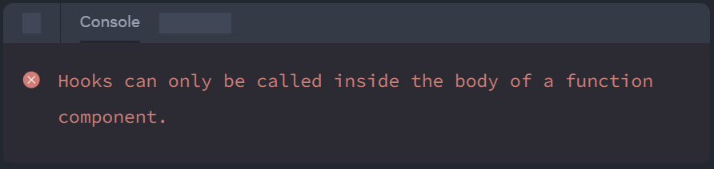

# State

---

### Goals

1. Describe `useState`
1. Explain `useReducer`
1. List the **rules of hooks**

---

## Overview

---

### What's **State**?

- **State** _is any data that directly effects what's on the screen._
- Components are rendered under 2 conditions:
  - Initial render
  - Updated state
- Functional components are called for each render

---

### Motivating Example

```jsx
export const App = () => {
  let i = 1;
  return <>
          <h1>Your number is: {i}</h1>
          <button onClick={() => (i = i + 1)}>Increment</button>
        </>;
};
```

- It's just a function:
  - Invocation initializes local variables
  - Exiting recovers memory from the stack
- Nothing tells React that state has changed

---

### What we Need

- Functional components are just functions
- So we need
  - Something to keep track of state across multiple invocations of a functional component
  - Kind of like data members of a class

---

### [`useState`](https://react.dev/reference/react/useState) to the Rescue

- A 'hook' function lets you 'hook' into React behavior
- `useState` is a 'hook' providing
  - A **state variable** to retain the data between renders.
  - A **state setter** function to update the variable and trigger React to render the component again.
- **_Unbreakable rule:_** Only update state through its setter function

```jsx
const [i,setI] = useState(1); //Array destructuring
```

---

### Fixed

- With `useState` even a fuctional component can remember

```jsx
import { useState } from 'react';

export const App = () => {
  const [i,setI] = useState(1);
  return <>
          <h1>Your number is: {i}</h1>
          <button
            onClick={() => setI(i+1)}
          >
            Increment
          </button>
        </>;
};
```

---

### `useState` Bloopers

#### Why isn't this working?

```jsx
export const App = () => {
  let [i,setI] = useState(1);
  return (
    <>
      <h1>Your number is: {i}</h1>
      <button onClick={() => i=i+1}>Increment</button>
    </>
  );
};
```

---

### State == Snapshot

> State variables might look like regular
> JavaScript variables that you can read
> and write to. However, state behaves more
> like a snapshot. Setting it does not change
> the state variable you already have, but
> instead triggers a re-render.

-- [React.dev](https://react.dev/learn/state-as-a-snapshot)

---

### Proof

#### Why isn't this working?

```jsx
export const App = () => {
  const [i, setI] = useState(1);
  const handleClick = () => {
    setI(i + 1);
    setI(i + 1);
    setI(i + 1);
  };
  return <>
          <h1>Your number is: {i}</h1>
          <button onClick={handleClick}>Increment</button>
        </>;
};
```

---

## Hooks

---

### About Hooks

- A _hook_ is a special fuction
  - Only available during rendering
  - Has a `use` prefix
- Lets you 'hook into' react features
- The most fundamental hook is `useState` (maybe)

---

### [Rules of Hooks](https://react.dev/warnings/invalid-hook-call-warning)

- ** Always** call a hook at the top level of a component or custom hook
- **Don't** call a hook
  - Inside conditions or loops
  - After a conditional return statement
  - From class components
- **Good news**: The linter is good about warnings

---

### Multiple `useState`

- How does React know which state is which?

```jsx
export const UserEditor = () => {
  const [givenName, setGivenName] = useState('');
  const [surname, setSurname] = useState('');
  return <form>
          <h1>Hello, {givenName} {surname}</h1>
          <input type="text"
            onChange={event => setGivenName(event.target.value)}
            value={givenName}
          />
          <input type="text"
            value={surname}
            onChange={event => setSurname(event.target.value)}
          />
        </form>;
};
```

---

### Bad Ideas

```jsx
export const BadIdea = ({ hasTheme }) => {
  if (hasTheme) {
    const theme = useContext(ThemeContext);
  }
  // ...
}

export const AnotherBadIdea = ({ hidden }) => {
  if (hidden) {
    return;
  }
  const [clicks, setClicks] = useState(0);
  // ...
}
```

---

### Not _Normal_ Functions

#### **More good news**: Error messages are actually helpful!

<br/>



---

### Complaints About Hooks

- Feels weird
  - Sort of magical
  - Different from class-based state management
- Violates the explicit dependency principle
- React lock-in
- Too much magic

Note:

- https://medium.com/codex/can-we-all-just-admit-react-hooks-were-a-bad-idea-c48120c5188d
- https://medium.com/codex/can-we-all-just-admit-react-hooks-were-a-bad-idea-795505b0485d
- https://dillonshook.com/a-critique-of-react-hooks/
- https://jakelazaroff.com/words/were-react-hooks-a-mistake/
- https://danielrotter.at/2022/01/16/some-reasons-for-disliking-react-hooks.html
- https://news.ycombinator.com/item?id=22995928

---

### Reasons to Love Hooks

- Composable
- Functional
- Everyone else uses them

---

## State Molecules

---

### Overview

- Most real-world state is non-atomic
  - Lists
  - Object graphs
- React tracks state changes based on identity

---

### Multiple `useState`

```jsx
export const UserEditor = () => {
  const [givenName, setGivenName] = useState('');
  const [surname, setSurname] = useState('');
  return <form>
          <h1>Hello, {givenName} {surname}</h1>
          <input type="text"
            onChange={event => setGivenName(event.target.value)}
            value={givenName}
          />
          <input type="text"
            value={surname}
            onChange={event => setSurname(event.target.value)}
          />
        </form>;
};
```

---

### Objects as State

- There's nothing wrong with more than one `useState`
- **But** for related data, it's often better to use an object

```ts
interface User{
  givenName:string;
  surname:string;
}

```

---

### Failed User Object

```jsx
export const UserEditor = () => {
  const [user, setUser] = useState<User>({givenName:'',surname:''});
  return <form> <h1>Hello, {user.givenName} {user.surname}</h1>
      <input type="text"
        onChange={event => {
          user.givenName = event.target.value;
          setUser(user);
        }}
        value={user.givenName}
      />
      <input type="text"
        onChange={event => {
          user.surname = event.target.value;
          setUser(user);
        }}
        value={user.surname}
      />
    </form>;
};
```

---

### Why So Much Fail?

- Two important points
  - React only re-renders based on changes to state
  - React uses [Object.is](https://developer.mozilla.org/en-US/docs/Web/JavaScript/Reference/Global_Objects/Object/is) to determine whether state's changed
- So
  - State changes can't be mutations

---

### The Fix

#### Problematic Mutation

```jsx
onChange={event => {
  user.surname = event.target.value;
  setUser(user);
}}
```

#### Chad Copy

```jsx
onChange={event => {
  setUser({...user, surname:event.target.value});
}}
```

---

### Fixed

```jsx
export const UserEditor = () => {
  const [user, setUser] = useState<User>({givenName:'',surname:''});
  return <form> <h1> Hello, {user.givenName} {user.surname}</h1>
      <input type="text"
        onChange={event => {
          setUser({...user,givenName:event.target.value});
        }}
        value={user.givenName}
      />
      <input type="text"
        onChange={event => {
          setUser({...user,surname:event.target.value});
        }}
        value={user.surname}
      />
    </form>;
};
```

---

### Arrays too

- Mutating an array in-place doesn't change its identity
- If the array changes (or something in it changes), make a copy of the array
- e.g.
  - [Array.map](https://developer.mozilla.org/en-US/docs/Web/JavaScript/Reference/Global_Objects/Array/map)
  - [Array.filter](https://developer.mozilla.org/en-US/docs/Web/JavaScript/Reference/Global_Objects/Array/filter)
  - [Array.slice](https://developer.mozilla.org/en-US/docs/Web/JavaScript/Reference/Global_Objects/Array/slice)
  - [Spread syntax](https://developer.mozilla.org/en-US/docs/Web/JavaScript/Reference/Operators/Spread_syntax) e.g. `[...originalArray]`

---

### Quiz

#### What's the output?

```js
  const ws = [1,2,3];
  const xs = ws;
  xs[0] = 500;
  console.log(`Is xs ws? ${Object.is(xs,ws)}`)

  const ys = ws.map(w=>w);
  console.log(`Is ys ws? ${Object.is(ys, ws)}`);

  const zs = ws.filter(w=>true);
  console.log(`Is zs ws? ${Object.is(zs, ws)}`);
```

---

### Fail #1

```jsx
export const Planets = () => {
  const [planets, setPlanets] = useState(['Mercury','Venus','Earth','Mars']);
  return (
    <>
      {planets.map((planet,i)=>
        <button onClick={
          ()=>planets.splice(i,1)
        }
      >
          Nuke {planet}
        </button>
      )}
    </>
  );
};
```

---

### Fail #2

```jsx
export const Planets = () => {
  const [planets, setPlanets] = useState(['Mercury', 'Venus', 'Earth', 'Mars']);
  return (
    <>
      {planets.map((planet, i) => (
        <button onClick={() => {
          planets.splice(i, 1);
          setPlanets(planets);
        }}
        >Nuke {planet}</button>
      ))}
    </>
  );
};
```

---

### Success #1

```jsx
export const Planets = () => {
  const [planets, setPlanets] = useState(['Mercury', 'Venus', 'Earth', 'Mars']);
  return (
    <>
      {planets.map((planet, i) => (
        <button onClick={() => {
          planets.splice(i, 1);
          setPlanets([...planets]); //Update with shallow copy!
        }}
        >Nuke {planet}</button>
      ))}
    </>
  );
};

```

---

### Success #2

```jsx
export const Planets = () => {
  const [planets, setPlanets] = useState(['Mercury', 'Venus', 'Earth', 'Mars']);
  return (
    <>
      {planets.map(planet => (
        <button
          onClick={
            event => setPlanets(planets.filter(p => p !== planet))
          } //Filter creates a new array.
        >
          Nuke {planet}
        </button>
      ))}
    </>
  );
};

```

---

## Reducers

---

### Overview

> Components with many state updates spread across
> many event handlers can get overwhelming. For these
> cases, you can consolidate all the state update
> logic outside your component in a single function,
> called a reducer.

-- [React.dev](https://react.dev/learn/extracting-state-logic-into-a-reducer)

---

### What's a 'reducer'?

- Function that takes (a) the current state and (b) a piece
  of data to update the state, returning a new state.

- A.k.a [**Fold**](<https://en.wikipedia.org/wiki/Fold_(higher-order_function)>)
- e.g. ECMAScript's [Array.reduce](https://developer.mozilla.org/en-US/docs/Web/JavaScript/Reference/Global_Objects/Array/reduce)

```ts
const sum = (xs:Array<number)
  =>xs.reduce(
    //This is the reducer function
    (state,x)=>state+x, // Create a new state with additional item

    0  // This is the initial state
  );

console.log(sum([1,2,3,4,5]))
```

---

### [Command Pattern](https://en.wikipedia.org/wiki/Command_pattern)


<div class='n-overview' style='width:85%;'>
  <div class='n-o-label'>Category</div>
  <div class='n-o-value'>Behavioral</div>

  <div class='n-o-label'>Problem</div>
  <div class='n-o-value'>
    <ul>
      <li>Initiating a request tightly coupled it its fulfillment.</li>
      <li>You want a history of actions</li>
      <li>Other components want to know</li>
    </ul>
  </div>

  <div class='n-o-label'>Solution</div>
  <div class='n-o-value'>
    <ul>
      <li>Create an abstraction to represent the action</li>
    </ul>
  </div>
</div>

---

### React's [useReducer](https://react.dev/learn/extracting-state-logic-into-a-reducer)

> Reducers are a different way to handle state. You can migrate
> from useState to useReducer in three steps:
>
> 1. Move from setting state to dispatching actions.
> 1. Write a reducer function.
> 1. Use the reducer from your component.

---

### Dumb Example

```jsx
interface CounterIncrementor{
  commandType:'increment';
}

interface CounterDecrementor {
  commandType: 'decrement';
}

type CounterCommand = CounterIncrementor | CounterDecrementor;

const counterReducer = (state: number, command: CounterCommand) => {
  if(command.commandType==='increment')
    return state + 1;
  if(command.commandType==='decrement')
    return state-1;
  throw new Error('Unknown command type');
};
```

---

### Dumb Example (Continued)

```jsx

export const Counter = () => {
  const [i, dispatch] = useReducer(counterReducer, 0);
  return (
    <>
      <h1>Your number is: {i}</h1>
      <button onClick={() => dispatch({ commandType: 'increment' })}>
        Increment
      </button>
      <button onClick={() => dispatch({ commandType: 'decrement' })}>
        Decrement
      </button>
    </>
  );
};

```

---

### Better Example: Planets

- Look under **src/demos/planets/**
- Two actions:
  - `UpdatePlanetDescription`
  - `DestroySatellite`
- Reducer: `planetsReducer`
- Typescript helps a lot


---

### Advantages of [useReducer](https://react.dev/reference/react/useReducer)

1. Testabilty
1. Fewer bugs (?)
1. Separation of concerns

---

### Lab: Word Processor

#### Instructions: `src/practice/word-processor`

#### **Summary**:

- Simple word processor
- Display word count
- Enable simple editing
  - Color
