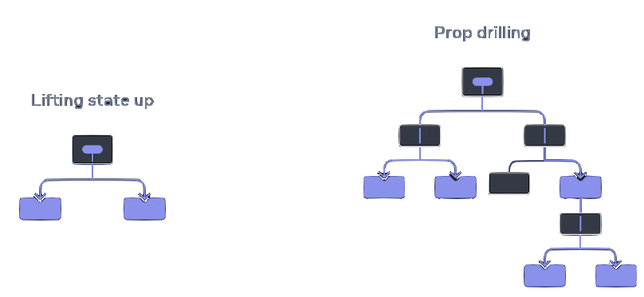

# Context

---

### Goals

1. Explain what 'lifting state up' means
1. Describe how to use `createContext`

---

## Context

---

### Motivating Example

```jsx
export const Page = () =>
    <Section>
      <Heading level={1}>Title</Heading>
      <Section>
        <Heading level={2}>Heading</Heading>
        <Heading level={2}>Heading</Heading>
        <Heading level={2}>Heading</Heading>
        <Section>
          <Heading level={3}>Sub-heading</Heading>
          <Heading level={3}>Sub-heading</Heading>
          <Section>
            <Heading level={4}>Sub-sub-heading</Heading>
            <Heading level={4}>Sub-sub-heading</Heading>
          </Section>
        </Section>
      </Section>
    </Section>;


```

---

### Lifting State Up

- Known as ['prop drilling'](https://react.dev/learn/passing-data-deeply-with-context#the-problem-with-passing-props)

<figure  style='width:65%;position:absolute; right:2rem; bottom:4rem;'>

</figure>

---

### Solution: [Context](https://react.dev/learn/passing-data-deeply-with-context)

> Usually, you will pass information from a parent component to a
> child component via props. But passing props can become verbose
> and inconvenient if you have to pass them through many components
> in the middle, or if many components in your app need the same
> information. Context lets the parent component make some information
> available to any component in the tree below it—no matter how
> deep—without passing it explicitly through props.

---

### Step 1: [createContext](https://react.dev/reference/react/createContext)

````jsx

import { createContext } from 'react';

//
---

### Step 2: Use the Context
```jsx
export const Heading = ({ children }: PropsWithChildren) => {
  const level = useContext(LevelContext);
  switch (level) {
    case 1:
      return <h1>{children}</h1>;
    case 2:
      return <h2>{children}</h2>;
    // Etc....
````

---

### Step 3: Inject the Context

```jsx
interface SectionProps extends PropsWithChildren {
  level: number;
}

export const Section = ({ children, level }: SectionProps) => {
  return (
    <section className="section prose">
      <LevelContext.Provider value={level}>{children}</LevelContext.Provider>
    </section>
  );
};

```

---

### Context Use Cases

- Theming
- User information
- Routing
- Services [(with reducers)](https://react.dev/learn/scaling-up-with-reducer-and-context)

---

## Routing

---

### Overview

- Common options:
  - Roll your own
  - [Comes with your framework](https://nextjs.org/docs/pages/building-your-application/routing)
  - [React Router](https://reactrouter.com/en/main)
- Often 'routing' includes more than just routing

---

### Example: React Router

- Common solution when you don't have a framework

```jsx
const router = createBrowserRouter([
  {
    path: '',
    element: <App />,
    errorElement: <ErrorPage />,
    children: Object.values(routes),
  },
]);

ReactDOM.createRoot(document.getElementById('root')!).render(
  <React.StrictMode>
    <RouterProvider router={router} />
  </React.StrictMode>,
);

```

---

### App.js

```jsx
import { Navbar } from './components/nav-bar/Navbar.tsx';
import { Outlet } from 'react-router-dom';
import { ThemeProvider } from '@components/theme/theme-provider.tsx';

export function App() {
  return (
    <ThemeProvider
      defaultTheme="light"
      storageKey="vite-ui-theme"
    >
      <Navbar />
      <Outlet />
    </ThemeProvider>
  );
}
```

---

### Routes

```jsx
export interface RouteInfo {
  path: string;
  element: ReactNode;
  title: string;
}

export const demoRoutes: { [key: string]: RouteInfo } = {
  Planets: {
    path: '/demo/planets',
    element: <PlanetsDemo />,
    title: 'Planets',
  },
  Headings: {
    path: '/demo/headings',
    element: <HeadingsDemo />,
    title: 'Headings',
  },
};

```

---

### Links

```jsx
interface Props extends PropsWithChildren {
  to: string;
}

export const NavbarMenuLink = ({ to, children, ...props }: Props) => (
  <Link
    className="block select-none space-y-1 rounded-md p-3 leading-none no-underline outline-none transition-colors hover:bg-accent hover:text-accent-foreground focus:bg-accent focus:text-accent-foreground"
    to={to}
    {...props}
  >
    <NavigationMenuLink>{children}</NavigationMenuLink>
  </Link>
);

```
