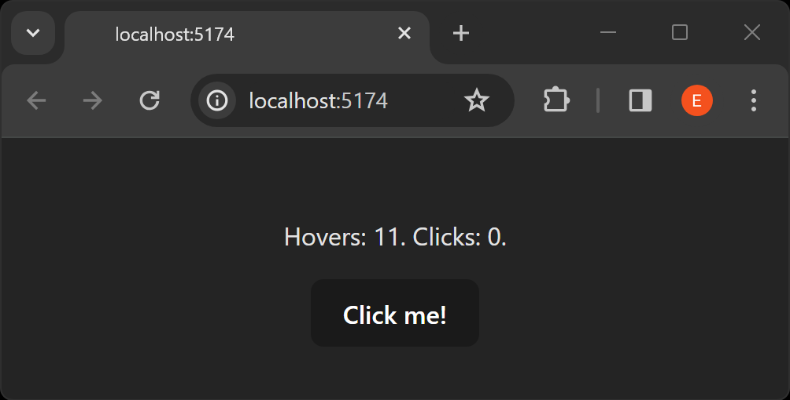
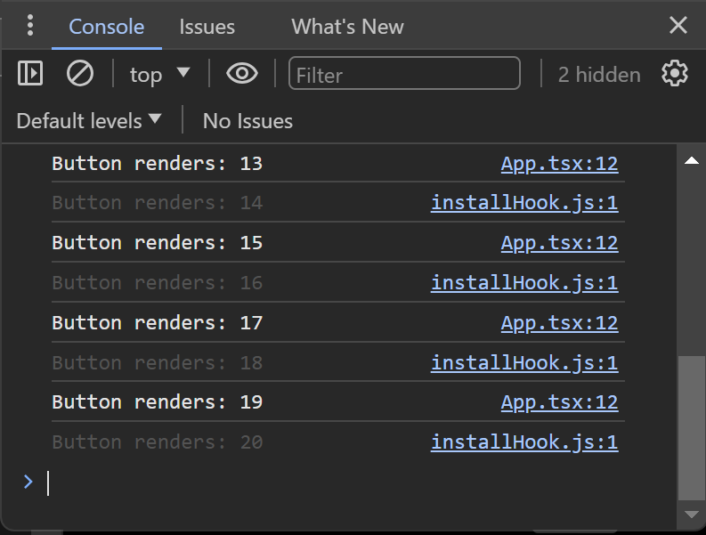

# Performance

---

### Goals

1. Lorem ipsum

---

## Memoization

---

### Overview

> [**`memo`**](https://react.dev/reference/react/memo) lets you skip re-rendering a component when its props are unchanged.

---

### Lots of Renders

```jsx
interface LabelProps{
  isEven:boolean;
}

let labelRenderCount = 0;
export const Label = ({isEven}:LabelProps)=>{
  console.log(`Label renders: ${++labelRenderCount}`);
  return <h1>{isEven ? "Even!!" : "Odd!"}</h1>
};
export const Incrementor = ()=>{
  const [clicks, setClicks] = useState(0);
  return <>
          <Label isEven={clickCount % 2 === 0}/>
          <button onClick={()=>setClicks(clicks+1)}>
            Click me!
          </button>
        </>;
}

```

---

### Pedantic Complaint

<br/>

#### [Memoization means](https://en.wikipedia.org/wiki/Memoization):

> Storing the results of expensive function calls ... and returning the cached result when the same inputs occur again

<br/>

- **`memo`** doesn't really memoize
  - It **doesn't** cache results of previous invocations
  - Only the previous invocation

---

### When to use `**memo**`

---

## useCallback

---

### Overview

> [**`useCallback`**](https://react.dev/reference/react/useCallback) is a React Hook that lets you cache a function definition between re-renders.

---

### Motivation

```jsx
export const Button = ({onClick,children}:ButtonProps)=>
  <button onClick={onClick}>{children}</button>

export const Incrementor = ()=>{
  const [clickCount, setClickCount] = useState(0);
  const [hoverCount, setHoverCount] = useState(0);
  return <div onMouseEnter={()=>setHoverCount(hoverCount+1)}>
          <p>Hovers: {hoverCount}. Clicks: {clickCount}.</p>
          <Button onClick={()=>setClickCount(clickCount+1)}>
            Click me!
          </Button>
        </div>;
}

```

---

### Complaints

#### Low-Budget Instrumentation

```jsx
let buttonRenderCount = 0;
export const Button = ({onClick,children}:ButtonProps)=>{
  console.log(`Button renders: ${++buttonRenderCount}`);
  return <button onClick={onClick}>{children}</button>;
}

```

---

### Xyz

<figure  style='width:35%;height:auto;margin-left:1rem;margin-bottom:1rem;'>

</figure>

<figure  style='width:35%;height:auto;margin-left:1rem;clear:both;'>

</figure>

- Lorem
- Ipsum sic dolo nedelnad esta

---

### Fix Attempt #1

#### Attempt: Use **`memo`**

```jsx
export const Button = memo(({onClick,children}:ButtonProps)=>{
  console.log(`Button renders: ${++buttonRenderCount}`);
  return <button onClick={onClick}>{children}</button>;
});
```

<br/>
<br/>

#### Result: No good!

<br/>

- Using **`memo`** doesn't help because **`onClick`** really does change with each render.

---

### Fix Attempt #2

#### Attempt: Use named handlers

```jsx
export const Incrementor = ()=>{
  const [clickCount, setClickCount] = useState(0);
  const [hoverCount, setHoverCount] = useState(0);
  const handleHover = ()=> setHoverCount(hoverCount+1);
  const handleClick = ()=>setClickCount(clickCount+1);
  return <div onMouseEnter={handleHover}>
          <p>Hovers: {hoverCount}. Clicks: {clickCount}.</p>
          <Button onClick={handleClick}>Click me!</Button>
        </div>;
}

```

<br/>

#### Result: No good!

- A function instances is referentially distinct with each render

---

### Fix Attempt #3

#### Attempt: **`useCallback`**

```jsx
export const Incrementor = ()=>{
  const [clickCount, setClickCount] = useState(0);
  const [hoverCount, setHoverCount] = useState(0);
  const handleClick = useCallback(()=>setClickCount(clickCount+1),
    [clickCount]
  );
  return <div onMouseEnter={handleHover}>
          <p>Hovers: {()=> setHoverCount(hoverCount+1)}. Clicks: {clickCount}.</p>
          <Button onClick={handleClick}>Click me!</Button>
        </div>;
}
```

<br/>

#### Result: Success!

---

## Tips & Tricks

---

### Overview

- Lorem ipsum
