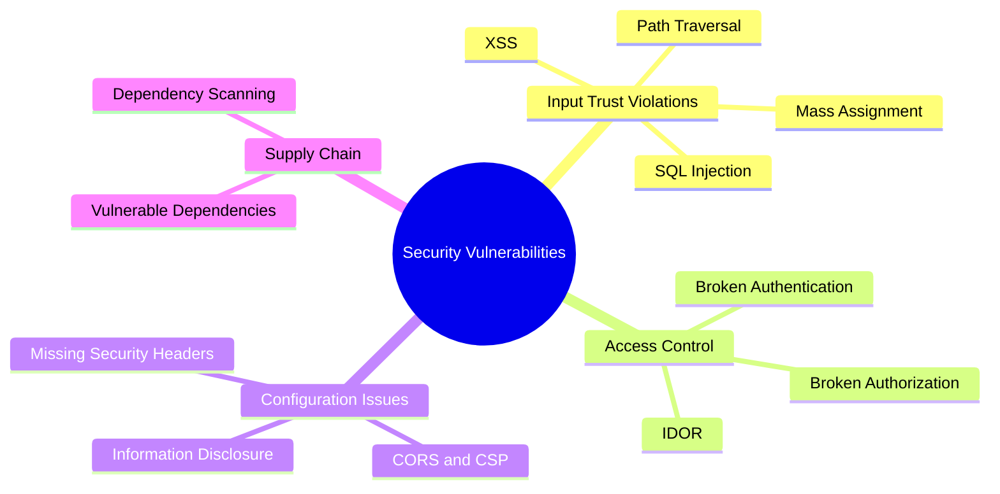

# Principles

---

### Goals
By the end of this deck, you should be able to answer--
1. What are 2 of the "basicest" rules for web apps?
2. Why is the **OWASP Top 10** more useful for executives than developers?
3. Name 3 categories in our **workshop security taxonomy**.


---

### Roadmap
1. Overview
2. Taxonomies
3. Mindset
4. Core Rules

---


## Overview

---

### Why this Matters

<figure class='bc-framed-image bc-figure-float' style='width:25%;height:auto;'>

</figure>

> So in software, people should 
> be careful, kind of like in self-driving. In self-driving, if things go 
> wrong, you might get injured. There are worse outcomes. But in software, 
> it's __almost unbounded how terrible something could be__.

#### [Andrej Karpathy](https://www.youtube.com/watch?v=lXUZvyajciY)

---

### [Samy (2005)](https://en.wikipedia.org/wiki/Samy_(computer_worm))
* First major XSS worm attack on MySpace
* Infected over 1 million users in 20 hours
* Combined failures:
  - MySpace didn't sanitize HTML input
  - Browsers lacked CSP and modern protections
* Creator: Samy Kamkar, arrested under Computer Fraud and Abuse Act


---

### [Stuxnet (2010)](https://en.wikipedia.org/wiki/Stuxnet)
* State-sponsored cyberweapon targeting Iranian nuclear facilities
* Used [4 zero-day exploits](https://www.wired.com/2014/11/countdown-to-zero-day-stuxnet/) and stolen certificates
* Combined failures:
  - Exploited air-gapped network via USB
  - Targeted centrifuges via PLCs
  - Manipulated monitoring systems to hide sabotage

---

### [Jaguar Land Rover](https://www.cybersecuritydive.com/news/jaguar-land-rover-attack-british-economy-25-billion/803491/) (2025)
* Criminal gang attack
  - $2.5 billion in damages
  - Production halted for weeks
* Combined failures:
  - Jira authentication bypass
  - Credential harvesting from exposed logs
  - Possible vishing and Cisco vulnerabilities

---

### Common Themes
* Attacks:
  - Exploit multiple vulnerabilities in sequence
  - Range from individuals to state actors to criminal enterprises
* Defense requires layered security approach
* *Good news*: Single failures are rarely catastrophic


---


## Taxonomies

---

### [OWASP Top 10](https://owasp.org/www-project-top-ten/)
* Standard for **executive** communication
* Organized by prevalence and impact
* **Useful for** getting budget and attention
* **Less useful for**
  - Day-to-day development
  - Code review checklists
  - Teaching security patterns

---

### OWASP Top 10 List
{/* TODO: Update to 2025 */}
1. [Broken Access Control](https://owasp.org/Top10/A01_2021-Broken_Access_Control/)
2. [Cryptographic Failures](https://owasp.org/Top10/A02_2021-Cryptographic_Failures/)
3. [Injection](https://owasp.org/Top10/A03_2021-Injection/)
4. [Insecure Design](https://owasp.org/Top10/A04_2021-Insecure_Design/)
5. [Security Misconfiguration](https://owasp.org/Top10/A05_2021-Security_Misconfiguration/)

Etc, etc, etc.

---

### A Certain Chinese Encyclopedia
<figure class='bc-framed-image bc-figure-float' style='width:25%;height:auto;'>

</figure>

> **Animals are divided into** (a) belonging to the Emperor, (b) embalmed, (c) tame, 
> (d) suckling pigs, (e) sirens, (f) fabulous, (g) stray dogs, (h) included in the 
> present classification, (i) frenzied, (j) innumerable, (k) drawn with a very 
> fine camelhair brush, (l) et cetera, (m) having just broken the water pitcher, 
> (n) that from a long way off look like flies

#### [Jorge Luis Borges](http://individual.utoronto.ca/bmclean/hermeneutics/foucault_suppl/OT_Borges.htm)

---

### Categories Are Tools
* _Categories are made for man, not man for categories_
* Different taxonomies serve different purposes:
  - Understanding attacker behavior
  - Assigning responsibility
  - Executive reporting
  - Industry communication

---

### Taxonomy: Workshop Focus

<figure class='bc-figure-hero-diagram'>


</figure>


---


## Mindset


---

### Overview
1. Not Binary
1. Relative
1. Process


---

### Security is Not Binary
#### [Gene Spafford](https://en.wikipedia.org/wiki/Gene_Spafford):
<figure class='bc-framed-image bc-figure-float' style='width:25%;height:auto;'>

</figure>


> The only truly secure system is one that is powered off, 
> cast in a block of concrete and sealed in a lead-lined room 
> with armed guards - and even then I have my doubts. 


---

### Security is relative
* There's no door that the NSA can't get in, but that doesn't matter. 
* (Hereafter referred to as a skilled and determined hacker.) 
* But even with those resources, it's not worth the money.


---

### Surface Area vs Blast Radius
* **Surface Area**: What can be attacked
  - Public APIs
  - User input fields
  - Third-party dependencies
  - Exposed ports and services
* **Blast Radius**: Damage when something fails
  - Single user vs entire database
  - One service vs entire infrastructure

---

### Minimize Both
* **Reduce Surface Area**
  - Principle of least privilege
  - Remove unused endpoints
  - Limit exposed functionality
* **Contain Blast Radius**
  - Database connection with minimal permissions
  - Separate read/write databases
  - Network segmentation

---

### Bear Joke 
<figure class='bc-figure-float' style='width:25%;height:auto;bottom:0;'>

</figure>

---

### Stand on the Shoulders of Giants
* Use established frameworks and libraries
* Avoid reinventing security primitives
* Choose mainstream tools with active communities
* Balance dependencies: avoid them when simple, use them when complex


---

### Think Like a Practitioner
* You have a responsibility to your users
* Their data, their accounts, their trust
* Like a doctor: first, do no harm
* Security breaches hurt real people
* Take it seriously even when management doesn't


---


## Basicist Rules for Web Apps


---

### Rule 1: Treat external data with suspicion
* User input, API responses, file uploads - all untrusted
* Validate, sanitize, and encode before use
* Never concatenate untrusted data into code (SQL, HTML, shell commands)
* Use type systems to distinguish trusted from untrusted data

---

### Don't Mix Streams
* SQL Injection: mixing SQL code with user data
* XSS: mixing HTML/JavaScript with user content
* Path Traversal: mixing file paths with user input
* Command Injection: mixing shell commands with parameters
* Solution: Parameterized queries, template engines, value objects

---

### Make Types Help You
* Use [branded types](https://github.com/SteveDunn/Vogen) or value objects for sensitive data
* `SanitizedString` vs `string` prevents accidental misuse
* [Trusted Types](https://web.dev/trusted-types/) in browser prevent XSS
* If semantically different, make them different types

---

### [Vogen](https://github.com/SteveDunn/Vogen)
* Code generator for generating value objects

```csharp title='SanitizedString.cs'
using Vogen;

[ValueObject<string>()]
public partial struct SanitizedString{}
```

```csharp title='UserProfile.cs'
public sealed record UserProfile
{
  public Guid Id { get; init; }
  public string Name { get; init; }
  public string Email { get; init; }
  public SanitizedString Bio { get; init; }
}
```


---

### Rule 2: Minimize surface area and blast radius
* **Surface Area**: What can be attacked
  - Remove unused endpoints and features
  - Principle of least privilege
* **Blast Radius**: Damage when something fails
  - Database connections with minimal permissions
  - Network segmentation
  - Isolate sensitive operations

---

### Rule 3: Follow established checklists
* [OWASP Cheat Sheet Series](https://cheatsheetseries.owasp.org/)
* Translate checklist items directly into tickets
* Makes security auditable and trackable
* Industry standards provide cover during incidents

---

### Rule 4: Build redundant protections
<figure class='bc-figure-float' style='width:25%;height:auto;bottom:0;'>

</figure>

* Defense in depth like a [Motte-and-bailey castle](https://en.wikipedia.org/wiki/Motte-and-bailey_castle)
* Secure the database AND hash passwords
* Validate client-side AND server-side
* Single failures rarely catastrophic

---

### Rule 5: Treat security as a feature
* Requires requirements, tracking, and prioritization
* Define risk profile and risk tolerance
* Security work needs tickets like any other feature
* Industry-standard minimums plus real protections


---

### Resources

* Sites
  * [Schneier on Security](https://www.schneier.com/)
  * [OWASP Cheat Sheet Series](https://owasp.org/www-project-cheat-sheets/cheatsheets/)
  * [Krebs on Security](https://krebsonsecurity.com/)

* Books
  * Kevin Mitnick
  * The Gift of Fear 
  * Facing Violence

---

## Fin

---

### Recap
1. What are the 5 **core security rules** for web applications?
2. Why is the **OWASP Top 10** more useful for executives than developers?
3. Name 3 categories in our **workshop security taxonomy**.
