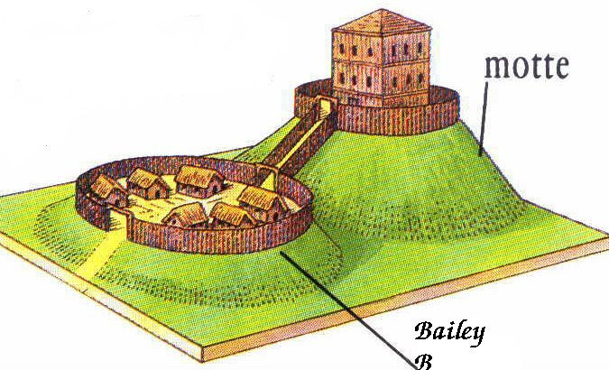
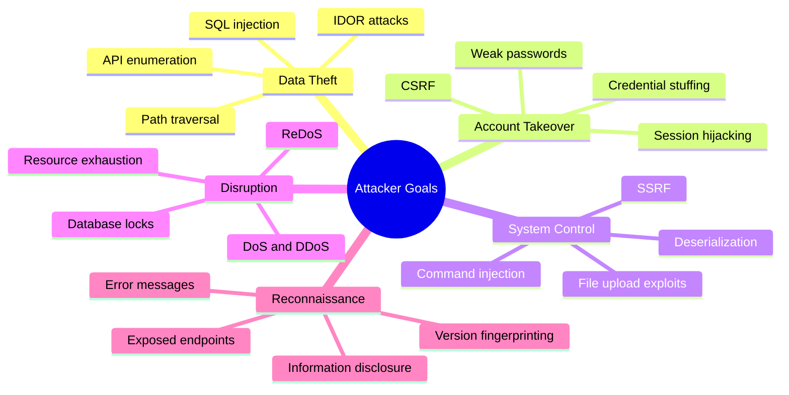
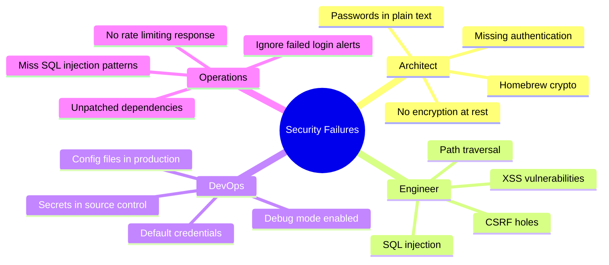

# Guiding Principles

---

### Goals
By the end of this deck, you should be able to answer--
1. What are 2 of the "basicest" rules for web apps?
2. Why is the **OWASP Top 10** more useful for executives than developers?
3. Name 2 components of a **defense-in-depth** security strategy.


---

### Roadmap
1. Overview
2. Mindset
3. Basicist Rules for Web Apps
4. Taxonomies

---


## Overview

---

### Why this Matters

<figure class='bc-framed-image bc-figure-float' style='width:25%;height:auto;'>

</figure>

> Millions and hundreds of millions of people's personal Social Security 
> numbers get leaked or something like that. So in software, people should 
> be careful, kind of like in self-driving. In self-driving, if things go 
> wrong, you might get injured. There are worse outcomes. But in software, 
> it's almost unbounded how terrible something could be.

#### [Andrej Karpathy](https://www.youtube.com/watch?v=lXUZvyajciY)

---

### [Samy (2005)](https://en.wikipedia.org/wiki/Samy_(computer_worm))
* First major XSS worm attack on MySpace
* Infected over 1 million users in 20 hours
* Combined failures:
  - MySpace didn't sanitize HTML input
  - Browsers lacked CSP and modern protections
* Creator: Samy Kamkar, arrested under Computer Fraud and Abuse Act


---

### [Stuxnet (2010)](https://en.wikipedia.org/wiki/Stuxnet)
* State-sponsored cyberweapon targeting Iranian nuclear facilities
* Used [4 zero-day exploits](https://www.wired.com/2014/11/countdown-to-zero-day-stuxnet/) and stolen certificates
* Combined failures:
  - Exploited air-gapped network via USB
  - Targeted centrifuges via PLCs
  - Manipulated monitoring systems to hide sabotage

---

### [Jaguar Land Rover](https://www.cybersecuritydive.com/news/jaguar-land-rover-attack-british-economy-25-billion/803491/) (2025)
* Criminal gang attack
  - $2.5 billion in damages
  - Production halted for weeks
* Combined failures:
  - Jira authentication bypass
  - Credential harvesting from exposed logs
  - Possible vishing and Cisco vulnerabilities

---

### Common Themes
* Attacks:
  - Exploit multiple vulnerabilities in sequence
  - Range from individuals to state actors to criminal enterprises
* Defense requires layered security approach
* *Good news*: No single failure causes catastrophe

---


## Mindset


---

### Overview
1. Not Binary
1. Relative
1. Process


---

### Security is Not Binary
#### [Gene Spafford](https://en.wikipedia.org/wiki/Gene_Spafford):
<figure class='bc-framed-image bc-figure-float' style='width:25%;height:auto;'>

</figure>


> The only truly secure system is one that is powered off, 
> cast in a block of concrete and sealed in a lead-lined room 
> with armed guards - and even then I have my doubts. 

---

### Security is relative
* There's no door that the NSA can't get in, but that doesn't matter. 
* (Hereafter referred to as a skilled and determined hacker.) 
* But even with those resources, it's not worth the money.


---

### Bear Joke 
<figure class='bc-figure-float' style='width:25%;height:auto;bottom:0;'>

</figure>

---

### Security is a Feature
* It's just for a long time, no one was very articulate
* They just say, it should 'be secure'
* Think about your risk profile and risk tolerance


---

### Alignment is Hard
#### [Mark Magliocco:](https://blog.sonatype.com/beyond-npm-audit)
<br/>

> Agreement is easy... alignment is hard. When I ask my wife if she wants dinner,
> she quickly says okay-- the trouble starts when I ask where we should go.


---

### Security Should be Redundant
<figure class='bc-figure-float' style='width:25%;height:auto;bottom:0;'>

</figure>


* Defence in depth
* Like a [Motte-and-bailey castle](https://en.wikipedia.org/wiki/Motte-and-bailey_castle)
* Example: 
  * Secure your identity database
  * Hash and salt passwords


---

### Stand on the shoulders of giants
* Don't roll your own stuff
* Think hard before adopting non-mainstream stuff (e.g. Choose Vue over Elm (or whatever))
* Avoid dependencies. If you don't need dancing bunnies, or whatever, maybe roll your own.
* Follow best-practices


---

### Think Like a Practitioner
* The one time I got fired 
* Hippocratic oath
* Responsibility to users


---


## Basicist Rules for Web Apps


---

### Think about __Trust__
* Can you trust the integrity an HTTP request?
* Answer: No
* What about internally-facing services?
* Also: No


---

### Don't Mix Streams


* An entire class of vulnerabilities comes f
  rom mixing superficially similar text-like data:
  - SQL Injection
  - XSS
  - Command Injection
  - LDAP Injection
* Analogy: Tap water and flood water

---

### Recipe: Value Objects & Branded Types
* Way out of primitive obsession
* 

---

### [Vogen](https://TODO_Vogen_link.com)
* Code generator for generating value objects
```csharp title='SanitizedString.cs'
using Vogen;

[ValueObject<string>()]
public partial struct SanitizedString{}
```

```csharp title='UserProfile.cs'
public sealed record UserProfile
{
  public Guid Id { get; init; }
  public string Name { get; init; }
  public string Email { get; init; }
  public SanitizedString Bio { get; init; }
}

```


---

### Validate Input
> **Input validation** is the process of ensuring input data is consistent with application expectations. Data that falls outside of an expected set of values can cause our application to yield unexpected results, for example violating business logic, triggering faults, and even allowing an attacker to take control of resources or the application itself. 


---

### Never Trust Input
* When building a client, assume the server is compromised
* Building an API, assume you're talking to a hacker


---

### Bad Input Validation Enables
* Cross Site Scripting
* SQL Injection
* Path Traversal


---

### Encode HTML
* HTML is a very, very permissive format
* Browsers try their best to render the content, even if it is malformed


---

### Bind Parameters for Database Queries
* **Don't** concatenate strings
* Use a prepared statement
  e.g. [SqlCommand](https://docs.microsoft.com/en-us/dotnet/api/system.data.sqlclient.sqlcommand)
* Better yet [EF Core](https://docs.microsoft.com/en-us/ef/core/)


---

### Protect Data in Transit
* SSL Everywhere


---

### Follow Checklists
* Look it up
* cheatsheetseries.owasp.org


---

### Security Theater
* Lots of security practices don't help
  * Password expiration
  * PIN complexity
* Do it anyway
* Tall poppy syndrome


---

### Resources

* Sites
  * [Schneier on Security](https://www.schneier.com/)
  * [OWASP Cheat Sheet Series](https://owasp.org/www-project-cheat-sheets/cheatsheets/)
  * [Krebs on Security](https://krebsonsecurity.com/)

* Books
  * Kevin Mitnick
  * The Gift of Fear 
  * Facing Violence

---


## Taxonomies

---

### [OWASP Top 10](https://owasp.org/www-project-top-ten/)
* Standard for **executive** communication
* Organized by prevalence and impact
* **Useful for** getting budget and attention
* **Less useful for**
  - Day-to-day development
  - Code review checklists
  - Teaching security patterns

---

### OWASP Top 10 List
{/* TODO: Update to 2025 */}
1. [Broken Access Control](https://owasp.org/Top10/A01_2021-Broken_Access_Control/)
2. [Cryptographic Failures](https://owasp.org/Top10/A02_2021-Cryptographic_Failures/)
3. [Injection](https://owasp.org/Top10/A03_2021-Injection/)
4. [Insecure Design](https://owasp.org/Top10/A04_2021-Insecure_Design/)
5. [Security Misconfiguration](https://owasp.org/Top10/A05_2021-Security_Misconfiguration/)

---

### OWASP Top 10 List (II)
6. [Vulnerable and Outdated Components](https://owasp.org/Top10/A06_2021-Vulnerable_and_Outdated_Components/)
7. [Identification and Authentication Failures](https://owasp.org/Top10/A07_2021-Identification_and_Authentication_Failures/)
8. [Software and Data Integrity Failures](https://owasp.org/Top10/A08_2021-Software_and_Data_Integrity_Failures/)
9. [Security Logging and Monitoring Failures](https://owasp.org/Top10/A09_2021-Security_Logging_and_Monitoring_Failures/)
10. [Server-Side Request Forgery](https://owasp.org/Top10/A10_2021-Server-Side_Request_Forgery_%28SSRF%29/)

---

### A Certain Chinese Encyclopedia
<figure class='bc-framed-image bc-figure-float' style='width:25%;height:auto;'>

</figure>

> **Animals are divided into** (a) belonging to the Emperor, (b) embalmed, (c) tame, 
> (d) suckling pigs, (e) sirens, (f) fabulous, (g) stray dogs, (h) included in the 
> present classification, (i) frenzied, (j) innumerable, (k) drawn with a very 
> fine camelhair brush, (l) et cetera, (m) having just broken the water pitcher, 
> (n) that from a long way off look like flies

#### [Jorge Luis Borges](http://individual.utoronto.ca/bmclean/hermeneutics/foucault_suppl/OT_Borges.htm)

---

### Categories Are Tools
* _Categories are made for man, not man for categories_
* Different taxonomies serve different purposes:
  - Understanding attacker behavior
  - Assigning responsibility
  - Executive reporting
  - Industry communication

---

### Taxonomy: What Attackers Want

<figure class='bc-figure-hero-diagram'>


</figure>
---

### Taxonomy: Who Gets Yelled At

<figure class='bc-figure-hero-diagram'>


</figure>

---

### Use the Right Tool
* **In threat modeling**: What attackers want
* **In incident response**: Who gets yelled at
* **In compliance meetings**: OWASP Top 10
* **In code review**: Technical mechanisms (SQL injection, XSS)
* **In architecture review**: Design patterns and principles
* Don't let any single taxonomy constrain your thinking

---

## Fin

---

### Recap
1. What are 2 of the "basicest" rules for web apps?
2. Why is the **OWASP Top 10** more useful for executives than developers?
3. Name 2 components of a **defense-in-depth** security strategy.
