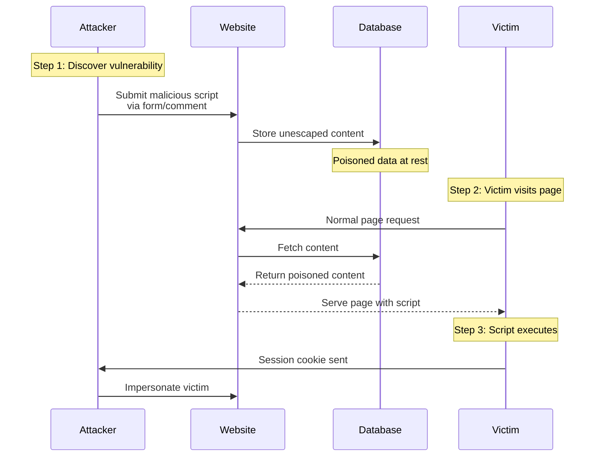

# XSS

---

### Goals
By the end of this deck, you should be able to answer--
1. Name 3 flavors of **XSS** attack.
2. What do XSS and SQL injection have in common?
3. How does **Angular** automatically protect against XSS?
4. Why are server-side safeguards still essential?


---

### Roadmap
1. Overview
2. Basics
3. Server-side XSS
4. DOM-Based XSS
5. Server-Side Defenses
6. Next Steps

---

## Overview

---

### XSS in 2025
* Client-side frameworks (Angular, React, Vue) have robust built-in protections
* Still common in legacy apps and custom implementations
* You have to actively bypass safeguards to introduce vulnerabilities
* Actual use cases for bypassing protections are fairly rare

---

### Terminology Note
* "Cross-Site Scripting" is somewhat antiquated
* Originally meant injecting scripts from one site into another
* Now means any kind of script injection, not necessarily cross-site
* More accurately: **client-side code injection**

---

### XSS vs SQL Injection
* Both stem from trusting user input
* Both treat string-like data as executable code instead of literal strings
* **SQL Injection**: Less frequent, more devastating (full database access)
* **XSS**: More frequent, less devastating (client-side only)

---

### Recent Incidents
* [Angular vulnerability](https://security.snyk.io/vuln/SNYK-JS-ANGULAR-2949781) (2022) - IE caching bypass
* [WordPress plugins](https://wpscan.com/statistics/) - Hundreds of XSS CVEs annually
* Persistent problem despite modern framework protections

---

## Basics


---

### What is [<u>C</u>ross-<u>S</u>ite <u>S</u>cripting](https://owasp.org/www-community/attacks/xss/)?
* Attacker sneaks a malicious script into a web app
* Script runs on other users when they run the app<sup>*</sup>
* Attacker can access
  * Cookies
  * Session tokens
  * Misc Data
{/* Note:  https://www.acunetix.com/websitesecurity/cross-site-scripting/ */}


---

### Impact Range
* **Minimum**: Deface page content, annoy users
* **Typical**: Steal session cookies, impersonate user in API calls
* **Maximum**: Access HTML5 APIs ([geolocation](https://developer.mozilla.org/en-US/docs/Web/API/Geolocation_API), [webcam](https://developer.mozilla.org/en-US/docs/Web/API/MediaStream_Recording_API), [mic](https://developer.mozilla.org/en-US/docs/Web/API/MediaStream_Recording_API))
* **Nightmare**: Deploy persistent keyloggers across user base
{/* Note: https://www.dionach.com/en-us/blog/the-real-impact-of-cross-site-scripting/ */}


---

### Famous Examples
* [Samy](https://en.wikipedia.org/wiki/Samy_(computer_worm)) broke MySpace in 2005
* [Lots more](https://www.exploit-db.com/?type=webapps&tag=8)


---

### XSS Flavors
1. **Reflected** - Non-persistent
4. **Self-XSS** - User tricked into pasting malicious code into the console
2. **Server-side** - aka 'persistant' Sneak content into a database
3. **DOM-Based** - Exploits SPA vulnerabilities


---

### Reflected XSS
* Old-school
* Usually manipulates a query string
* Popular for phishing
* **Solution**: Don't trust query parameters


---

### Reflected XSS Vulnerability
```html
  <body>
    <h1>Welcome Home, <span id='greeting'>Loading...</span></h1>
  </body>
  <script>
    const queryString = location.search;
    const urlParams = new URLSearchParams(queryString);
    const userName = urlParams.get('user');
    document.getElementById('userName').innerHtml= userName || 'Anonymous';
  </script>
```


---

### Not Just `<script>` Elements
* Injected script elements are often blocked by the browser
* Malformed tags can work better:
  * ``
* Also events: 
  * ``
{/* Note:https://owasp.org/www-community/xss-filter-evasion-cheatsheet */}


---

### Variation: Self-XSS
* User tricked into pasting malicious code into browser console
* Fairly rare in practice
* Not really your concern as a developer
* Users have access to dev tools - can't prevent this
* Prevention: User education, console warnings

<a href='https://www.youtube.com/watch?v=pVIxO4Z_rYU'>
  <figure  style='width:25%;height:auto;right:0;bottom:0;'>
  
  </figure>
</a>


---


## Server-Side XSS

---

### Details
* Happens with apps containing user-generated content:
  * Forums
  * Content Management Systems
* Most dangerous because the script runs on everyone's browser
* SPAs are affected too!


---

### Server-side Attack Flow

<div style="transform: scale(0.9); transform-origin: top center;">



</div>

---

### XSS Mitigation 
* Encode output data
* Razor engine does this automatically
* Angular does too
* _But this is still possible to screw up_


---


## DOM-Based XSS

---

### Basics
* Doesn't involve trip to server
* Exploits vulnerabilities in
  * SPA Frameworks
  * Your app
* Filter potentially scary user input


---

### Angular: A Solved Problem*
* Angular treats all input as untrusted by default
* Automatic sanitization and escaping
* Have to actively bypass protections
* Bypass use cases are rare
{/* Note: * = mostly solved. https://angular.io/guide/security */}


---

### When Bypassing Seems Necessary
* Dynamic HTML from trusted CMS
* Syntax highlighting for code blocks
* Rich text editor output
* Custom font imports
* **Question first**: Do you really need this?


---

### The Dangerous Pattern

```typescript
import { Component, inject } from '@angular/core';
import { DomSanitizer, SafeHtml } from '@angular/platform-browser';

export class SearchResultsComponent {
  private sanitizer = inject(DomSanitizer);

  highlightQuery(text: string, query: string): SafeHtml {
    const highlighted = text.replace(
      new RegExp(query, 'gi'),
      match => `<mark>${match}</mark>`
    );
    
    return this.sanitizer.bypassSecurityTrustHtml(highlighted);
  }
}
```


---

### What's Wrong Here?
* `bypassSecurityTrustHtml` disables Angular's protections
* `query` parameter is user-controlled
* Attacker sends: ``
* Gets wrapped in `<mark>` tags but still executes
* **Fix**: Sanitize both `text` and `query` before highlighting


---

### Better Approach

```typescript
highlightQuery(text: string, query: string): string {
  const safeText = text.replace(/[<>]/g, '');
  const safeQuery = query.replace(/[<>]/g, '');
  
  return safeText.replace(
    new RegExp(safeQuery, 'gi'),
    match => `<mark>${match}</mark>`
  );
}
```

* No bypass needed
* Angular's built-in sanitization handles the rest
* Strips angle brackets from both inputs


---

### Best Practices
* Keep current with Angular releases
* Don't modify your copy of Angular
* Avoid Angular APIs marked in the documentation as *Security Risk.*
* Avoid raw DOM manipulation

---


## Server-Side Defenses

---

### Why Client Protection Isn't Enough
* Attackers can bypass client entirely
* Use `curl` or Postman to inject content directly
* Poisoned dependency could compromise Angular
* Sloppy engineering happens
* **Defense in depth**: Trust no single layer


---

### API-Side Responsibilities
* Validate all input against expected patterns
* Encode output before storing
* Never trust "safe" input from client
* Log suspicious patterns for monitoring
* Reject obviously malicious content


---

### Example: .NET Validation

```csharp
public class CommentDto {
    [Required]
    [MaxLength(500)]
    [RegularExpression(@"^[^<>]*$", 
        ErrorMessage = "HTML tags not allowed")]
    public string Content { get; set; }
}
```


---

### Benefits of Server-Side Detection
* Know when someone is probing for vulnerabilities
* Distinguish between fat-finger and attack
* Rate-limit suspicious actors
* Generate security metrics
* Feed into SIEM for pattern analysis


---


## Next Steps

---

### Browser-Based Protections
* XSS is one attack vector among many
* Browsers provide additional defense layers:
  * **Content Security Policy (CSP)** - Control what scripts can run
  * **CORS** - Control cross-origin resource access
  * **Trusted Types** - Prevent dangerous sink assignments
* Next deck: How these mechanisms work and when to use them


---


## Fin

---

### Recap
1. Name 3 flavors of **XSS** attack.
2. What do XSS and SQL injection have in common?
3. How does **Angular** automatically protect against XSS?
4. Why are server-side safeguards still essential?


