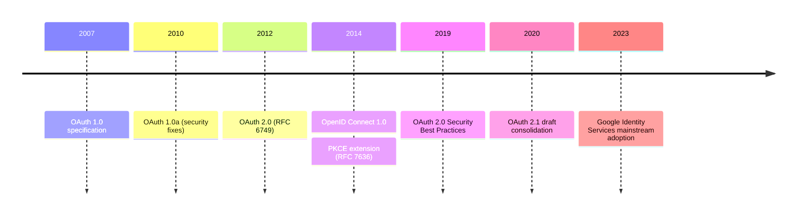
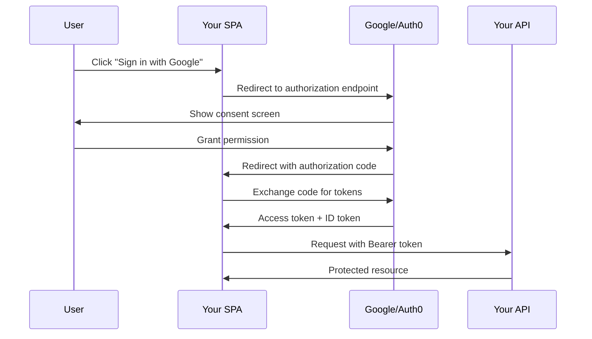

# Authorization, Authentication

---

### Goals
* Compare roles and claims
* Define CSRF
* Explain why .NET allows different authorization policies


---

## Overview


---

### Definitions _Review_
* ___Authentication___ confirms a user identity
* ___Authorization___  decides what that user can do


---

### Good News Everyone
* Security is like everything else
* Combination of 
  * Injectable services
  * Middleware
  * Controller attributes


---


## Authentication


---

### Options
* Forms - i.e. username/password
* Single Sign On 
  - Windows Authentication
  - Jwt
* External Provider
  - Oauth, Google, Facebook
* Mix and match


---

### [ASP.NET Core Identity](https://learn.microsoft.com/en-us/aspnet/core/security/authentication/identity)
* Includes UI for
  * End users
  * Management
* Lots of features to manage 
  - Users, Profiles
  - Passwords
  - Roles, Claims, Tokens


---

### Popular: [Windows Authentication](https://learn.microsoft.com/en-us/aspnet/core/security/authentication/windowsauth)
* Great for intranet apps
* Supported by
  * IIS 
  * HTTP.sys
  * Kestrel _No NTLM option_
* No Windows Requirement


---

### `launchSetting.json`
{/* TODO: Update this */}
```json title='launchSetting.json'
"iisSettings": {
    "windowsAuthentication": true,
    "anonymousAuthentication": false,
}
```


---

### Schemes and Handlers
* ___[Authentication Handler](https://learn.microsoft.com/en-us/dotnet/api/microsoft.aspnetcore.authentication.authenticationhandler-1)___ does the actual work
* ___[Authentication Scheme](https://learn.microsoft.com/en-us/aspnet/core/security/authentication/?view=aspnetcore-9.0#authentication-scheme)___ 
  - Configures the handler instance
  - Functions as a handle for other components to reference


---

### Key Player: [Identity Server](https://identityserver.io/)
* Microsoft's Open ID Implementation
* Authentication as a microservice


---

### Step 1: Configure Services
```csharp title='ServiceCollectionExtensions.cs'
	services.AddDefaultIdentity<SnakesUser>()
	        .AddEntityFrameworkStores<SnakesDbContext>();

	services.AddAuthentication()
	        .AddIdentityServerJwt();	        
```


---

### Variation
```csharp title='ServiceCollectionExtensions.cs'
services
  .AddAuthentication(JwtBearerDefaults.AuthenticationScheme)
  .AddJwtBearer(JwtBearerDefaults.AuthenticationScheme, options => Configuration.Bind("JwtSettings", options))
  .AddCookie(CookieAuthenticationDefaults.AuthenticationScheme, options => Configuration.Bind("CookieSettings", options));
```


---

### Step 2: Consume Services
{/* TODO: Consolidate this into a title=Program.cs */}
```csharp title='Program.cs'
  app.UseAuthentication();
```


---

## Authorization


---

### Overview
* Easy things are easy
  * e.g. Group membership 
* Sophistication is possible
  * Granular claims
  * Complex combinations


---

### Step 1: Define a Policy
```csharp title='AdministratorAuthorizationPolicy.cs'
public static class AdministratorAuthorizationPolicy 
{
    public static string Name => "SnakesAdministrators";
 
    public static void Build(AuthorizationPolicyBuilder policy) =>
        policy.RequireClaim("groups", "c5038c6f-c5bc-43d5-93f5-44ec607d62dc");    
}
```


---

### Step 2: Configure Services
```csharp title='ServiceCollectionExtensions.cs'
public static void ConfigureAuthorization(this IServiceCollection services)
{
    services.AddAuthorization(options =>
    {
        options.AddPolicy(AdministratorAuthorizationPolicy.Name, 
                          AdministratorAuthorizationPolicy.Build);
    });
    // ...
}
```


---

### Step 3: Consume
```csharp {17} title='SnakeEndpoints.cs'
    public static void MapSnakeEndpoints(this WebApplication app){
        ArgumentNullException.ThrowIfNull(app);

        var snakesGroup = app.MapGroup(ApiRoutes.Snakes)
            .WithTags("Snakes");

        snakesGroup.MapGet("/", GetSnakes)
            .WithName("GetSnakes")
            .Produces<Page<SnakeDto>>(StatusCodes.Status200OK)
            .WithDescription("Retrieves a paginated list of snakes.");

        snakesGroup.MapPost("/", CreateSnake)
            .WithName("CreateSnake")
            .Produces<SnakeDto>(StatusCodes.Status201Created)
            .Produces(StatusCodes.Status400BadRequest)
            .WithDescription("Creates a new snake.")
            .RequireAuthorization(policy => policy.RequireRole(UserRoles.Administrator));
    }
```


---

### Alternative: Claims-Based
* Canonical example: Buying beer
* Bartenders don't care who you are
* They just want evidence you're > 21


---

### It's all Middleware
```csharp title='Over21AuthorizationPolicy.cs'
public static class Over21AuthorizationPolicy 
{
    public static string Name => "Over21";
 
    public static void Build(AuthorizationPolicyBuilder policy) {
		policy.AuthenticationSchemes.Add(JwtBearerDefaults.AuthenticationScheme);
		policy.RequireAuthenticatedUser();
		policy.Requirements.Add(new MinimumAgeRequirement());
    }
}

```


---


## Angular Routing
{/* 
Note:
* Figure out what to do with this
* Maybe call it client-side or something */}

---

### Angular _'Security'_
* Real work happens on the server
* Angular uses routing to--
  * Improve user experience
  * Prevent information leaks


---

### If You Need Secure **Content**
* **SPA** means everyone gets everything
* People can look at the source
* For sensititve content, consider separate applications
* User experience can be seamless


---

### Review: Angular Modules
* Not necessarily a depoyable unit
* Facilitate 
  * Organization
  * Lazy loading
  * Tree-shaking


---

### Setting up the Angular Client
```ts
RouterModule.forRoot([
  { path: 'login', component: LoginComponent },
  { 
  	path: 'snakes-administration', 
  	component: SnakesAdministrationComponent, 
  	canActivate: [AdministratorGuard],
  },
])
```


---

### Example
```ts title='AdministratorGuard.ts'
@Injectable()
export class AdministratorGuard implements CanActivate {

  constructor(private _service: AuthService, private _router: Router) {}

  canActivate(next: ActivatedRouteSnapshot, state: RouterStateSnapshot) {
    if (this._authService.isAuthenticated()) {
        return true;
    }
    this._router.navigate(['/login']);
    return false;
  }
}
```


---


## Resource-based Authorization


---

### The Problem with Pure RBAC
* Real authorization often depends on **relationship to a resource**
* Example: Amazon order access
* Who can view order #12345?
  - Administrator ✓
  - Customer who placed the order ✓
  - Assigned delivery driver ✓
  - Warehouse supervisor for shipping site ✓
* Role membership alone isn't enough

---

### Anti-pattern: Inline Logic
```csharp title='DeliveryService.cs'
public async Task<Page<Delivery>> GetByCustomer(Guid customerId, int skip, int take)
{
    return await _deliveryStore.GetByCustomerId(customerId, skip, take);
}
```

**Problems:**
* No authorization check at all
* Anyone can query any customer's deliveries
* Easy to forget and hard to catch in review
* Security bug waiting to happen

---

### Pattern: Split by Role
```csharp title='DeliveryService.cs' {3,9}
public async Task<Page<Delivery>> GetByCurrentCustomer(int skip, int take)
{
    _authorizationService.ThrowIfUnauthorized([UserRoles.Customer]);    
    return await _deliveryStore.GetByCustomerId(customerId, skip, take);
}

public async Task<Page<Delivery>> GetByCustomer(Guid customerId, int skip, int take)
{
    _authorizationService.ThrowIfUnauthorized([UserRoles.Administrator]);
    return await _deliveryStore.GetByCustomerId(customerId, skip, take);
}
```

**Better**, but doesn't scale with complex role hierarchies

---

### Reality Check
* **Authentication**, **Authorization**, and **Business Logic** seem orthogonal
* True for RBAC: "Is user an admin?"
* **False for resource authorization**: "Does user own this order?"
* Resource authorization **is** business logic
* Can't separate them cleanly

---

### Architectural Decision: Where?
* **Option 1: Endpoints/Controllers**
  - ✓ Clear security boundary
  - ✓ Easy to audit
  - ✗ Must duplicate for WebSockets, BFF, gRPC, etc.
* **Option 2: Service Layer**
  - ✓ Single source of truth
  - ✓ Reusable across APIs
  - ✗ Blurs business logic boundaries

**Recommendation**: Services layer when authorization is business logic

---

### Imperative Style: Explicit Checks
```csharp title='DeliveryService.cs' {2-7}
public async Task<Result> BookDelivery(Guid customerId, DeliveryRequest request){
    _authorizationService.ThrowIfUnauthorized([UserRoles.Customer, UserRoles.Administrator]);
    
    if (!_currentUser.IsInRole(UserRoles.Administrator) &&
        _currentUser.CustomerId != customerId){
        throw new UnauthorizedAccessException("Customers can only book deliveries for themselves.");
    }
    
    return await _deliveryService.BookDelivery(customerId, request);
}
```

---

### Imperative Style Evaluated
**Strengths:**
* Explicit and easy to understand
* No magic or abstraction
* IDE autocomplete works well
* Easy to debug

**Weaknesses:**
* Verbose and repetitive
* Hard to test in isolation
* Authorization scattered across codebase
* Difficult to audit globally

---

### Declarative Style: Authorization Handlers
* Microsoft's `IAuthorizationHandler<TRequirement, TResource>`
* Separates authorization policy from business logic
* Testable and reusable
* [Microsoft Docs: Resource-based authorization](https://learn.microsoft.com/en-us/aspnet/core/security/authorization/resourcebased)

---
### Example

```csharp title='DeliveryAuthorizationHandler.cs'
public class DeliveryAuthorizationHandler 
    : AuthorizationHandler<OperationAuthorizationRequirement, Delivery>{
    protected override Task HandleRequirementAsync(
        AuthorizationHandlerContext context,
        OperationAuthorizationRequirement requirement,
        Delivery resource){
        if (requirement.Name == "Read" && CanReadDelivery(context.User, resource)){
            context.Succeed(requirement);
        }
        
        return Task.CompletedTask;
    }
    
    private bool CanReadDelivery(ClaimsPrincipal user, Delivery delivery) =>
        user.IsInRole(UserRoles.Administrator) ||
        user.GetCustomerId() == delivery.CustomerId ||
        user.GetDriverId() == delivery.AssignedDriverId;
}
```

---

### Using Authorization Handlers
```csharp title='DeliveryService.cs'
public async Task<Result<Delivery>> GetDelivery(Guid deliveryId){
    var delivery = await _deliveryStore.GetById(deliveryId);
    if (delivery is null){
        return Result.NotFound();
    }
    
    var authResult = await _authorizationService.AuthorizeAsync(
        _currentUser, 
        delivery, 
        Operations.Read);
    
    if (!authResult.Succeeded){
        return Result.Forbidden();
    }
    
    return Result.Success(delivery);
}
```

---

### Performance Considerations
**Problem**: Loading entire resource just to check authorization

```csharp title='DeliveryService.cs'
var order = await _context.Orders
    .Include(o => o.LineItems)
    .Include(o => o.Customer)
    .FirstOrDefaultAsync(o => o.Id == orderId);

if (order.CustomerId != currentUser.CustomerId)
{
    throw new UnauthorizedAccessException();
}
```
---

### Performance Considerations (II)
**Better**: Authorization queries

```csharp title='DeliveryService.cs'
var canAccess = await _context.Orders
    .Where(o => o.Id == orderId)
    .AnyAsync(o => o.CustomerId == currentUser.CustomerId);

if (!canAccess)
{
    throw new UnauthorizedAccessException();
}

var order = await _context.Orders
    .Include(o => o.LineItems)
    .Include(o => o.Customer)
    .FirstOrDefaultAsync(o => o.Id == orderId);
```

---

### Query Filtering vs Throwing
**Throwing (403 Forbidden):**
```csharp title='DeliveryService.cs'
var order = await _orderStore.GetById(orderId);
if (order.CustomerId != currentUser.CustomerId)
{
    throw new UnauthorizedAccessException();
}
```

**Filtering (empty results):**
```csharp title='DeliveryService.cs'
var orders = await _context.Orders
    .Where(o => o.CustomerId == currentUser.CustomerId)
    .ToListAsync();
```

**Choose based on UX**: Does user know resource exists?

---

### Common Patterns
* **Ownership**
  - Very common
  - Check `resource.OwnerId == currentUser.Id`

* **Multi-tenancy**
  - Resource-based auth in disguise
  - Check `resource.TenantId == currentUser.TenantId`

* **Hierarchical Access**
  - Manager sees team's resources
  - Check relationships in organization hierarchy

* **Time-based**
  - Access expires after deadline
  - Check `resource.ExpiresAt > DateTime.UtcNow`

---

### Testing Resource Authorization
```csharp title='DeliveryService.Tests.cs'
[Fact]
public async Task Customer_CannotAccess_OtherCustomerDeliveries(){
    var customer1 = TestUsers.Customer1;
    var customer2 = TestUsers.Customer2;
    var delivery = await CreateDelivery(customer2.Id);
    
    _currentUser.SetUser(customer1);
    
    await Assert.ThrowsAsync<UnauthorizedAccessException>(
        () => _deliveryService.GetDelivery(delivery.Id));
}
```
---

### Example (II)
```csharp title='DeliveryService.Tests.cs'
[Fact]
public async Task Administrator_CanAccess_AllDeliveries(){
    var customer = TestUsers.Customer1;
    var admin = TestUsers.Administrator;
    var delivery = await CreateDelivery(customer.Id);
    
    _currentUser.SetUser(admin);
    
    var result = await _deliveryService.GetDelivery(delivery.Id);
    
    Assert.NotNull(result);
    Assert.Equal(delivery.Id, result.Id);
}
```

---


## OAuth

---

### What's [OAuth 2.0](https://oauth.net/2/)?
* Delegated authorization framework
* Third-party identity providers handle credentials
* Your app receives tokens, never passwords
* Key advantage: eliminates password management burden
* Shifts security responsibility to specialists

---

### OAuth/OpenID Timeline



---

### The Password Problem
* Traditional auth: you store hashed passwords
* Regulatory compliance burden (GDPR, SOC2, PCI)
* Breach liability and notification requirements
* [Password reuse](https://owasp.org/www-community/attacks/Credential_stuffing) across sites amplifies damage
* OAuth delegates identity to Google, Microsoft, Auth0, etc.

---

### Authentication vs Authorization
* **Pedantic view:** [OAuth is authorization](https://oauth.net/articles/authentication/), not authentication
* OAuth tells you what a user **can do**, not **who they are**
* That's technically [OpenID Connect](https://openid.net/connect/)'s job (built on OAuth)
* **Reality:** OAuth + OIDC = de facto authentication standard
* Most implementations use both together

---

### OAuth 2.0 Authorization Code Flow

<div style="transform: scale(1.25); transform-origin: top center; margin-left: 8em;">


</div>

---

### Authorization Code Flow: Step by Step

| Step | Description |
|------|-------------|
| **1. Authorization Request** | Redirect to provider with client_id, redirect_uri, scope |
| **2. User Consent** | Provider authenticates user and shows permissions |
| **3. Authorization Code** | Provider redirects back with short-lived code |
| **4. Token Exchange** | Backend exchanges code for tokens (client_secret required) |
| **5. Access Resources** | Use access token in Authorization header |

[OAuth 2.0 Authorization Framework (RFC 6749)](https://datatracker.ietf.org/doc/html/rfc6749)

---

### Modern OAuth: [PKCE](https://datatracker.ietf.org/doc/html/rfc7636)
* **P**roof **K**ey for **C**ode **E**xchange
* Prevents authorization code interception attacks
* Browser generates code_verifier (random string)
* Sends code_challenge (hash of verifier) with auth request
* Provider validates verifier matches challenge on token exchange
* **Required** for SPAs and mobile apps
* [Recommended for all OAuth clients](https://datatracker.ietf.org/doc/html/draft-ietf-oauth-security-topics)

---

### [Google Identity Services](https://developers.google.com/identity/gsi/web)
* Modern alternative to traditional redirect flows
* One Tap sign-in with minimal friction
* Popup-based authorization (better UX)
* Still OAuth 2.0 + OpenID Connect underneath
* Similar patterns: Microsoft Identity Platform, Auth0 Universal Login

---

### OAuth Complaints
* Specification complexity ([many RFCs](https://oauth.net/specs/))
* Easy to misconfigure securely
* Token storage and management burden
* CORS preflight overhead with Bearer tokens
* "Not authentication" confusion
* Provider lock-in concerns

---

### .NET Backend: Google OAuth

```csharp title='Program.cs'
builder.Services
    .AddAuthentication(options => {
        options.DefaultScheme = CookieAuthenticationDefaults.AuthenticationScheme;
        options.DefaultChallengeScheme = GoogleDefaults.AuthenticationScheme;
    })
    .AddCookie()
    .AddGoogle(options => {
        options.ClientId = builder.Configuration["Authentication:Google:ClientId"];
        options.ClientSecret = builder.Configuration["Authentication:Google:ClientSecret"];
        options.Scope.Add("email");
        options.Scope.Add("profile");
    });
```

[Microsoft Docs: Google authentication](https://learn.microsoft.com/en-us/aspnet/core/security/authentication/social/google-logins)

---

### Angular Frontend: OAuth Setup

```typescript title='app.config.ts'
import { AuthConfig } from 'angular-oauth2-oidc';

export const authConfig: AuthConfig = {
  issuer: 'https://accounts.google.com',
  redirectUri: window.location.origin,
  clientId: 'YOUR_CLIENT_ID.apps.googleusercontent.com',
  scope: 'openid profile email',
  responseType: 'code',
  showDebugInformation: true,
  strictDiscoveryDocumentValidation: false,
};
```

[angular-oauth2-oidc documentation](https://github.com/manfredsteyer/angular-oauth2-oidc)

---

### Token Exchange Pattern

* SPA completes OAuth flow, receives Google's ID token
* SPA sends Google token to **your API's** `/auth/google` endpoint
* Your API validates Google token and issues **your own** JWT pair
* SPA uses your tokens for all subsequent requests
* **Why?** Decouple from provider, add custom claims, control expiration
* Enables multiple auth methods (Google, Microsoft, local) with consistent tokens

[Auth0: Token Exchange](https://auth0.com/docs/secure/tokens/token-exchange) | [OAuth 2.0 Token Exchange (RFC 8693)](https://datatracker.ietf.org/doc/html/rfc8693)

---

### Token Management

| Storage Location | Security | Persistence | XSS Risk | CSRF Risk |
|------------------|----------|-------------|----------|-----------|
| **Memory only** | High | Session only | Low | Low |
| **localStorage** | Low | Persistent | **High** | Low |
| **sessionStorage** | Medium | Tab-scoped | **High** | Low |
| **HttpOnly Cookie** | High | Persistent | Low | **Medium** |

* Access tokens: short-lived (minutes to hours)
* Refresh tokens: long-lived (days to months), handle with care
* [OWASP Token Storage Cheat Sheet](https://cheatsheetseries.owasp.org/cheatsheets/JSON_Web_Token_for_Java_Cheat_Sheet.html#token-storage-on-client-side)

---

### Hybrid Token Strategy

* **Web clients:** HttpOnly cookies protect against [XSS token theft](https://owasp.org/www-community/attacks/xss/)
* **Native clients:** Standard Bearer tokens (cookies don't work well)
* **Challenge:** Supporting both from same API endpoints
* **Solution:** Middleware transparently converts cookies → Bearer header
* Downstream authentication sees only Bearer tokens (consistent)

---

### Cookie-to-JWT Middleware

```csharp title='CookieToJwtMiddleware.cs'
public class CookieToJwtMiddleware {
    private readonly RequestDelegate _next;

    public async Task InvokeAsync(HttpContext context) {
        if (!context.Request.Headers.ContainsKey("Authorization") 
            && Cookies.HasAccessToken(context)) {
            var accessToken = Cookies.GetAccessToken(context);
            context.Request.Headers.Append("Authorization", $"Bearer {accessToken}");
        }
        await _next(context);
    }
}
```

Register before `UseAuthentication()` in middleware pipeline

---

### OAuth Security Gotchas

* Validate redirect_uri against whitelist (prevent [open redirects](https://cwe.mitre.org/data/definitions/601.html))
* Always use **state** parameter (CSRF protection)
* Validate JWT signatures with provider's public keys
* Check token expiration and audience claims
* **HTTPS only** in production
* Avoid storing tokens in localStorage if possible

[OWASP OAuth 2.0 Cheat Sheet](https://cheatsheetseries.owasp.org/cheatsheets/OAuth2_Cheat_Sheet.html)

---


