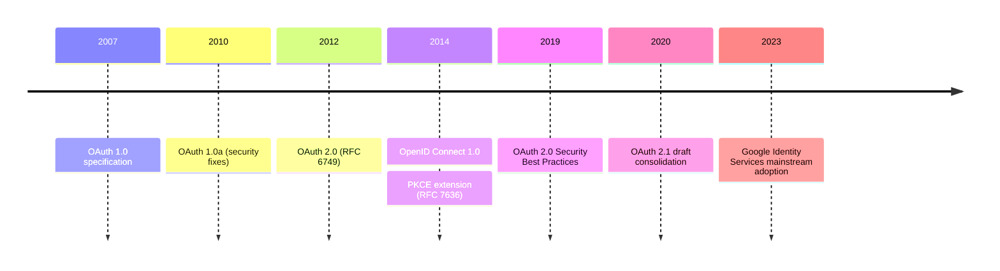
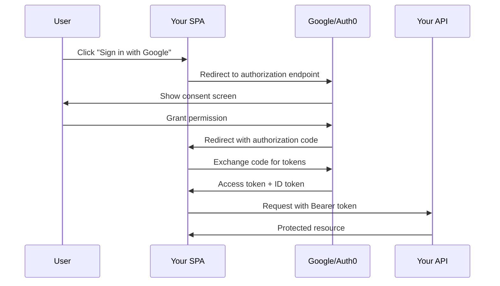
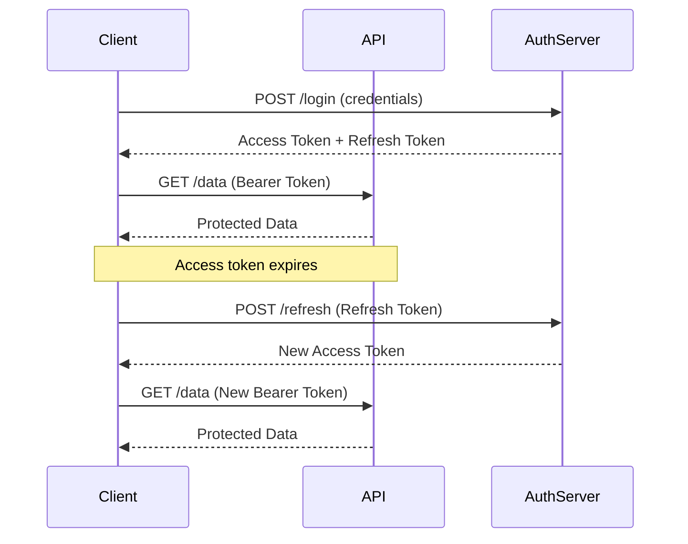

# Tokens

---

### Goals
* Compare roles and claims
* Define CSRF
* Explain why .NET allows different authorization policies


---


## OAuth

---

### What's [OAuth 2.0](https://oauth.net/2/)?
* Delegated authorization framework
* Third-party identity providers handle credentials
* Your app receives tokens, never passwords
* Key advantage: eliminates password management burden
* Shifts security responsibility to specialists

---

### OAuth/OpenID Timeline



---

### The Password Problem
* Traditional auth: you store hashed passwords
* Regulatory compliance burden (GDPR, SOC2, PCI)
* Breach liability and notification requirements
* [Password reuse](https://owasp.org/www-community/attacks/Credential_stuffing) across sites amplifies damage
* OAuth delegates identity to Google, Microsoft, Auth0, etc.

---

### Authentication vs Authorization
* **Pedantic view:** [OAuth is authorization](https://oauth.net/articles/authentication/), not authentication
* OAuth tells you what a user **can do**, not **who they are**
* That's technically [OpenID Connect](https://openid.net/connect/)'s job (built on OAuth)
* **Reality:** OAuth + OIDC = de facto authentication standard
* Most implementations use both together

---

### OAuth 2.0 Authorization Code Flow

<div style="transform: scale(1.25); transform-origin: top center; margin-left: 8em;">


</div>

---

### Authorization Code Flow: Step by Step

| Step | Description |
|------|-------------|
| **1. Authorization Request** | Redirect to provider with client_id, redirect_uri, scope |
| **2. User Consent** | Provider authenticates user and shows permissions |
| **3. Authorization Code** | Provider redirects back with short-lived code |
| **4. Token Exchange** | Backend exchanges code for tokens (client_secret required) |
| **5. Access Resources** | Use access token in Authorization header |

[OAuth 2.0 Authorization Framework (RFC 6749)](https://datatracker.ietf.org/doc/html/rfc6749)

---

### Modern OAuth: [PKCE](https://datatracker.ietf.org/doc/html/rfc7636)
* **P**roof **K**ey for **C**ode **E**xchange
* Prevents authorization code interception attacks
* Browser generates code_verifier (random string)
* Sends code_challenge (hash of verifier) with auth request
* Provider validates verifier matches challenge on token exchange
* **Required** for SPAs and mobile apps
* [Recommended for all OAuth clients](https://datatracker.ietf.org/doc/html/draft-ietf-oauth-security-topics)

---

### [Google Identity Services](https://developers.google.com/identity/gsi/web)
* Modern alternative to traditional redirect flows
* One Tap sign-in with minimal friction
* Popup-based authorization (better UX)
* Still OAuth 2.0 + OpenID Connect underneath
* Similar patterns: Microsoft Identity Platform, Auth0 Universal Login

---

### OAuth Complaints
* Specification complexity ([many RFCs](https://oauth.net/specs/))
* Easy to misconfigure securely
* Token storage and management burden
* CORS preflight overhead with Bearer tokens
* "Not authentication" confusion
* Provider lock-in concerns

---

### .NET Backend: Google OAuth

```csharp title='Program.cs'
builder.Services
    .AddAuthentication(options => {
        options.DefaultScheme = CookieAuthenticationDefaults.AuthenticationScheme;
        options.DefaultChallengeScheme = GoogleDefaults.AuthenticationScheme;
    })
    .AddCookie()
    .AddGoogle(options => {
        options.ClientId = builder.Configuration["Authentication:Google:ClientId"];
        options.ClientSecret = builder.Configuration["Authentication:Google:ClientSecret"];
        options.Scope.Add("email");
        options.Scope.Add("profile");
    });
```

[Microsoft Docs: Google authentication](https://learn.microsoft.com/en-us/aspnet/core/security/authentication/social/google-logins)

---

### Angular Frontend: OAuth Setup

```typescript title='app.config.ts'
import { AuthConfig } from 'angular-oauth2-oidc';

export const authConfig: AuthConfig = {
  issuer: 'https://accounts.google.com',
  redirectUri: window.location.origin,
  clientId: 'YOUR_CLIENT_ID.apps.googleusercontent.com',
  scope: 'openid profile email',
  responseType: 'code',
  showDebugInformation: true,
  strictDiscoveryDocumentValidation: false,
};
```

[angular-oauth2-oidc documentation](https://github.com/manfredsteyer/angular-oauth2-oidc)

---

### Token Exchange Pattern

* SPA completes OAuth flow, receives Google's ID token
* SPA sends Google token to **your API's** `/auth/google` endpoint
* Your API validates Google token and issues **your own** JWT pair
* SPA uses your tokens for all subsequent requests
* **Why?** Decouple from provider, add custom claims, control expiration
* Enables multiple auth methods (Google, Microsoft, local) with consistent tokens

[Auth0: Token Exchange](https://auth0.com/docs/secure/tokens/token-exchange) | [OAuth 2.0 Token Exchange (RFC 8693)](https://datatracker.ietf.org/doc/html/rfc8693)

---

### Token Management

| Storage Location | Security | Persistence | XSS Risk | CSRF Risk |
|------------------|----------|-------------|----------|-----------|
| **Memory only** | High | Session only | Low | Low |
| **localStorage** | Low | Persistent | **High** | Low |
| **sessionStorage** | Medium | Tab-scoped | **High** | Low |
| **HttpOnly Cookie** | High | Persistent | Low | **Medium** |

* Access tokens: short-lived (minutes to hours)
* Refresh tokens: long-lived (days to months), handle with care
* [OWASP Token Storage Cheat Sheet](https://cheatsheetseries.owasp.org/cheatsheets/JSON_Web_Token_for_Java_Cheat_Sheet.html#token-storage-on-client-side)

---

### Hybrid Token Strategy

* **Web clients:** HttpOnly cookies protect against [XSS token theft](https://owasp.org/www-community/attacks/xss/)
* **Native clients:** Standard Bearer tokens (cookies don't work well)
* **Challenge:** Supporting both from same API endpoints
* **Solution:** Middleware transparently converts cookies → Bearer header
* Downstream authentication sees only Bearer tokens (consistent)

---

### Cookie-to-JWT Middleware

```csharp title='CookieToJwtMiddleware.cs'
public class CookieToJwtMiddleware {
    private readonly RequestDelegate _next;

    public async Task InvokeAsync(HttpContext context) {
        if (!context.Request.Headers.ContainsKey("Authorization") 
            && Cookies.HasAccessToken(context)) {
            var accessToken = Cookies.GetAccessToken(context);
            context.Request.Headers.Append("Authorization", $"Bearer {accessToken}");
        }
        await _next(context);
    }
}
```

Register before `UseAuthentication()` in middleware pipeline

---

### OAuth Security Gotchas

* Validate redirect_uri against whitelist (prevent [open redirects](https://cwe.mitre.org/data/definitions/601.html))
* Always use **state** parameter (CSRF protection)
* Validate JWT signatures with provider's public keys
* Check token expiration and audience claims
* **HTTPS only** in production
* Avoid storing tokens in localStorage if possible

[OWASP OAuth 2.0 Cheat Sheet](https://cheatsheetseries.owasp.org/cheatsheets/OAuth2_Cheat_Sheet.html)

---


## JWT

---

### Bad Old Days
* Server-side session storage required
* Problems:
  - Scaling horizontally requires sticky sessions or shared session store
  - Cross-domain authentication difficult
  - Mobile apps and SPAs don't fit session model well
* Session ID in cookie has no information


---

### What's JWT?
* <u>J</u>SON <u>W</u>eb <u>T</u>oken
* Self-contained token with encoded claims
* Three parts: Header.Payload.Signature
* Signature verifies token hasn't been tampered with
* Stateless authentication
* [jwt.io](https://jwt.io)

---

### How does JWT work?

<div style="transform: scale(1.15); transform-origin: top center; margin-left: 15rem;"
>




</div>

---

### Jwt in .NET

```csharp title='ApplicationBuilderExtensions.cs'

public static IHostApplicationBuilder AddAuthentication(this IHostApplicationBuilder builder){
    var jwtSettings = builder.GetJwtSettings();

    builder.Services.AddAuthentication(options =>{
        options.DefaultAuthenticateScheme = JwtBearerDefaults.AuthenticationScheme;
    })
    .AddJwtBearer(options =>{
        options.TokenValidationParameters = new TokenValidationParameters{
            ValidateIssuerSigningKey = true,
            IssuerSigningKey = new SymmetricSecurityKey(jwtSettings.Secret),
            ValidateIssuer = true,
            ValidIssuer = jwtSettings.Issuer,
            ValidateAudience = true,
            ValidAudience = jwtSettings.Audience,
        };
    });

    return builder;
}

```

---
### Angular Interceptor
{/* TODO: Simplify below for essentials */}
```typescript

export const authInterceptor: HttpInterceptorFn = (req, next) => {
  const tokenStore = inject(TokenStoreService);
  const authService = inject(AuthService);
  const router = inject(Router);

  return next(req).pipe(
    catchError((error) => {
      if (error.status === 401 && !req.url.includes('/auth/')) {
        return authService.refreshToken().pipe(
          switchMap(() => {
            const newAccessToken = tokenStore.getAccessToken();
            if (newAccessToken) {
              req = req.clone({
                setHeaders: {
                  Authorization: `Bearer ${newAccessToken}`,
                },
              });
            }
            return next(req);
          }),
          catchError(() => {
            authService.signOut();
            router.navigate(['/signin']);
          })
        );
      }
      return throwError(() => error);
    })
  );
};
```


---


### Jwt Evaluated
* **Strengths**:
  - Self-contained, no database required
  - Supports federation and multiple clients
  - Configurable
* **Weaknesses**:
  - Tokens are stealable-- httponly cookies aren't


