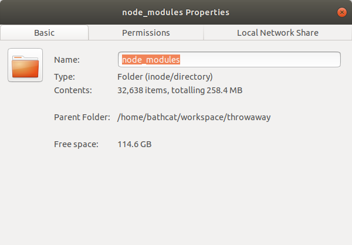

# Supply Chain

---

### Goals
* Lorem ipsum
* Lorem ipsum

---


## Dependencies & Attack Surface

---

### Consider Provenance
* Every dependency increases attack surface
* In the age of AI assistants, [Not Invented Here](https://en.wikipedia.org/wiki/Not_invented_here) has new meaning
* If you use 1 function from lodash, consider writing your own
* **Provenance matters:**
  - Angular, React, Microsoft.Extensions.* ✓ (mostly)
  - Obscure repos with single maintainer ✗
* [OWASP: Software Component Analysis](https://owasp.org/www-community/Component_Analysis)

---

### Big Attack Surface

<figure  style='width:40%;height:auto;'>

</figure>
<figure  style='width:40%;height:auto;'>

</figure>

---

### The Core Tension
* You will have dependencies (Angular, TypeScript, Microsoft.Extensions.*)
* Problems:
  - Updates can break things
  - You need security patches immediately
* These two needs **directly conflict**
* No perfect solution exists
* There is a tension between stability and security

---


## Problem #1: Updates Break Things

---

### [Left-pad Incident](https://qz.com/646467/how-one-programmer-broke-the-internet-by-deleting-a-tiny-piece-of-code/) (2016)
* Developer unpublished 11-line npm package
* Broke thousands of projects worldwide
* Babel, React, and many others couldn't build
* Not a security issue, but demonstrates fragility
* **Lesson**: Dependencies are single points of failure

---

### Patch Tuesday Stress
* Microsoft's monthly update cycle
* Will this update break production?
* Security teams: "Install immediately"
* Dev teams: "We need to test first"
* Classic stability vs security tension

---

### Semantic Versioning Isn't a Guarantee
* Version format: `MAJOR.MINOR.PATCH`
  - **Major**: Breaking changes
  - **Minor**: New features, backward compatible
  - **Patch**: Bug fixes
* [SemVer](https://semver.org/) is just a convention
* Breaking changes surprise you sometimes
* Best practice: Don't rely on non-public functionality
* [xkcd: Dependency](https://xkcd.com/2347/)

---

### Package.json Wildcards

| Wildcard | Upgrades | Example |
|----------|:----------|:---------|
| **~** | Patches only | "@angular/compiler": "~8.2.8" |
| **^** | Minor releases | "tslib": "^1.10.0" |
| **\*** | Major releases | "lodash": "*" (dangerous) |

---

### Strategy: Pin Everything
* Extreme: Commit `node_modules` to version control
* Less extreme: Hard version numbers in `package.json`
* **Pros:**
  - Explicit about everything
  - Team on same versions
  - Repeatable builds
* **Cons:**
  - Nuisance to manage
  - Miss security updates
  - Repository bloat

---

### Strategy: Soak Periods
* Don't install updates immediately
* Wait for unstable releases to get fixed
* **Bun**: [`minimumReleaseAge`](https://bun.com/docs/runtime/bunfig#install-minimumreleaseage) config setting

```toml title='bunfig.toml'
[install]
# Only install package versions published at least 3 days ago
minimumReleaseAge = 259200
# These packages will bypass the 3-day minimum age requirement
minimumReleaseAgeExcludes = ["@types/bun", "typescript"]
```

* **NuGet**: RenovateBot with configured delay
* **Theory**: Popular packages get fixed quickly if broken

---


## Problem #2: You Need Security Patches NOW

---

### [Newtonsoft.Json CVE-2024-43485](https://github.com/advisories/GHSA-5crp-9r3c-p9vr)
{/* TODO: I don't think this is the one I was thinking of. */}
* Polymorphic deserialization vulnerability
* Remote code execution possible
* Used in millions of .NET applications
* Clock starts ticking once CVE is public
* Attackers scan for vulnerable versions immediately
* [Microsoft Security Advisory](https://msrc.microsoft.com/update-guide/vulnerability/CVE-2024-43485)

---

### Lodash Security Fixes
* Regular occurrence of vulnerabilities
* [Snyk Lodash Vulnerabilities](https://security.snyk.io/package/npm/lodash)
* Recent issues:
  - Prototype pollution
  - ReDoS (Regular Expression DoS)
  - Command injection
* You want these patches **immediately**

---

### [Log4Shell](https://en.wikipedia.org/wiki/Log4Shell) (2021)
* Critical vulnerability in Log4j (Java logging library)
* CVSS score: 10.0 (maximum severity)
* Remote code execution
* Affected millions of applications
* Attackers exploited within hours of disclosure
* [CISA: Log4Shell Vulnerability Guidance](https://www.cisa.gov/news-events/cybersecurity-advisories/aa21-356a)

---

### The Race Against Time
* CVE published → Attackers start scanning
* Often within **hours**, not days
* Automated scanning tools everywhere
* Every hour of delay increases risk
* **But** rushing updates can break production
* This is the tension

---


## The Tension Visualized

---

### Competing Priorities

```
Fast Updates ←→ Stability
     ↑              ↑
     |              |
  Security      Production
   Patches       Reliability
     
     No perfect answer
```

* Move left: Get security fixes, risk breaking changes
* Move right: Stable system, vulnerable to attacks
* Optimal position depends on context

---


## Tooling & Strategies

---

### Package Lock Files
* **package-lock.json** (npm) / **yarn.lock** / **pnpm-lock.yaml**
  - Exact version of every dependency (recursive)
  - Includes integrity checksums
  - Ensures repeatable builds
* **packages.lock.json** (NuGet)
  - Similar concept for .NET
* Lock files are your source of truth
* Always commit to version control

---

### Example: package-lock.json

```json title='package-lock.json'
"@angular-devkit/build-angular": {
  "version": "0.803.24",
  "resolved": "https://registry.npmjs.org/@angular-devkit/build-angular/-/build-angular-0.803.24.tgz",
  "integrity": "sha512-uA789spMVghXehwAhl5zK0loY/wfxblUiL+y21T24LMCJc15a9QX5dwbXH72ioHz7qdzb/agXk7AK+foc2/0Hw==",
  "dev": true,
  "requires": {
    "@angular-devkit/architect": "0.803.24",
    "@angular-devkit/build-optimizer": "0.803.24",
```

---

### [npm audit](https://docs.npmjs.com/cli/v10/commands/npm-audit)
* Built into npm (since v6)
* Scans dependencies for known vulnerabilities
* Uses package-lock.json

```bash
npm audit
npm audit fix
npm audit fix --force
```

* Integrate into CI/CD pipeline
* **Warning**: `--force` can apply breaking changes

---

### [NuGet Security](https://learn.microsoft.com/en-us/nuget/concepts/security-best-practices)
* Visual Studio shows vulnerable package warnings
* `dotnet list package --vulnerable`
* `dotnet list package --outdated`
* No built-in auto-fix like npm


---

### [Dependabot](https://docs.github.com/en/code-security/dependabot)
* GitHub's automated dependency updates
* Creates PRs for updates
* Security updates flagged as critical
* Configurable update schedule

```yaml title='dependabot.yml'
version: 2
updates:
  - package-ecosystem: "npm"
    directory: "/"
    schedule:
      interval: "weekly"
```

---

### [RenovateBot](https://docs.renovatebot.com/)
* More configurable than Dependabot
* Supports soak periods
* Grouping updates
* Custom rules per dependency

```json title='renovate.json'
{
  "extends": ["config:base"],
  "stabilityDays": 7,
  "prConcurrentLimit": 3,
  "packageRules": [
    {
      "matchPackagePatterns": ["^@angular"],
      "groupName": "Angular packages"
    }
  ]
}
```

---

### Comparing Strategies

| Strategy | Security Updates | Stability | Effort |
|----------|------------------|:-----------|:---------|
| **Pin everything** | Manual only | 🔴 High | 🔴 High |
| **Auto-update all** | Immediate | 🟢 Low | 🟢 Low |
| **Dependabot weekly** | Fast | 🟡 Medium | 🟡 Medium |
| **RenovateBot + soak** | Delayed | 🔴 High | 🟡 Medium |
| **Manual review** | Controlled | 🔴 High | 🔴 Very High |

---

### Private Package Repositories
* Common in large organizations
* Examples: [Artifactory](https://jfrog.com/artifactory/), [Azure Artifacts](https://azure.microsoft.com/en-us/products/devops/artifacts/), [Nexus](https://www.sonatype.com/products/nexus-repository)
* **How it works:**
  - DevOps team maintains approved package list
  - Developers pull from private registry, not public npm/NuGet
  - Security scanning before packages enter registry

---

### Private Repositories Evaluated
* **Benefits:**
  - Centralized security control
  - Pre-vetted packages only
  - Protection from supply chain attacks
  - Consistent across organization
* **Drawbacks:**
  - Bureaucratic approval process
  - Slow adoption of new packages/versions
  - Developer friction
  - DevOps team becomes bottleneck
* Another trade-off: security vs developer velocity

---


## Security as a Feature

---

### Context Determines Strategy
* **Startup MVP**: Auto-update, accept breakage risk
* **E-commerce site**: Weekly updates, staging tests
* **Banking system**: Manual review, extensive testing
* **Government/Healthcare**: Long soak periods, compliance audits
* **Internal tools**: Depends on criticality

No one-size-fits-all answer

---

### Questions for Your Team
* What's our risk tolerance for downtime?
* How quickly can we respond to production issues?
* What's our testing infrastructure like?
* What's the cost of a security breach vs outage?
* Do we have compliance requirements?
* What's our deployment frequency?

---

### Best Practices
* **Monitor**: Use audit tools in CI/CD
* **Prioritize**: Security patches > features > other updates
* **Test**: Staging environment for updates
* **Automate**: Use Dependabot/RenovateBot
* **Document**: Know what you depend on
* **Plan**: Updating is a task on the backlog
* Security is ongoing work, not a one-time fix

---

### Trade-offs Are Real
* Perfect security: Install every patch immediately
* Perfect stability: Never update anything
* **Reality**: Navigate the middle ground
* Tools help, but judgment is required
* Security is a **feature** you prioritize
* Balance competing priorities for your context
