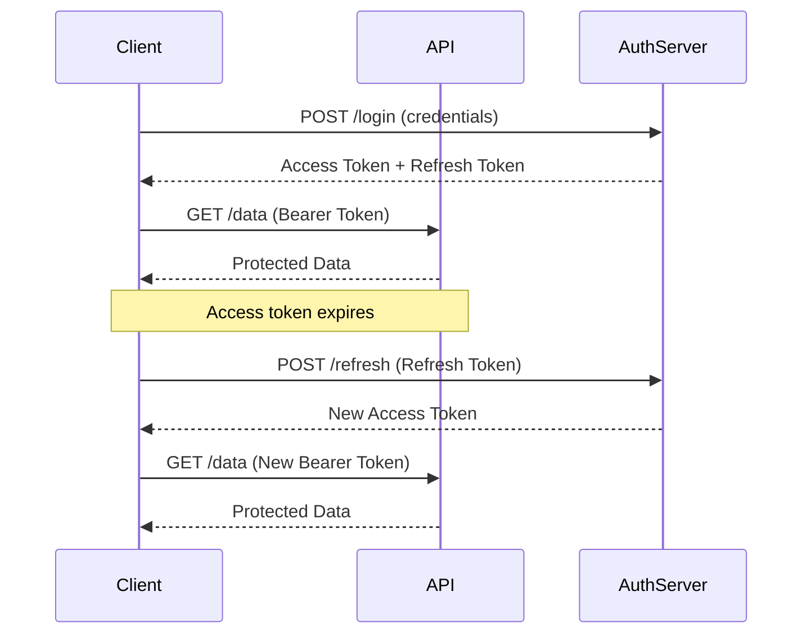

# Potpourri

---


## CSRF


---

### What's CSRF?
* Less of a concern with SPAs
* Common in [spear phishing](https://usa.kaspersky.com/resource-center/definitions/spear-phishing) technique
* <u>C</u>ross <u>S</u>ite <u>R</u>equest <u>F</u>orgery (CSRF)
* Logged-in user has a cookie, which passes along with every request
* If a user's page is compromised, the attacker can pretend to be the authenticated user

---

### Example: example.badactorstudio.com
* Real site: example.com
* **Attack**:
  - Email user link to example.badactorstudio.com
  - Browser sends form POST to real site with the user's authenticated cookie
  - Real site processes request and sends response


```html
<h1>You Are a Winner!</h1>
  <form action="http://example.com/api/account" method="post">
    <input type="hidden" name="Transaction" value="withdraw" />
    <input type="hidden" name="Amount" value="1000000" />
  <input type="submit" value="Click Me"/>
</form>
```

---

### Mitigations
1. Anti-Forgery Token
2. CORS policy
3. `SameSite` Cookie Attribute

---

### Mitigation #1: Anti-Forgery Token 
* Built-in to ASP.NET Core via [`AutoValidateAntiforgeryTokenAttribute`](https://docs.microsoft.com/en-us/dotnet/api/microsoft.aspnetcore.mvc.autovalidateantiforgerytokenattribute?view=aspnetcore-3.1)
```csharp
public void ConfigureServices(IServiceCollection services){

    services.AddMvc(options=> options.filters.add(new AutoValidateAntiforgeryTokenAttribute());
}
```


---

### Solution
```html
<form action="/Home/Test" method="post">
    <input name="__RequestVerificationToken" type="hidden"   
           value="6fGBtLZmVBZ59oUad1Fr33BuPxANKY9q3Srr5y[...]" />    
    <input type="submit" value="Submit" />
</form>
```


---

### Mitigation #2: CORS policy
* Set a CORS policy on the API endpoint
* Works for:
  - XmlHttpRequest / Fetch API
* Ignored by:
  - Simple form POSTs

---

### Mitigation #3: `SameSite` Cookie Attribute
* Set the `SameSite` attribute on the cookie


---


## JWT

---

### Bad Old Days
* Server-side session storage required
* Problems:
  - Scaling horizontally requires sticky sessions or shared session store
  - Cross-domain authentication difficult
  - Mobile apps and SPAs don't fit session model well
* Session ID in cookie has no information


---

### What's JWT?
* <u>J</u>SON <u>W</u>eb <u>T</u>oken
* Self-contained token with encoded claims
* Three parts: Header.Payload.Signature
* Signature verifies token hasn't been tampered with
* Stateless authentication
* [jwt.io](https://jwt.io)

---

### How does JWT work?

<div style="transform: scale(1.3); transform-origin: top center; margin-left: 15rem;"
>




</div>

---

### Jwt in .NET

```csharp

public static IHostApplicationBuilder AddAuthentication(this IHostApplicationBuilder builder){
    var jwtSettings = builder.GetJwtSettings();

    builder.Services.AddAuthentication(options =>{
        options.DefaultAuthenticateScheme = JwtBearerDefaults.AuthenticationScheme;
    })
    .AddJwtBearer(options =>{
        options.TokenValidationParameters = new TokenValidationParameters{
            ValidateIssuerSigningKey = true,
            IssuerSigningKey = new SymmetricSecurityKey(jwtSettings.Secret),
            ValidateIssuer = true,
            ValidIssuer = jwtSettings.Issuer,
            ValidateAudience = true,
            ValidAudience = jwtSettings.Audience,
        };
    });

    return builder;
}

```

---
### Angular Interceptor
{/* TODO: Simplify below for essentials */}
```typescript

export const authInterceptor: HttpInterceptorFn = (req, next) => {
  const tokenStore = inject(TokenStoreService);
  const authService = inject(AuthService);
  const router = inject(Router);

  return next(req).pipe(
    catchError((error) => {
      if (error.status === 401 && !req.url.includes('/auth/')) {
        return authService.refreshToken().pipe(
          switchMap(() => {
            const newAccessToken = tokenStore.getAccessToken();
            if (newAccessToken) {
              req = req.clone({
                setHeaders: {
                  Authorization: `Bearer ${newAccessToken}`,
                },
              });
            }
            return next(req);
          }),
          catchError(() => {
            authService.signOut();
            router.navigate(['/signin']);
          })
        );
      }
      return throwError(() => error);
    })
  );
};
```


---


### Jwt Evaluated
* **Strengths**:
  - Self-contained, no database required
  - Supports federation and multiple clients
  - Configurable
* **Weaknesses**:
  - Tokens are stealable-- httponly cookies aren't

---


## Path Traversal

---


### What's Path Traversal?
* Aka *Directory Traversal*
* **Impact:** ranges from obnoxious vandalism to catastrophic data loss
* Attacker manipulates file paths using `../` sequences
* Accesses files outside intended directory

---

### The Root Problem
{/* TODO: Style tables in globals.scss */}
| Attack Type | Control Characters | Root Cause |
|-------------|-------------------|------------|
| **SQL Injection** | `'`, `--`, `;` | Mixing data with SQL commands |
| **XSS** | `<script>`, `"`, `>` | Mixing data with HTML/JS |
| **Path Traversal** | `..`, `/`, `\` | Mixing data with filesystem paths |


<br/>
* **Common pattern**: Treating special input as ordinary strings + trusting users

* **Anti-pattern**: Primitive obsession (using `string` when you need something more specific)

---

### The Vulnerability
```csharp
private async Task<ImageUploadResult> SaveImageCore(
    ReadOnlyMemory<byte> imageData,string fileName,string storageRoot){
        
    var extension = _path.GetExtension(fileName).ToLowerInvariant();
    if (!_options.AllowedExtensions.Contains(extension)){
        return ImageUploadResult.FailureResult($"Extension not allowed");
    }
    
    var mimeType = MimeTypes.GetMimeType(imageData.Span);
    if (mimeType is null){
        return ImageUploadResult.FailureResult("Invalid image");
    }
    
    var physicalPath = _path.Combine(storageRoot, fileName);
    using (var fileStream = _fileStreamFactory.New(physicalPath, FileMode.Create)){
        await fileStream.WriteAsync(imageData);
    }
    
    return ImageUploadResult.SuccessResult(physicalPath, imageData.Length);
}
```
---

### The Exploit: Step by Step

| Step | Value | Result |
|------|-------|--------|
| **User provides** | `../../uploads/pilot-avatars/target.jpg` | Malicious filename |
| **storageRoot** | `/var/app/storage/user-123/` | Intended directory |
| **Path.Combine** | `/var/app/storage/user-123/../../uploads/pilot-avatars/target.jpg` | Combined path |
| **Normalized** | `/var/app/uploads/pilot-avatars/target.jpg` | Escaped intended directory! |
| **Impact** | 💥 | Overwrites arbitrary file |

---

### Mitigation #1: Validation
* Check for path separator characters
* Reject any filename containing `/`, `\`, `..`
    
```csharp
if (fileName.Contains("..") || 
    fileName.Contains("/") || 
    fileName.Contains("\\")){
    return ImageUploadResult.FailureResult("Invalid filename");
}
```
---

### Mitigation #2: Type Safety
* Avoid primitive obsession
* Use value object or branded type for filenames
```csharp
public sealed class SafeFileName{
    private readonly string _value;
    
    private SafeFileName(string value) => _value = value;
    
    public static Result<SafeFileName> Create(string input){
        if (string.IsNullOrWhiteSpace(input) ||
            input.Contains("..") ||
            input.IndexOfAny(Path.GetInvalidFileNameChars()) >= 0){
            return Result.Failure<SafeFileName>("Invalid filename");
        }
        return Result.Success(new SafeFileName(input));
    }
    
    public override string ToString() => _value;
}
```

---

### Mitigation #3: Isolation
* Host user-uploaded content on separate origin
* Example: `api.example.com` vs `uploads.example.com`
* Limits blast radius if path traversal succeeds
* Also mitigates XSS in uploaded files


---


## Denial of Service

---

### What's [DoS](https://owasp.org/www-community/attacks/Denial_of_Service)?
* <u>D</u>enial <u>o</u>f <u>S</u>ervice attack
  - **DoS**: Single source attack
  - **DDoS**: <u>D</u>istributed attack from multiple sources
* **Goal**: Make service unavailable to legitimate users
* **Impact**: Ranges from temporary slowdown to complete shutdown

---

### Evolution of the Threat
* **Good news**: Ecosystem has improved dramatically
* **Then (2000s)**:
  - Easy to recruit botnet armies via XSS worms
  - Limited infrastructure protection
  - Browsers lacked modern security features
* **Now (2020s)**:
  - Browser security makes worm propagation harder
  - CDNs like [Cloudflare](https://www.cloudflare.com/learning/ddos/what-is-a-ddos-attack/) provide edge protection
  - Cloud providers offer built-in DDoS mitigation


---

### [Mirai Botnet](https://en.wikipedia.org/wiki/Mirai_(malware)) (2016)
* Recruited 600,000+ IoT devices with default credentials
* Attacked Dyn DNS infrastructure
* Took down Twitter, Netflix, GitHub, Reddit, and more
* Combined failures:
  - IoT devices shipped with default passwords
  - No security updates for consumer devices
  - Critical DNS infrastructure vulnerability
* Peak traffic: 1.2 Tbps

---

### [GitHub Attack](https://www.wired.com/story/github-ddos-memcached/) (2018)
* Largest DDoS attack recorded at the time: 1.35 Tbps
* Memcached amplification attack
* GitHub mitigated in ~10 minutes using Akamai
* Attack mechanism:
  - Spoofed GitHub IPs in requests to memcached servers
  - Memcached servers amplified response 50,000x

---

### Mitigation #1: Rate Limiting
* Simple and effective for non-distributed attacks
* Built into ASP.NET Core
* Supports different policies for different endpoints

```csharp
public static IServiceCollection AddRateLimit(this IServiceCollection services)
=>  services.AddRateLimiter(options => {
        options.GlobalLimiter = PartitionedRateLimiter.Create<HttpContext, string>(httpContext =>
            RateLimitPartition.GetFixedWindowLimiter(
                partitionKey: httpContext.Request.Headers.Host.ToString(),
                factory: partition => new FixedWindowRateLimiterOptions{
                    AutoReplenishment = true,
                    PermitLimit = 1000,
                    QueueLimit = 0,
                    Window = TimeSpan.FromMinutes(1)
                }));
    });
```

---

### Dumb Example: Why Rate Limiting Works
```bash
while true; do
    curl https://example.com/pilots/
    sleep 0.01
done
```

**Why this is dumb:**
* Single IP address (trivial to block)
* Predictable pattern (easy to detect)
* Regular requests (rate limiter stops it immediately)
* Logged and traced (you will get caught)

---

### The Smarter Attack
* Rate limiting stops volume attacks
* **But**: Smart attackers target expensive operations
* Examples:
  - Exception-heavy endpoints
  - [Complex regex patterns (ReDoS)](https://owasp.org/www-community/attacks/Regular_expression_Denial_of_Service_-_ReDoS)
  - Wildcard database searches
  - Heavy computations
* **Historical example**: Node.js process crashes
  - Crash took ~1 second to restart
  - Continuous crashes = indefinite downtime

---

### Mitigation #2: Resource Protection
* Protect expensive operations
* **Strategies**:
  - Query complexity limits
  - Request timeouts
  - Circuit breakers
  - Async processing for heavy tasks
  - Pagination and result limits
* [Microsoft: Rate limiting middleware](https://learn.microsoft.com/en-us/aspnet/core/performance/rate-limit)
* [Polly: Resilience patterns](https://www.pollydocs.org/)

---

### [Defense in Depth](https://www.schneier.com/essays/archives/2003/11/beyond_fear_introduction.html)
* DoS attacks are more potent when combined with other vulnerabilities
* **Examples**:
  - Error disclosure reveals how to trigger exceptions
  - Resource exhaustion + session fixation
  - DoS during incident response masks other attacks
* **Principle**: No single mitigation is enough
* Monitor, alert, and respond to anomalies


