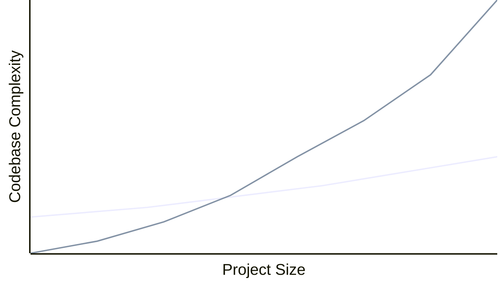

## What's Effect?

[**Effect**](https://effect.website/) is a lot of things: a standard library for TypeScript, a system for
handling errors via the type ssytem, a unifying pattern for async and in-process code, and a lifestyle
choice.

(BTW, this isn't really an introduction to effect. There are a [lot](https://www.sandromaglione.com/articles/how-to-model-TypeScript-app-with-effect-docgen)
[of](https://medium.com/@alexanderknips/if-you-are-unfamiliar-with-effect-systems-zio-or-effect-ts-i-recommend-reading-the-following-8a7bc51124a4)
[those](https://www.typeonce.dev/course/effect-beginners-complete-getting-started). Rather, this
is a review, like a book review. Hopefully this will help you decide whether Effect might help on your
project.)

Here's the best summary of Effect. Someone-- I can't remember who-- said that **Effect is React for services**.
Fundamentally React consists of a useful primitive for building UIs-- the jsx component-- and a standard library
and ecosystem built around that useful primitive. Similarly, Effect is a suite of tools build around a primitive for building
composable workflows--the `Effect` type. That's the selling point: You can wire together atomic pieces
of functionality without the assembly introducing too much additional complexity.

That sounds nice-- and I'll discuss what it means below-- but it comes at a price. If you watch videos
on Effect or read blog posts, you'll be familiar with a chart like this:

import {ChartLegend} from '../../components/ChartLegend';

<ChartLegend/>



<br/>

Which I think is the essential part: Effect is an investment. It takes extra work to learn and
extra work to build with and get the typing right, and extra work unwrapping effects. With sufficiently
complex projects, the initial investment pays for itself by reducing overall complexity.

Effect isn't always a sensible investment. If your application is simple and UI-centric, Effect is not
for you. Don't make an Effect-based meditation timer for the app store.

Even if you're building services, the investment may not pay off. Because a lot of this depends on your
team. Things that lower the break-even point:

- Experience with Effect
- Experience with functional programming
- Experience with TypeScript
- Willingness to learn

## Effect: the Useful Primitive

It might be nice if Effect were just a bunch of normal and useful TypeScript stuff packaged into a
single library. But it's not just that. Because _Effect is also a pattern_ for working with the core
primitive. And because most of the 'standard library' conforms to that pattern, using the standard
library in your code requires you to use the pattern.

It's kind of like Angular verses React. You can't use some React hook library inside your Angular
component because the two technologies are build around different primitives with different
mechanisms for composability.

Because at its core, Effect is a type, `Effect.Effect` that represents three things:

1. A lazily executable function
2. Possible failures
3. Ambient dependencies

Here's a fake example:

```ts title = 'Effect Type'
import { Effect } from 'effect';

type SomeFakeEffect = Effect.Effect<
  SuccessReturnType, //e.g. DTO, HttpResponse, string
  PossibleErrorA | PossibleErrorB, //e.g. SchemaValidationError, HttpError
  RequiredResource //e.g. Logger, Shared state, Transaction scope
>;
```

Here's a better example. It's a cosmetically modified [snippet](https://github.com/Effect-TS/effect/blob/main/packages/experimental/src/SocketServer/Node.ts)
from Effect's own NodeJS socket server implementation:

```ts title = 'SocketServer/Node.ts'
type SocketServerEffect = Effect.Effect<
  SocketServer.SocketServer,
  SocketServer.SocketServerError,
  Scope.Scope
>;

export const make = (options: Net.ServerOpts & Net.ListenOptions): SocketServerEffect
  => {/*...*/}
```

The types are nice here: just looking at the return value, you know everything important about
the `make` function:

1. If successfull, it creates an instance of `SocketServer`.
2. On failure, it returns `SocketServerError`.
3. Running this requires an instance of `Scope` (whatever that is) attached to the execution context.

So when people talk about Effect as a pattern, it's wiring together instances of the type `Effect.Effect`.

### The Case for Effect: Complaints about Vanilla TypeScript

Here's a standard-looking function to get some data from a RESTful service and transform it into
a record structure:

```ts title='fetchGridLocation.ts (Vanilla TypeScript, naive)' collapse={1-20}
export interface Position {
  latitude: number;
  longitude: number;
}

export interface GridLocationResponse {
  properties: { gridId: string; gridX: number; gridY: number };
}

export interface GridLocation {
  office: string;
  x: number;
  y: number;
}

const toGridLocation = (response: GridLocationResponse): GridLocation => ({
  office: response.properties.gridId,
  x: response.properties.gridX,
  y: response.properties.gridY,
});

export async function fetchGridLocation(p: Position) {
  const url = `https://api.weather.gov/points/${p.latitude},${p.longitude}`;
  const response = await fetch(url);
  const json = (await response.json()) as GridLocationResponse;

  return toGridLocation(json);
}
```

This isn't bad code:

- It's familiar-looking to most developers
- `Async/await` is nicer than callbacks

But it's hard to extend. Just adding the ability to retry in case of transient network
errors makes the code significantly more complicated:

```ts title='fetchGridLocation.ts (with retries)' ins={3-6, 10-15}
export async function fetchGridLocation(p: Position): Promise<GridLocation> {
  const url = `https://api.weather.gov/points/${p.latitude},${p.longitude}`;
  const retries = 3;

  for (let attempt = 0; attempt < retries; attempt++) {
    try {
      const response = await fetch(url);
      const json = await response.json();
      return toGridLocation(json);
    } catch (error) {
      await new Promise(resolve => setTimeout(resolve, 500));
    }
  }

  throw new Error('Unable to fetch resource');
}
```

This isn't great, obviously: it's more lines with more complexity that obscures the intent of the
function itself. Plus, the retry functionality above isn't reusable. So the next step would be to
factor out the retry logic into a standalone implementation-- maybe using a decorator or something.

Moreover, in a production application, you need more than just retries. You need stuff like:

- Cancellation
- Timeouts
- Schema validation
- Caching
- Instrumentation
- Fallback behavior
- Platform independence

All of this adds complexity because most TypeScript isn't always easily composable. In other words,
often there's no good way to add functionality without additional flow control that obscures the core
intention and potentially introduces new bugs.

### Effect to the Rescue

So how do you add the things above while minimizing additonal flow control? Composition. Effects are
composible via pipelines and generators.

Here's a naive[^1] Effect version of function above:

[^1]:
    Naive because in production, you'd probably use the `HttpClient` instead of `fetch`. You'd also
    want to think more carefully about possible failures.

```ts title='fetchGridLocationEffect.ts (naive)'
type Result = Effect.Effect<
  GridLocation,
  UnknownException,
  never
>;

export const fetchGridLocationEffect = (p: Position):Result =>
  pipe(
    `https://api.weather.gov/points/${p.latitude},${p.longitude}`,
    url => Effect.tryPromise(() => fetch(url)),
    Effect.andThen(response => response.json()),
    Effect.map(json => toGridLocation(json)),
  );
```

It's different than the more idiomatic `async` function from earlier. This is part of the investment
required: learning how to use it, getting the typing right, and making the case to the rest of the team
that despite using a different idiom, the juice is actually worth the squeeze.

But it's easy enough to read. And the `pipe` function makes composition easy. To extend this code
retries is just one line:

```ts ins={5} title='fetchGridLocationEffect.ts (with retries)'
export const fetchGridLocationEffect = (p: Position) =>
  pipe(
    `https://api.weather.gov/points/${p.latitude},${p.longitude}`,
    url => Effect.tryPromise(() => fetch(url)),
    Effect.retry({times: 3}),
    Effect.andThen(response => response.json()),
    Effect.map(json => toGridLocation(json)),
  );
```

So that's when an investment in Effect starts to pay off: when you can stack up 
functionality without obscuring your intention.

### Effect: the Standard Library

Here's from the [docs](https://effect.website/docs/getting-started/why-effect/#dont-re-invent-the-wheel):

> Application code in TypeScript often solves the same problems over and over again. Interacting with
> external services, filesystems, databases, etc. are common problems for all application developers.
> Effect provides a rich ecosystem of libraries that provide standardized solutions to many of these
> problems. You can use these libraries to build your application, or you can use them to build your
> own libraries.

Effect is big enough to replace a lot of a la cart options. Here are just a few:

| Use Case             | À la carte                                                                                                                                            | In Effect                                                                                                                  |
| -------------------- | ----------------------------------------------------------------------------------------------------------------------------------------------------- | -------------------------------------------------------------------------------------------------------------------------- |
| Reactive Streams     | [Rxjs](https://rxjs.dev/), [Most.js](https://github.com/cujojs/most)                                                                                  | [Streams](https://effect.website/docs/stream/introduction/)                                                                |
| Schema               | [Zod](https://zod.dev/)                                                                                                                               | [Schema](https://effect.website/docs/schema/introduction/)                                                                 |
| State Management     | [Redux](https://redux.js.org/), [Zustand](https://zustand-demo.pmnd.rs/)                                                                              | [Ref](https://effect.website/docs/state-management/ref/)                                                                   |
| Http Server          | [Express](https://expressjs.com/), [koa](https://koajs.com/)                                                                                          | [ Platform / HTTP Server](https://github.com/Effect-TS/effect/blob/main/packages/platform/README.md#http-server)           |
| Dependency Injection | [Inversify](https://inversify.io/)                                                                                                                    | [Requirements](https://effect.website/docs/requirements-management/services/)                                              |
| HTTP Client          | [Fetch API](https://developer.mozilla.org/en-US/docs/Web/API/Fetch_API), [Https](https://nodejs.org/api/https.html), [Axios](https://axios-http.com/) | [Platform / HttpClient](https://github.com/Effect-TS/effect/blob/main/packages/platform/README.md#http-client)             |
| Pattern Matching     | [ts-pattern](https://github.com/gvergnaud/ts-pattern)                                                                                                 | [Match](https://effect.website/docs/code-style/pattern-matching/)                                                          |
| Datetime / Duration  | [tempo](https://github.com/formkit/tempo), [js-joda](https://github.com/js-joda/js-joda), [Luxon](https://github.com/moment/luxon/)                   | [DateTime](https://effect.website/docs/data-types/datetime/), [Duration](https://effect.website/docs/data-types/duration/) |
| Branded Types        | (Roll your own)                                                                                                                                       | [tagged](https://effect.website/docs/data-types/data/#tagged)                                                              |

And this, by the way, isn't even exhaustive. There's more.

And having all this functionality in a single dependency is an underrated benefit of Effect. If you know
that Effect has an (e.g.) http client library, and you trust that it's at least good enough-- because
everything I've seen is at least competent-- then you don't have to shop alternatives
on NPM.

Additionally, even if you like shopping, selling a team on adding a new dependency is often hard-- especially
on a mature code base. If you already use Effect Schema, then it's easy to also leverage its Dependency 
Injection functionality without adding to `package.json`.

## Good Parts

1. **Composable** The library allows developers to compose multiple effects easily. This composability is akin to building
   with Lego blocks; you can create complex structures by combining simple pieces without worrying about
   them collapsing under pressure.
2. **Readable** By using declarative syntax and functional programming concepts, Effect promotes cleaner and more
   maintainable code.
3. **Strongly Typed** I'm a big fan of catching problems with the typesystem instead of waiting for problems at runtime.
   The `Effect` type includes possible errors.
4. **Batteries Included** Effect comes with a rich set of utilities that can replace specialized libraries like Lodash or Zod. This means fewer
   dependencies and less bloat in your project—like going on a diet but still enjoying dessert (in moderation).

## Things I'm Less Enthusiastic About

1. **Different Idiom** Effect has a learning curve. For developers new to functional programming,
    Effect has a steep learning curve. Even when your team is up to speed, onboarding new engineers will take longer.
2. **Opinionated** The library strongly encourages you to do things a certain way. Errors, for example. Even if you have no 
   stylistic problem with normal TypeScript exception handling, using Effect means handling errors the Effect way. 
3. **(Relatively) Small Community** The docs are good, but seaching on Stackoverflow isn't always great.

## **Rating**: Impressive, but not for Everyone

import {Rating} from '../../components/Rating';

<Rating value='4' client:only/>

It's overkill for some things. The biggest barrier to entry is that Effect requires a different idiom
than standard TypeScript. However, this new idiom brings some good things with it: composability,
type safety, and a big standard library.

So deciding to use Effect means evaluating the break-even point for your application and your team. It's a bit like the phase 
transition from a bunch of shell scripts to a real application. 

---
